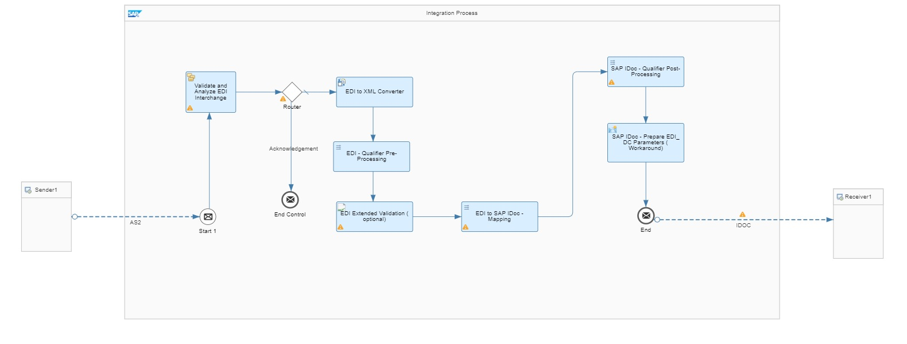

<!-- loioa33a6c64fd224b7aae7a049dfa95dbe8 -->

# Consuming Artifacts in Integration Flows

A B2B integration scenario involves many tasks associated with the exchange of business messages between the business partners. The required tasks include defining interfaces for the involved partners, creating mappings between the interfaces, generating the runtime artifacts and, finally, modeling the integration scenario. SAP Integration Advisor and SAP Cloud Integration play a key role in simplifying and streamlining the integration tasks.

Integration Advisor unifies all the required tasks for defining the desired interfaces, mappings, and generating the runtime artifacts. The runtime artifacts generated are used within the processing steps of an integration flow. An integration flow defines how messages are processed and exchanged between the sender and receiver systems in a B2B scenario. The platform provides a graphical designer interface to configure – the sender and receiver systems, the adapters to connect the sender and receiver systems to the tenant, and the steps that define the message processing. For more information, see [Getting Started with Integration Flow Development](https://help.sap.com/viewer/368c481cd6954bdfa5d0435479fd4eaf/Cloud/en-US/e5724cd84b854719973afe0356ea128b.html "Learn how to develop and run your first integration flow.") :arrow_upper_right: and [Configure Adapter in Communication Channels](configure-adapter-in-communication-channels-1f06633.md).

To get you started with minimum effort in your integration flow creation, SAP Integration Suite Integration Advisor provides a pre-defined set of templates for various B2B integration scenarios. These templates are available in the EDI Integration Templates for SAP Integration Advisor integration package. You can access the integration package via the SAP Business Accelerator Hub. You can copy the integration package into your tenant and adapt or extend the predefined integration flow as per your requirements. The package provides the required templates for inbound and outbound integration flows. These cover the standard integration scenarios such as EDI to IDoc, EDI to SOAP, IDoc to EDI, and IDoc to cXML. However, the list of templates and scenarios covered is growing rapidly.

The Documents tab of the integration package provides details regarding the templates and the usage of the runtime artifacts in the integration flow steps.

Let's consider the example of EDI to IDoc integration scenario. The various processing steps and the artifacts involved in this scenario are detailed in the following table.

<table>
<tr>
<th valign="top">

Processing Step

</th>
<th valign="top">

Description

</th>
</tr>
<tr>
<td valign="top">

Sender channel

</td>
<td valign="top">

The sender channel is configured using an AS2 adapter. An EDI message is received by the sender adapter.

</td>
</tr>
<tr>
<td valign="top">

Validate and Analyze EDI Interchange

</td>
<td valign="top">

The incoming EDI message is validated, and an acknowledgement is generated. The validation of the inbound message is done based on the XSD configured in this step. You've to use the XSD schema located in the `source Message Implementation Guideline (MIG)` folder within the exported zip file generated in SAP Integration Suite \(IA\) – `UN-EDIFACT<MessageType>.xsd`. The payload is forwarded for further processing based on the result of validation.

</td>
</tr>
<tr>
<td valign="top">

Router

</td>
<td valign="top">

Acknowledgement messages and EDI messages are routed separately.

</td>
</tr>
<tr>
<td valign="top">

EDI to XML Converter

</td>
<td valign="top">

The EDI message is converted into XML format using the XSD schema, located in the `source MIG` folder within the exported zip file generated in IA – `UN-EDIFACT_<MessageType>.xsd`.

</td>
</tr>
<tr>
<td valign="top">

EDI - Qualifier Pre-Processing

</td>
<td valign="top">

The qualifier suffixes are added in the XML based on the source MIG definition to perform a content validation of the message in the next step. The resource `<SourceMIGName>_preproc.xsl`, located in the `source MIG` folder within the exported zip file is used. After this step, the payload validation is executed based on the defined qualifiers and qualifier values.

</td>
</tr>
<tr>
<td valign="top">

EDI Extended Validation \(optional\)

</td>
<td valign="top">

The result of the qualifier preprocessing step is validated against the Russian Doll \(RD\) XSD generated for the source MIG in IA. The resource `<SourceMIGName>_RD.xsd` located in the `source MIG` folder within the exported zip file is used.

> ### Note:  
> If the source MIG folder contains multiple *\*\_RD\*.xsd* files, all these xsd files need to be added as a Resource to the Integration Flow.

</td>
</tr>
<tr>
<td valign="top">

EDI to SAP IDoc Mapping

</td>
<td valign="top">

This step converts the EDI message into SAP IDoc format using the XSLT mapping generated in IA. The resource `<MAGName>.xsl` located in the `MAG` folder within the exported zip file is used.

</td>
</tr>
<tr>
<td valign="top">

SAP IDoc - Qualifier Post-Processing

</td>
<td valign="top">

The qualifiers within the IDoc message are removed using the XSLT mapping as they aren't required in the final payload. The resource `<TargetMIGName>_postproc.xsl` located in the `target MIG` folder within the exported zip file is used.

</td>
</tr>
<tr>
<td valign="top">

SAP IDoc - Prepare EDI\_DC Parameters

</td>
<td valign="top">

The IDoc control record is defined.

</td>
</tr>
<tr>
<td valign="top">

End Event

</td>
<td valign="top">

The End message event is connected to the receiving system.

</td>
</tr>
<tr>
<td valign="top">

Receiver channel

</td>
<td valign="top">

The receiver channel is configured using an IDoc adapter.

</td>
</tr>
</table>

