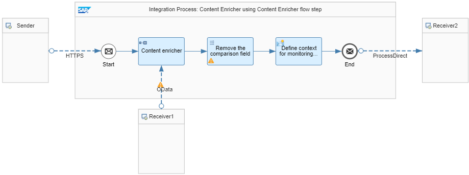

<!-- loio0e7ba7fc4d4b4f47ab84ad6ce0d1a8ec -->

# Content Enricher

You want to send an order to a supplier but you can't provide all the information that the receiver system requires to process the order. For instance, the items only contain a product category code but the main category name is missing. The Content Enricher reads data synchronously from an external system, and appends the additional information to the original message before routing to the actual receiver.

As an example, let's assume that the message has the following structure before being processed by the pattern:

> ### Sample Code:  
> ```
> <?xml version="1.0"?>
> <ns0:PurchaseOrder xmlns:ns0="http://demo.sap.com/eip/content-enricher"
> PurchaseOrderNumber="99401" OrderDate="2019-05-06">
> <Items>
> <Item ItemNumber="10">
> <ProductId>HT-1030</ProductId>
> <ProductName>Ergo Screen</ProductName>
> <Category>Flat screens</Category>
> <Quantity>2</Quantity>
> <CurrencyCode>EUR</CurrencyCode>
> <Price>460.00</Price>
> </Item>
> <Item ItemNumber="20">
> <ProductId>HT-1101</ProductId>
> <ProductName>Smart Design</ProductName>
> <Category>Software</Category>
> <Quantity>10</Quantity>
> <CurrencyCode>EUR</CurrencyCode>
> <Price>799.00</Price>
> </Item>
> </Items>
> </ns0:PurchaseOrder>
> ```

After being processed by the Content Enricher, the message has the following structure and content:

> ### Sample Code:  
> ```
> <?xml version="1.0" encoding="UTF-8"?>
> <ns0:PurchaseOrder xmlns:ns0="http://demo.sap.com/eip/content-enricher" PurchaseOrderNumber="99401" OrderDate="2019-05-06">
> <Items>
> <Item ItemNumber="10">
> <ProductId>HT-1030</ProductId>
> <ProductName>Ergo Screen</ProductName>
> <Category>Flat screens</Category>
> <MainCategoryName>Computer components</MainCategoryName>
> <Quantity>2</Quantity>
> <CurrencyCode>EUR</CurrencyCode>
> <Price>460.00</Price>
> </Item> <Item ItemNumber="20"> 
> <ProductId>HT-1101</ProductId> 
> <ProductName>Smart Design</ProductName> 
> <Category>Software</Category> 
> <MainCategoryName>Software</MainCategoryName> 
> <Quantity>10</Quantity> 
> <CurrencyCode>EUR</CurrencyCode> 
> <Price>799.00</Price> 
> </Item> </Items> 
> </ns0:PurchaseOrder>
> ```

> ### Note:  
> In the resulting message, the *MainCategoryName* field has been added.


<a name="loio0e7ba7fc4d4b4f47ab84ad6ce0d1a8ec__section_rwy_rp1_5jb"/>

## Implementation

In this example, you need to gather the missing main product category information via an external lookup call. The *Pattern Content Enricher* integration flow illustrates this simple scenario.



First, the Content Enricher reads the missing data from an external system via OData protocol. Here, the complete list of product categories is gathered.

The external data source supports the Open DataProtocol \(OData\). For our scenario, we use the ESPM WebShop, which is based on the Enterprise Sales and Procurement Model \(ESPM\) provided by SAP.

To reach this component, the following address is specified in the OData receiver adapter in the *Connection Details* tab:

`https://espmrefapps.hana.ondemand.com/espm-cloud-web/espm.svc`

The following settings are defined in the OData receiver adapter under *Processing Settings*:


<table>
<tr>
<th valign="top">

Attribute

</th>
<th valign="top">

Value

</th>
</tr>
<tr>
<td valign="top">

Operation Details

</td>
<td valign="top">

Query \(GET\)

</td>
</tr>
<tr>
<td valign="top">

Resource Path

</td>
<td valign="top">

ProductCategories

</td>
</tr>
<tr>
<td valign="top">

Query Options

</td>
<td valign="top">

$select=Category,MainCategoryName

</td>
</tr>
</table>

The *Processing* tab of the Content Enricher defines how the additional information is added to the original message. In this case, the *Enrich* option is chosen. By defining a correlation between the original message and the lookup message, the additional information is automatically matched to the corresponding item.

For *Aggregation Algorithm*, the *Enrich* option is chosen.

Under *ORIGINAL MESSAGE*, the following settings are defined:


<table>
<tr>
<th valign="top">

Attribute

</th>
<th valign="top">

Value

</th>
</tr>
<tr>
<td valign="top">

Path to Node

</td>
<td valign="top">

PurchaseOrder/Items

</td>
</tr>
<tr>
<td valign="top">

Key Element

</td>
<td valign="top">

Item/Category

</td>
</tr>
</table>

Under *LOOKUP MESSAGE*, the following settings are defined:


<table>
<tr>
<th valign="top">

Attribute

</th>
<th valign="top">

Value

</th>
</tr>
<tr>
<td valign="top">

Path to Node

</td>
<td valign="top">

ProductCategory

</td>
</tr>
<tr>
<td valign="top">

Key Element

</td>
<td valign="top">

Category

</td>
</tr>
</table>

In an additional Mapping step, the redundant fields are removed, that means that 1 occurrence of the product category is used as the correlation key.

> ### Note:  
> You can use the dedicated Content Enricher step to enrich bulk data. Using this option is much better in terms of performance compared to a request response pattern. If you've a message with 1000 single items, using a request response pattern, you would need to loop through the items and at the end would need to carry out 1000 lookup calls. Using the dedicated Content Enricher, you carry out 1 lookup call only. Furthermore, the matching is done automatically based on your key.

**Related Information**  


[Define Content Enricher](define-content-enricher-8827f9f.md "")

