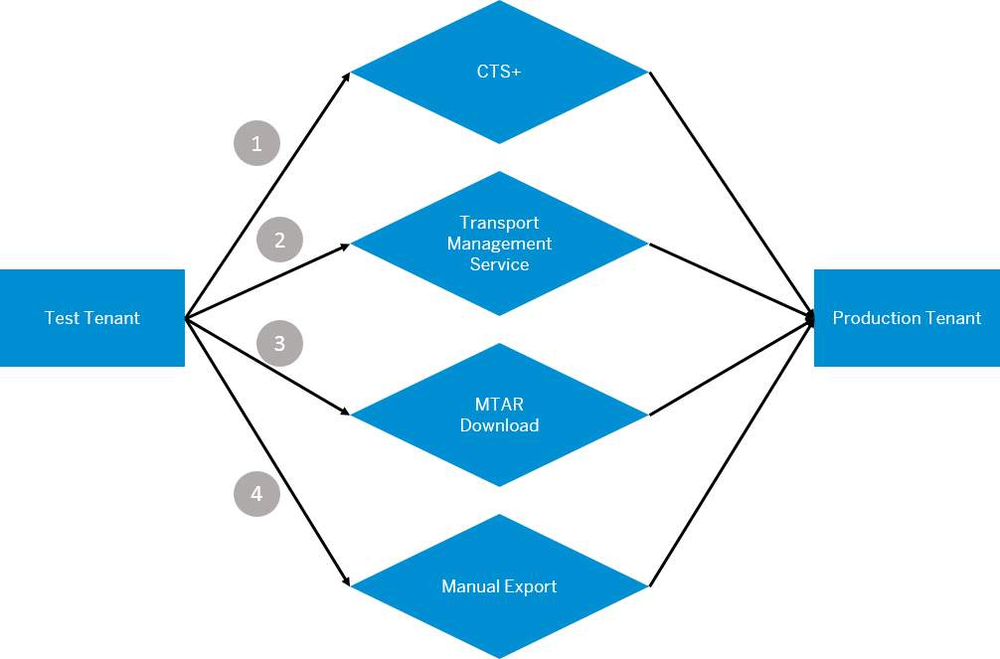

<!-- loioe3c79d65aa604b80992e20609881ad7a -->

# Content Transport

Reuse content across multiple tenants. Export integration content from one \(source\) tenant and import it on another \(target\) tenant.

Let us consider an example where you have two tenants – test and production. You design and test an integration flow on the test landscape and it works as expected. Instead of redesigning the integration flow on the production landscape, you can reuse the integration content that you've tested in the test landscape in the production landscape as well.

There are four content transport options:

> ### Remember:  
> There are different criteria that help you to decide on a transport option. Before you pick your choice of transport option, see [Decision Help for Choosing the Right Content Transport Option](decision-help-for-choosing-the-right-content-transport-option-19e0e73.md).

<table>
<tr>
<th valign="top">

Transport Option

</th>
<th valign="top">

Description

</th>
</tr>
<tr>
<td valign="top">

CTS+

</td>
<td valign="top">

With a single step, transport integration content from one tenant to another through the CTS+ system.

For more information, see [Content Transport Using CTS+](content-transport-using-cts-3cdfb51.md).

</td>
</tr>
<tr>
<td valign="top">

Transport Management Service

</td>
<td valign="top">

With a single step, transport integration content from one tenant to another through the Cloud Transport Management service.

For more information, see [Content Transport Using Cloud Transport Management](content-transport-using-cloud-transport-management-d458b17.md).

</td>
</tr>
<tr>
<td valign="top">

MTAR Download

</td>
<td valign="top">

Download an MTAR file from the source tenant and manually upload the same file to a CTS+ system or Cloud Transport Management service.

In the Neo environment, you can deploy an MTAR file to a target Cloud Integration tenant from the subscriber account \(through *Solutions*\).

For more information, see [Content Transport using MTAR Download](content-transport-using-mtar-download-c111710.md).

</td>
</tr>
<tr>
<td valign="top">

Manual export and import

</td>
<td valign="top">

Manually export integration content from the source tenant and manually import this content to the target tenant.

For more information, see [Content Transport using Manual Export and Import](content-transport-using-manual-export-and-import-fd23e14.md).

</td>
</tr>
</table>

> ### Note:  
> -   If the configuration or the transport results in an error, the error codes are displayed along with the error message.
> 
> -   The externalized parameters/configured values of the integration flows aren't overwritten during a content re-transport.
> 
> -   If the standard/pre-shipped integration packages are transported to the target tenant, the updates on those packages aren't available in the target tenant.

<a name="loioe3c79d65aa604b80992e20609881ad7a__section_i3f_srf_bqb"/>

## Selective Transport of Integration Artifacts

You can select one or more integration artifacts that were modified or updated, and transport them to another tenant. See blog on: [Transport at Artifact Level](https://blogs.sap.com/2021/06/21/sap-cloud-integration-transport-at-artifact-level/).

> ### Remember:  
> -   A package is the container for an artifact. So, when you transport only a selected artifact, you only see the package in your transport request. The transported package in the target tenant contains only the artifact that you transported.
> 
> -   Artifacts in the draft version can't be transported.
> 
> -   A Function Libraries artifact can't be transported independently. You must transport the package that contains the Function Libraries artifact.

You can't transport those artifacts that are protected with access policies in the source tenant. The constraint is also applicable when you transport an artifact that is already present in the target tenant protected with access policies. For more information in how to manage access policies for cloud environments, see [Creating Custom Roles for Access Policies](creating-custom-roles-for-access-policies-7db3c87.md).

[Enabling Content Transport, Cloud Foundry Environment](enabling-content-transport-cloud-foundry-environment-452c677.md "All the tasks mentioned here are one-time activities. The tenant administrator performs these tasks to enable content transport.")

[Guidelines and Best Practices for Content Transport](guidelines-and-best-practices-for-content-transport-8a8aa38.md "Cloud Integration offers different options to transport integration content. There are certain criteria that help you to decide which option to choose for your integration project.")

