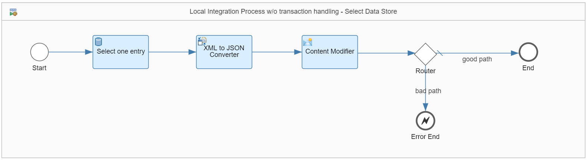

<!-- loio90628e9aa78f49c29abaecb77553614c -->

# Control the Number of Simultaneously Opened Database Connections

An integration flow must be designed following the guidance to control the number of simultaneously opened database connections.

<a name="loio90628e9aa78f49c29abaecb77553614c__section_jys_p3q_tjb"/>

## Implementation

Writing data to storage exposed in SAP Integration Suite requires appropriate management of the associated database transaction. If transaction handling is activated within an integration flow, the related database transaction is only committed if the whole integration flow execution is completed successfully. If an error occurs, the transaction is rolled back and the data isn't written to storage. When transaction handling is deactivated, the data is committed directly when the processing step in the integration flow is executed. Each database transaction requires a dedicated connection to the database. If too many connections are opened simultaneously, the number of available connections to the database can potentially be exhausted. In such a case, no more data can be read from, or written to the database.

By default, each runtime node has 8 database connections. The number can be increased if necessary. In any case, the number of concurrent database connections is limited. Therefore, ensure that single database transactions are kept open for as short a time as possible. The longer a database transaction is kept open, the more likely it is that the limit is hit due to other transactions that are opened in parallel.

On the other side, you need to set up your integration model in such a way that data consistency is kept end-to-end across your integration scenario. An integration scenario can contain multiple flow steps and adapters that execute transactions on the database. Depending on your specific scenario, you need to ensure that all steps belonging together are executed in 1 transaction so that data is either persisted or rolled back in all transactional resources.

On the first glance, these requirements are at odds with each other. A proper modeling of your integration scenario, therefore, is a challenge: On the 1 hand, you need to configure the transaction as long as needed for a consistent runtime execution. On the other hand, keep the transaction as short as possible.

The following example scenario illustrates JDBC transaction handling for different situations. It helps you to better understand the behaviour of the different configuration options and to choose the right setting for your integration model always keeping the limited resources in mind.

<a name="loio90628e9aa78f49c29abaecb77553614c__section_zgl_bcw_glb"/>

## Implementation

The example integration flow *Manage Resources - Control DB Connections* consists of a main Integration Process and 2 sub processes \(Local Integration Processes\). In the main Integration Process, product information is fetched via an OData call. Afterwards, certain database transactions are carried out. Here, data consistency across all those database transactions needs to be guaranteed.

The main Integration Process is designed in the following way:

There are 2 options to configure transaction handling for the scenario:

-   Configure the JDBC transaction in the main Integration Process.

    The database transaction is already opened on the database at the beginning of the overall process and kept open until the whole processing ends. Depending on the complexity of the overall process, the transaction is kept for a long period. This behavior is to be avoided.

-   Configure the JDBC transaction in the Local Integration Processes.

    The transactions open only as short as possible and as long as needed.

To meet the discussed requirements, the database transaction is modeled in the Local Integration Processes.

In the main Integration Process, the parameter *Transaction Handling* is set to *Not Required* \(tab *Processing* when shape *Integration Process w/o transaction handling* is clicked\).

The first Local Integration Process *Local Integration Process w/ transaction handling - Write Data Store* is designed in the following way.

It performs the following steps:

1.  It writes the product information \(fetched from the WebShop\) into a data store.

    The name of the data store is *ManageResources-ControlDBConnections*.

2.  It filters the message based on a specific product category.

3.  It writes the subset of products into the same data store.

The subsequent processing steps with the Router simulate either a successful delivery or an error. Which route is taken depends on a header that you can define when testing the scenario.

Both write operations are to be carried out within the same transaction to ensure data consistency. That means, both entries are either to be committed or to be rolled back. This can be ensured by selecting *Required for JDBC* for the *Transaction Handling* parameter \(tab *Processing* when shape *Local Integration Process w/ transaction handling - Write Data Store* is clicked\).

The 2nd Local Integration Process *Local Integration Process w/o transaction handling - Select Data Store* is designed in the following way.

It selects 1 entry from the data store created in the first Local Integration Process.

On successful processing of the Local Integration Process, the entry is deleted from the data store. To configure this behavior, the parameter *Delete On Completion* is selected for this step \(*Processing* tab when data store Select step *Select one entry* is clicked\).

The *Delete On Completion* feature helps you to ensure data consistency in a most efficient way. When selected, you don't need to keep the transaction for the whole processing within the Local Integration Process. Nevertheless, it is ensured that deletion is only accomplished after successful message processing. Therefore, there is no need to select a transaction handling. Instead of this, the *Transaction Handling* parameter is set to *From Calling Process* \(tab *Processing* when Local Integration Process shape *Local Integration Process w/o transaction handling - Select Data Store* is clicked\).

Note that for the main Integration Process the parameter *Transaction Handling* is set to *Not Required*. Therefore, for the 2nd Local Integration Process it is not required either.

The subsequent integration flow steps do not require any transaction handling.

The subsequent processing steps with the Router simulate either a successful delivery or an error. Which route is taken depends on a header that you can define when testing the scenario.

<a name="loio90628e9aa78f49c29abaecb77553614c__section_qpp_nhw_glb"/>

## Executing the Scenario

When testing the scenario, you provide 2 header keys with the inbound request to simulate the different situations: `errorWrite` and `errorSelect`. The following combinations lead to the following results:

> ### Note:  
> If you use Postman together with the Postman collection provided with the package, you can use the following requests.

-   Request *ControlDBConnections - Write & Select ok*:

    If you choose `errorWrite` equals `false` and `errorSelect` equals `false`, both Local Integration Processes are successfully carried out. The 1st Local Integration Process creates 2 entries in the data store, while the 2nd Local Integration Process deletes one afterwards. Hence, you see 1 entry only after successful processing of the overall Integration Process.

-   Request *ControlDBConnections - Write fails*:

    If you choose `errorWrite` equals `true` and `errorSelect` equals `false`, the first Local Integration Process fails and both database write operations are rolled back. Finally, there won’t be any entry in the data store.

-   Request *ControlDBConnections - Select fails*:

    If you choose `errorWrite` equals `false` and `errorSelect` equals `true`, the first Local Integration Process is successfully carried out, and 2 entries are created in the data store. The 2nd Local Integration Process fails and therefore deletion of 1 entry is not accomplished. You find both entries in the data store.

> ### Note:  
> If you choose `errorWrite` equals `true`, you can choose any value for `errorSelect`. The 1st Local Integration Process fails and hence the 2nd Local Integration Process isn't processed anyway. Both data base write operations are rolled back. Finally, there isn't any entry in the data store.

For more information, check out the following information:

-   [Cloud Integration – How to configure Transaction Handling in Integration Flow](https://blogs.sap.com/2017/05/31/cloud-integration-how-to-configure-transaction-handling-in-integration-flow/)

-   [Define Data Store Operations](define-data-store-operations-79f63a4.md)

-   [Define Transaction Handling](define-transaction-handling-2a5d4bc.md)

