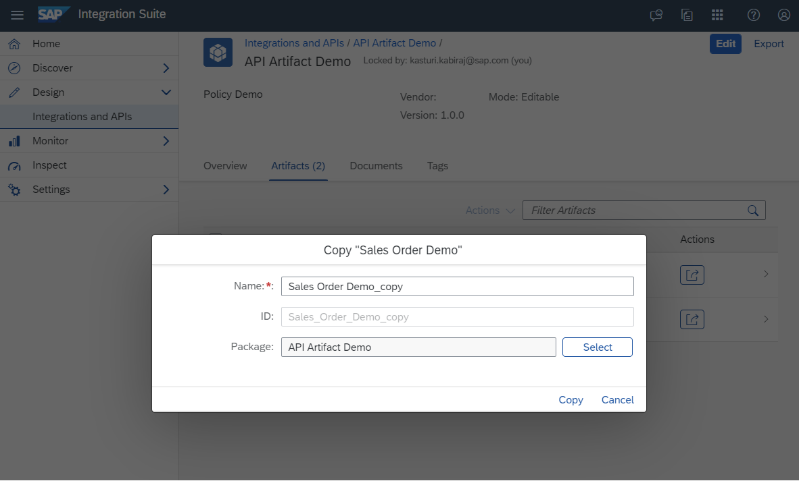

<!-- loio820c9e8219ca4ab88c7a80950c6fe360 -->

<link rel="stylesheet" type="text/css" href="../css/sap-icons.css"/>

# Copying an API Artifact

You may want to create a copy of an existing API artifact with all its configurations and policies intact. This can be useful when you want to create a similar API but with some modifications or variations. The copy feature allows you to quickly duplicate the API artifact and make the necessary changes without starting from scratch.You can create a duplicate of an API artifact by copying it within the same package or in a different integration package within the same SAP Integration Suite subscription.

<a name="loio820c9e8219ca4ab88c7a80950c6fe360__prereq_rnp_v53_b2b"/>

## Prerequisites

You are assigned the *PI\_Integration\_Developer* role.

<a name="loio820c9e8219ca4ab88c7a80950c6fe360__context_snp_v53_b2b"/>

## Context

APIs often have multiple policies associated with them, such as authentication, rate limiting, caching, and transformation policies. When you copy an API artifact, all the associated policies are also copied, allowing you to maintain consistency across multiple APIs. This can save time and effort in configuring policies for each API individually.

To copy an API artifact, proceed as follows:

<a name="loio820c9e8219ca4ab88c7a80950c6fe360__steps_tnp_v53_b2b"/>

## Procedure

1.  Log on to SAP Integration Suite.

2.  Choose the navigation icon on the left and choose *Design* \> *Integrations and APIs*.

3.  Select the *<integration package\>* from where you want to copy the API artifact.

4.  On the *<integration package\>* details page, choose *Artifacts*.

5.  Choose the  Action icon against the required API artifact and then select the *Copy* option.

6.  In the *Copy <API Artifact\>* dialog box, the details for each attribute is pre filled.

    By default, "\_copy" will get appended to the *Name*. However, you have the option to change the *Name* and provide a unique name for the API artifact you are copying. When you change the *Name*, the *ID* will be automatically generated.

    > ### Note:  
    > If you try to copy the API artifact with the same name, the copy action will fail and display the following error: "The <API artifact\> could not be copied because an API artifact with the same ID already exists. Please edit the name to modify the ID and try again.".
    > 
    > Whether you're copying an API artifact within the same integration package or a different package, you must provide a unique name for the copied API artifact.

    

    > ### Note:  
    > The name should start with an alphabet or an underscore \(\_\). It can also include numbers, spaces, periods, or hyphens \(-\), but it must not end with a period \(.\)

7.  To copy this API artifact to an Integration package of your choice, choose *Select*.

    In the *Package Selection* dialog, search for and select the desired package.

8.  Choose *Copy* to initiate the copying process.

<a name="loio820c9e8219ca4ab88c7a80950c6fe360__result_av2_h23_31c"/>

## Results

After the copying process is finished, you will receive a success message instructing you to go to the package where the API artifact has been copied.

You can access the API artifact in view mode, allowing you to download, deploy, and copy the API artifact. If you want to delete the API artifact, simply switch to edit mode by selecting the *Edit* option.

**Related Information**  

[Adding an API Artifact](adding-an-api-artifact-c2fe62c.md "Add an API artifact to an package.")

[Policy Definition and Types of Policies](policy-definition-and-types-of-policies-c744df5.md "You can define the behavior of an API by using policy steps.")

[Request Reply Step for API Artifact](request-reply-step-for-api-artifact-a0b3712.md "You can use this step to call an external receiver system in a synchronous step and get back a response.")

[Deploying an API Artifact](deploying-an-api-artifact-b70e7ec.md "After creating an API artifact, it is necessary to deploy it on the chosen runtime profile in order to make it executable and ready for use.")

