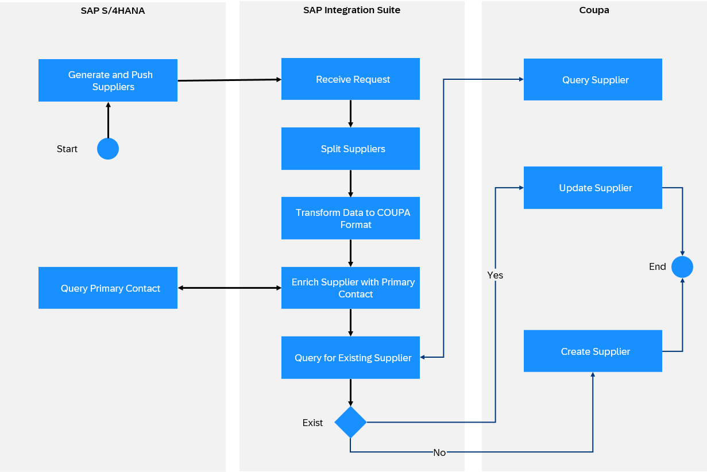

<!-- loio648ac016b9bc49288c7a86ee7a4a1972 -->

# Coupa Receiver Adapter

The Coupa receiver adapter connects SAP Integration Suite to Coupa. Coupa is a business spending management software. The Coupa adapter helps you exchange data between the two systems.

> ### Note:  
> This adapter is available on SAP Business Accelerator Hub.
> 
> For more information, see [Consuming Integration Adapters from SAP Business Accelerator Hub](consuming-integration-adapters-from-sap-business-accelerator-hub-b9250fb.md).
> 
> The availability of the adapter is dependent on your SAP Integration Suite service plan. For more information about different service plans and their supported feature set, see SAP Notes [2903776](https://launchpad.support.sap.com/#/notes/2903776) and [3188446](https://launchpad.support.sap.com/#/notes/3188446).

> ### Note:  
> This adapter exchanges data with a remote component that might be outside the scope of SAP. Make sure that the data exchange complies with your company’s policies.

<a name="loio648ac016b9bc49288c7a86ee7a4a1972__section_b2w_j5b_3bc"/>

## How the Coupa Receiver Adapter Works

If you have configured a Coupa receiver adapter, the data exchange is performed as follows at runtime: The SAP through SAP Integration Suite tenant sends the request to Coupa \(this is a receiver system\), the Coupa works on the request and sends back the data to the SAP.

For Example, SAP S4/HANA generates and pushes the list of suppliers to be copied to Coupa. SAP Integration Suite receives the request and transforms it to the Coupa format. SAP Integration Suite then queries the existing suppliers in Coupa, updates the data for them, and creates a new supplier for the non-existent suppliers.

The following diagram illustrates the example.

<a name="loio648ac016b9bc49288c7a86ee7a4a1972__section_usz_45b_3bc"/>

## Configuring the Coupa Receiver Adapter

Once you have created a receiver channel and selected the Coupa receiver adapter, you can configure the following attributes.

Select the *Connection* tab.

The *Connection* tab contains the connection and the authentication parameters for the Coupa. The adapter supports only OAuth 2.0 authentication type.

**Connection**

<table>
<tr>
<th valign="top">

Parameter

</th>
<th valign="top">

Description

</th>
</tr>
<tr>
<td valign="top">

*Address* 

</td>
<td valign="top">

Specifies the recipient's endpoint URL, this is Coupa tenant’s URL of the organization.

Example:

`https://<your_coupa_instance>.coupacloud.com`

</td>
</tr>
<tr>
<td valign="top">

*OAuth Credential Name* 

</td>
<td valign="top">

Specifies the name of the *User Credentials* artifact configured or saved under *Monitor* \> *Manage Security* \> *Security Material*. It contains the Coupa OAuth key and client secret pair. This property enables the system to fetch the security token from the keystore for authentication.

</td>
</tr>
<tr>
<td valign="top">

*Scopes* 

</td>
<td valign="top">

Specifies the permissions configured in Coupa. Enter the different scope values with a space in between.

Example:

`core.accounting.read core.account.write core.budgeting.write`

</td>
</tr>
<tr>
<td valign="top">

*Connection Timeout* 

</td>
<td valign="top">

Specifies the connection timeout in milliseconds. This timeout allows the user to configure the maximum waiting time for the connection to be established between SAP and Coupa.

Example:

`3000`

</td>
</tr>
<tr>
<td valign="top">

*Response Timeout* 

</td>
<td valign="top">

Specifies the response timeout in milliseconds. This timeout allows the user to configure the maximum waiting time for SAP until a response is received from Coupa.

Example:

`3000`

</td>
</tr>
</table>

The *Processing* tab contains all operation configurations for the Coupa adapter.

**Processing**

<table>
<tr>
<th valign="top">

Parameter

</th>
<th valign="top">

Description

</th>
</tr>
<tr>
<td valign="top">

*Operation* 

</td>
<td valign="top">

To access and exchange data with Coupa, you can choose one of the provided operations. Here, you specify the type of action you want to run in Coupa.

</td>
</tr>
<tr>
<td valign="top">

*Resource* 

</td>
<td valign="top">

Select the name of the Coupa resources to perform the API operation. It can be any of the Coupa defined resources like reference data resource, transactional resources or shared resources or any user defined custom object resources. This is an editable dropdown field. You can manually add any other resources that are not listed in the dropdown.

> ### Note:  
> Since the dropdown is editable, ensure you do not leave the operation field blank.

</td>
</tr>
<tr>
<td valign="top">

*Resource Parameters* 

</td>
<td valign="top">

To specify the resource key and value in case resource path included parameters. For example, if Account/:id is the resource, name should be specified with `id`, and `<account Id>` value should be specified as corresponding value pair. This is mostly used in Get Resources, Modify Resources and Update Resource Operations.

</td>
</tr>
<tr>
<td valign="top">

*Return Object Fields* 

</td>
<td valign="top">

To specify only the set of fields to be passed in the response payload. The return objects format should be in JSON.

For example:

`["firstname","lastname",{"roles":["id","name"]}]`

</td>
</tr>
<tr>
<td valign="top">

*Payload Format* 

</td>
<td valign="top">

Specifies the format of the request message to be sent to and the response to be returned from Coupa. Values include *Application/XML* and *Application/JSON*.

Default value: *Application/XML*

</td>
</tr>
<tr>
<td valign="top">

*Data from Attachment* 

</td>
<td valign="top">

Specify whether the attachment object should be obtained from an attachment of the message exchange in SAP Integration Suite or the from the body in SAP Integration Suite.

> ### Note:  
> The Create Resource operation allows working with attachments. After selecting a resource including attachments such as invoices/:invoice\_id/attachment, additional options appear.

</td>
</tr>
<tr>
<td valign="top">

*Attachment Name* 

</td>
<td valign="top">

When selecting data from attachment, specify the name of the attachment on the exchange in SAP Integration Suite to retrieve the file.

Example:

`Filename.zip, ${property.filename}.zip`

This field appears when you select *Data from Attachment*.

</td>
</tr>
<tr>
<td valign="top">

*File Name* 

</td>
<td valign="top">

Specify the name of the file to be uploaded to Coupa.

</td>
</tr>
<tr>
<td valign="top">

*Type* 

</td>
<td valign="top">

Specify the attachment type expected by Coupa.

Default value: *file*

</td>
</tr>
<tr>
<td valign="top">

*Attachment Properties* 

</td>
<td valign="top">

Specify the key and value in case attachment includes parameters. You can add Property Name and Property Value pairs for various fields like file-url, linked-to, intent, text, url.

</td>
</tr>
<tr>
<td valign="top">

*Limit* 

</td>
<td valign="top">

Specify the limit to query records with maximum of 50 records.

Example: `20` 

When auto pagination is enabled the limit value does not work as all the records will be queried or up to the pre-defined limit value of 100.

> ### Note:  
> Query Resource operation allows querying of any Coupa Resource. After selecting this operation additional fields appear that help you to customize your query requests.

</td>
</tr>
<tr>
<td valign="top">

*Offset* 

</td>
<td valign="top">

Specify the offset value for the number of records to be acquired after.

Example: `20`

</td>
</tr>
<tr>
<td valign="top">

*Auto Pagination* 

</td>
<td valign="top">

Enable to retrieve all the records in case the query result has more than one page of records.

</td>
</tr>
<tr>
<td valign="top">

*Query Filter Parameter* 

</td>
<td valign="top">

Specify the querying parameters to use to retrieve the records.

This parameter has the following options:

-   *Name*

-   *Operator*

-   *Value*

Example:

`Name Contains Created date`

`Operator Contains Greater Than`

`Value Contains 2202-01-01` 

</td>
</tr>
<tr>
<td valign="top">

*Order by Field* 

</td>
<td valign="top">

Specify the field or resource property to perform the sorting of the queried records.

</td>
</tr>
<tr>
<td valign="top">

*Sorting Direction* 

</td>
<td valign="top">

Specify the sorting order of the records. There are the following options:

-   *Ascending*

-   *Descending*

The default value is *Ascending*.

</td>
</tr>
</table>

