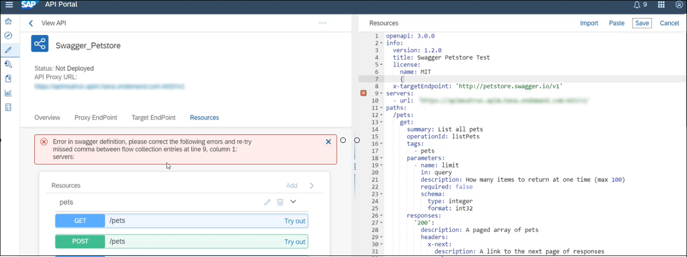

<!-- loioc0842d5698eb4143b8cfa528b5435cf9 -->

# Create an API

This topic describes the steps to create an API from the Integration Suite.

## Prerequisites

To build APIs, you must do the following:

-   Make sure that you have the REST, OData, or SOAP URL of the service that you want to expose as an API.
-   Browse for a service on a specific API provider. To do so, you must configure the required API provider on the *Configure* tab.
-   You’ve created an instance against ORG/USER secret for creating an API Proxy from an Open Connector type API Provider.

## Context

Instead of consuming services directly, application developers can access APIs exposed via API Management. You do so, by creating an API proxy that camouflages the service you want to expose. The API maps a publicly available HTTP endpoint to back-end services. Creating this API proxy lets API Management handle the security and authorizations required to protect, analyze, and monitor your services.

<a name="loioc0842d5698eb4143b8cfa528b5435cf9__steps_w2q_3hg_ks"/>

## Procedure

1.  Log on to the Integration Suite.

2.  Choose the navigation icon on the left and choose *Design* \> *APIs*.

    A list of registered APIs appears in the catalog.

    Alternatively, browse for a service on a specific API provider. To do so, you must configure the required API provider on the *Configure* \> *APIs* tab. You can view the number of calls made for an API in the current month. The data is visible for each API in the *Calls* column and also on the details screen of the individual API.

    You can click the refresh icon to obtain the latest data.

    > ### Note:  
    > There’s some delay in reflecting the latest data.

    The notion used to display the data follows metric specifications, for example:

    -   999 shows as 999 and 1000 shows as 1k
    -   999000 shows as 999 K and 1000000 shows as 1M
    -   1500000 shows as 1.5M and 1000000000 shows as 1G

3.  To expose a service as an API, choose *Create*.

4.  If you want to browse for an OData service for a provider that you’ve already configured, proceed as follows:

    1.  Select the *API Provider* radio button.

    2.  Select the required open connector type provider from the *API Provider* dropdown list.

        The dropdown list contains the providers that you’re connected to. If the provider you need isn’t listed here, add it on the *Configure* tab.

    3.  To view the list of OData services available in the provider, choose *Discover*.

    4.  Select the required service.

    5.  If you want to link the API to the target server, select the checkbox *Link API Provider*.

        If you deselect the *Link API Provider* checkbox, the API proxy is no longer linked to any API provider. It now acts just like a URL-based API. However, since the API created is originally of type OData, you can’t add or delete resources to it.

        Also, since such APIs aren’t linked to any API provider, you can’t use the *Synchronize* option to update the API with the latest version that might be available in the backend.

    6.  Select a virtual host alias from the *Host Alias* dropdown.

        The details of the API name, description, API base path, and service type are automatically populated.

    7.  Optional: Enter a version for your API proxy.

        When you choose to version your API proxy, its name is appended with the version, and its basepath are prepended with the version. For example, if the version you enter is v1, the name is Name\_v1, and the basepath is /v1/SalesOrder. For more information, see [API Versioning](api-versioning-b3cda3b.md)

    8.  Choose *Create*.

    9.  If you want to add SAP documentation annotations to the API documentation, choose *Yes* for *Documentation*.

        > ### Note:  
        > This field is only displayed if you’re fetching services from SAP Gateway Systems. For more information about SAP documentation annotations, see [Extended Support of Long Texts in the Metadata](http://help.sap.com/saphelp_gateway20sp10/helpdata/en/30/6e8c537c8fcc26e10000000a4450e5/frameset.htm).

5.  If you want to create a proxy for an Open Connector instance for a provider that you’ve already configured, proceed as follows:

    1.  Select the *API Provider* radio button.

    2.  Select the required provider from the *API Provider* dropdown list.

        The dropdown list contains the providers that you’re connected to. If the provider you need isn’t listed here, add it on the *Configure* \> *APIs* tab.

    3.  To view the list of instances available in the provider, choose *Discover*.

    4.  Select the required instance.

    5.  Link the API to the target server, and select the checkbox *Link API Provider*.

        If you deselect the *Link API Provider* checkbox, the API proxy is no longer linked to any API provider. It now acts just like a URL-based API. However, since the API created is originally of type OData, you can’t add or delete resources to it.

        Also, since such APIs aren’t linked to any API provider, you can’t use the *Synchronize* option to update the API with the latest version that might be available in the backend.

    6.  Select a virtual host alias from the *Host Alias* dropdown.

        The details of the API name, description, API base path, and service type are automatically populated.

        > ### Note:  
        > Name and basepath shouldn’t contain spaces.

    7.  Optional: Enter a version for your API proxy.

        When you choose to version your API proxy, its name is appended with the version, and its basepath is prepended with the version. For example, if the version you enter is v1, the name is Name\_v1, and the basepath is /v1/SalesOrder. For more information, see [API Versioning](api-versioning-b3cda3b.md)

    8.  Choose *Create*.

        On creating the proxy, an encrypted key value map is created with the following name `apim.oc.instance.token` and key name `default`. Also, an open connector policy is attached to the incoming POST flow request of the target endpoint of the APIProxy.

        > ### Note:  
        > -   For an API Proxy, you can have only one open connector policy attached and the content of the open connector policy can’t be modified.
        > 
        > -   An API Proxy consists of a virtual host and a base path. The base path can be identical for multiple API proxies, provided the API proxies have different virtual hosts. This means, for an API Proxy, the combination of the virtual host and base path should be unique.
        > 
        >     The example below explains the same, where AP1 is proxy 1, AP2 is proxy 2, VH1 is Virtual Host 1, VH2 is the Virtual Host 2, and BP\(A\) is the base path.
        > 
        >     Example: AP1 = VH1+ BP\(A\)
        > 
        >     AP2 = VH2 + BP\(A\)
        > 
        > -   On deleting the proxy, the encrypted key value map created above is also deleted. Further, while exporting the API, encrypted key value map created above isn’t exported with the API.

6.  If you want to browse for an existing API proxy, proceed as follows:

    1.  Select the *API Proxy* radio button.

        To view all available API proxies, choose *Discover*. Select the required API proxy from the dropdown list.

    2.  Enter a name and description for the API.

    3.  Optional: Enter a version for your API Proxy.

        When you choose to version your API Proxy, its name is appended with the version, and its basepath is prepended with the version. For example, if the version you enter is v1, the name is Name\_v1, and the basepath is /v1/SalesOrder. For more information, see [API Versioning](api-versioning-b3cda3b.md)

    4.  Select a virtual host alias from the *Host Alias* dropdown.

    5.  In the *API Base Path* field, provide a path prefix for the API.

7.  If you have the URL of the OData service, proceed as follows:

    1.  Select the *URL* radio button.

    2.  Enter the OData service URL in the *URL* field. For example, http://<***host***\>:<***port***\>/SFlight.

        > ### Note:  
        > Ensure that the service URL you provide doesn’t redirect to a different URL. That is, check if the service URL you’re trying to access is temporarily or permanently moved to a different location. If it does so, then it’s recommended that you provide the new location \(redirected URL, if exists\) of the service.
        > 
        > For more information about how to handle URL redirection, see [Handling URL Redirects in an API Proxy Using Policies](handling-url-redirects-in-an-api-proxy-using-policies-9e63c01.md).

    3.  Enter a name and description for the API.

    4.  Optional: Enter a version for your API Proxy.

        When you choose to version your API Proxy, its name is appended with the version, and its basepath is prepended with the version. For example, if the version you enter is v1, the name is Name\_v1, and the basepath is /v1/SalesOrder. For more information, see [API Versioning](api-versioning-b3cda3b.md)

    5.  Select a virtual host alias from the *Host Alias* dropdown.

    6.  In the *API Base Path* field, provide a path prefix for the API. For example, ***v1/SFlight***.

    7.  In the *Service Type* field, enter ***OData***.

8.  If you have the URL of the REST service, proceed as follows:

    1.  Select the *URL* radio button.

    2.  Enter the REST-based service URL in the *URL* field. For example, http://<***host***\>:<***port***\>/SFlight.

        > ### Note:  
        > Ensure that the service URL you provide doesn’t redirect to a different URL. That is, check if the service URL you’re trying to access is temporarily or permanently moved to a different location. If it does so, then it’s recommended that you provide the new location \(redirected URL, if exists\) of the service.
        > 
        > For more information about how to handle URL redirection, see [Handling URL Redirects in an API Proxy Using Policies](handling-url-redirects-in-an-api-proxy-using-policies-9e63c01.md).

    3.  Enter a name and description for the API.

    4.  Optional: Enter a version for your API Proxy.

        When you choose to version your API Proxy, its name is appended with the version, and its basepath is prepended with the version. For example, if the version you enter is v1, the name is Name\_v1, and the basepath is /v1/SalesOrder. For more information, see [API Versioning](api-versioning-b3cda3b.md)

    5.  Select a virtual host alias from the *Host Alias* dropdown.

    6.  In the *API Base Path* field, provide a path prefix for the API. For example, ***v1/SFlight***.

    7.  In the *Service Type* field, enter ***REST***.

9.  If you have the URL of the SOAP service, proceed as follows:

    1.  Choose the *URL* radio button.

    2.  Enter the SOAP service URL in the *URL* field. For example, http://<***host***\>:<***port***\>/SFlight.

    3.  Enter a name and description for the API.

    4.  Optional: Enter a version for your API Proxy.

        When you choose to version your API Proxy, its name is appended with the version, and its basepath is prepended with the version. For example, if the version you enter is v1, the name is Name\_v1, and the basepath is /v1/SalesOrder. For more information, see [API Versioning](api-versioning-b3cda3b.md)

    5.  Select a virtual host alias from the *Host Alias* dropdown.

    6.  In the *API Base Path* field, provide a path prefix for the API. For example, ***v1/SFlight***.

    7.  In the *Service Type* field, choose ***SOAP***.

10. Choose *Create*.

    > ### Note:  
    > -   For an OData service, all the associated artifacts appear on the different tab pages mentioned below. The *Resources* tab lists all the resources associated with the API. The API documentation with SAP documentation annotations, if selected, is also fetched from the metadata.
    > 
    > -   For a SOAP- and REST-based service, the *Resources* tab appears. Add the resources manually.

    > ### Note:  
    > In case you want to restrict your users from accessing all the resources associated with the API Proxy, you need to create a new Product, add the required API to the Product, and select the resources for which you want to provide access. For more information, see [Create a Product](create-a-product-d769622.md). 

11. For a REST service, add a resource as follows:

    1.  Choose + \(*Add*\).

    2.  In the popup, enter a title and path prefix for the resource.

    3.  Select the methods that need to be supported for this resource.

    4.  Add descriptions in the editor and choose *Add*.

        The added resource appears on the *Resources* tab.

    5.  Choose *Add* to add more resources to the same API.

    6.  Proceed to Step 14.

12. For a SOAP service, add a resource as follows:

    1.  Choose + \(*Add*\).

    2.  Enter a title and specify the SOAP operation name in the path prefix.

    3.  Use the editor to enter the relevant API documentation in the description field, and choose *Add*.

        The added resource appears on the *Resources* tab. By default, only the *POST* operation is selected.

    4.  Choose *Add* to add more resources to the same API.

    5.  Proceed to Step 14.

13. For an OData service, select the methods that the application developer can perform:

    -   *Get*: Read an entity.
    -   *Post*: Create an entity.
    -   *Put*: Update an entity.

        > ### Note:  
        > API Management generates PUT operation as the default update operation. However, you can override the default update operation for API Proxy of type OData. For more information, see [Overriding the Default Update Operation for API Proxy of Type OData](overriding-the-default-update-operation-for-api-proxy-of-type-odata-4a12c59.md).

    -   *Delete*: Delete an entity.

    > ### Note:  
    > Only the supported methods for each resource appear on the UI. By default, only permitted methods are selected.

14. For a given resource, choose *Show/Hide* to view the list of properties and their associated API documentation. You can add descriptions for each resource in the editor.

    > ### Note:  
    > For a given resource, choose *Open API Designer* and correct the errors in swagger definition, if any. The error message displayed on the screen helps in error detection and correction. Choose *Save* after making the necessary corrections in the swagger file.
    > 
    > See the example in the following screen: 

15. To define policies on the API, go to the *Policies* tab. For more information about how to create a policy, see [Create a Policy](create-a-policy-c90b895.md).

16. If you want to define multiple proxy endpoints, navigate to *Proxy EndPoint* tab.

    In the *Proxy Endpoint Properties*section, choose *Add*. Enter the *Property Name* and the *Values*. For the Proxy Endpoint property specifications, see [Proxy Endpoint Properties](proxy-endpoint-properties-1705a92.md).

17. If you want to define multiple route rules, navigate to *Proxy EndPoint* tab. In the *Route Rules* section, choose *Add*.

    > ### Note:  
    > When the API is created, the default route rule is set. It points to the default target endpoint and no rule is attached to it. Use the option *None* to ensure that no request is routed to any target endpoint. If there are multiple route rules, the rules are evaluated in sequence as displayed on the screen.
    > 
    > For more information on how to define multiple target endpoints using Route Rule, see [Enable Dynamic Routing](enable-dynamic-routing-49cbe91.md).

18. If you want to define multiple target endpoints, navigate to *Target EndPoint* tab. In the *Target Endpoint Properties*section, choose *Add*.

    In the *Target Endpoint Properties*section, choose *Add*. Enter the *Property Name* and the *Values*. For the Target Endpoint property specifications, see [Target Endpoint Properties](target-endpoint-properties-edeed6a.md).

19. Once you’ve filled in all the required details of the API, you can select one of the following 2 actions for the API:

    <table>
    <tr>
    <th valign="top">

    Action

    
    </th>
    <th valign="top">

    Resulting API State

    
    </th>
    <th valign="top">

    Future Action on API

    
    </th>
    </tr>
    <tr>
    <td valign="top">

     *Save* 

    
    </td>
    <td valign="top">

    *Not Deployed:*API is available only in the Integration Suite, and isn’t available for product assignments.

    
    </td>
    <td valign="top">

    *Deploy*

    API is deployed and is ready for product assignments.

    
    </td>
    </tr>
    <tr>
    <td valign="top">

     *Deploy* 

    
    </td>
    <td valign="top">

     *Deployed*: Only deployed APIs can be selected for product publishing.

    
    </td>
    <td valign="top">

    *Undeploy*

    If any API is undeployed after being published, it’s removed from the developer portal. When the API is deployed again, the product is updated. You can bring down an API without having to delete it from the product assignment. You can’t undeploy an API if it’s the only one associated with the product.

    
    </td>
    </tr>
    </table>
    
20. 21. Once you’ve created an API, you can do the following:

    -   Go to the *Resources* tab, where you can test the API resource by using the *Operations* button beside it. For more information, see [Test APIs](test-apis-3ba6151.md).
    -   Go to more options and from the drop-down select *Synchronize*. This functionality updates the API with the latest version available in the back end.

        > ### Note:  
        > -   This functionality is available only for OData API proxies.
        > -   The discovered OData API proxies, which already exist and have their resource documentation in OAS 2.0 are rendered in OAS 2.0 after synchronization.
        > -   With OAS 3.0 support, the discovered OData API proxies, which have their resource documentation in OAS 3.0 are rendered in OAS 3.0 after synchronization.

**Related Information**  

[Create an API from API Designer](create-an-api-from-api-designer-26e1bbd.md "Model APIs in the Open API format that is available on the Integration Suite.")

