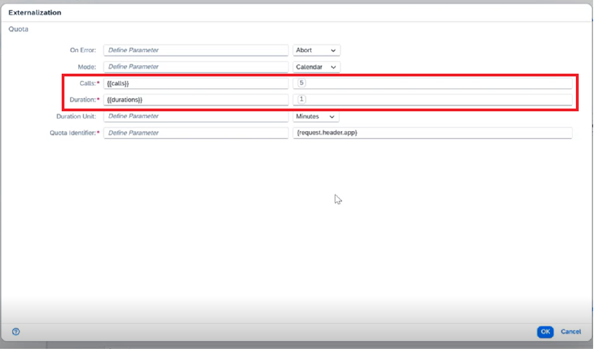

<!-- loio417e4e8ea4594776bb79becb5c82132b -->

# Create New Parameters in Externalization Editor

Create new parameters in the externalization editor to define configuration values that can be accessed dynamically at runtime. This allows API policies to retrieve externalized values without modifying the standard API artifact, enabling flexible, environment-specific configurations.

<a name="loio417e4e8ea4594776bb79becb5c82132b__prereq_brp_tyf_4fc"/>

## Prerequisites

The *Integration\_Provisioner* role collection should be assigned to you.

## Procedure

1.  Log on to SAP Integration Suite 

2.  From the left navigation pane, choose *Design* \> *Integrations and APIs* to view the list of integration packages.

3.  Select the *<integration package\>* where your API artifact is located.

4.  Choose the *Artifacts* tab, and click on the API artifact to open it.

5.  To externalize the parameters for a field/attribute in the policy step of the API artifact, choose the *Policies* tab.

    The *Policy Model* for the API artifact opens.

6.  Choose *Edit* to add a policy step on the request flow. For more information, see [Add Policies to the API Artifact](add-policies-to-the-api-artifact-c2b3e56.md).

7.  Double click on the policy to open the properties panel.

8.  To begin configuring the parameters for the fields within the policy settings, choose *Externalize* on the properties panel header.

    All the attributes that are available for externalization are displayed in the *Externalization* dialog.

    -   **Create a new parameter**:

        Enter the parameter in curly brackets in the relevant field and hit [Enter\].

        > ### Example:  
        > \{\{Parameter\_1\}\}

        Let's say you added a Quota policy to an API artifact and you wish to externalize the *Calls* attribute. You can define the attribute as*\{\{Calls\}\}* and set the default value to 5.

        Also, when externalizing values in the IP Filter policy, use double curly braces \(\{\{ \}\}\) to reference the IP address. For example, \{\{123.456.789\}\}.

    -   **Externalize the text area**:

        Enter the parameter in curly brackets in the text-area field and hit [Enter\].

        > ### Example:  
        > -   \{\{header\_message\}\}
        > 
        > -   \{\{header\_queryresponse\}\}

9.  Enter the value of the parameter under the *Parameter Value* field in the table that appears on the right side of the editor.

    

10. Choose *OK* on the *Externalization* dialog to return to the Policy Model. Finally, click *Save* on this page to save your changes.

<a name="loio417e4e8ea4594776bb79becb5c82132b__postreq_ekn_4fb_r2c"/>

## Next Steps

Navigate back to the *Artifacts* tab, select the API artifact that you just externalized and choose *Download*. A .zip file of the API artifact will be downloaded. You will be prompted to choose one of the following options for *Download Externalized Parameters*:

-   Default Values Only
-   Merge Configured and Default Values

When you import this .zip file into another tenant and create an API artifact, you’ll be presented with a *Configure* option. This allows you to configure the attributes in the policy settings without needing to manually set up all the attributes from scratch. Instead, you can focus on configuring only the attributes that have been externalized. For more information, see [Configure Externalized Parameters](configure-externalized-parameters-024b8fd.md).

