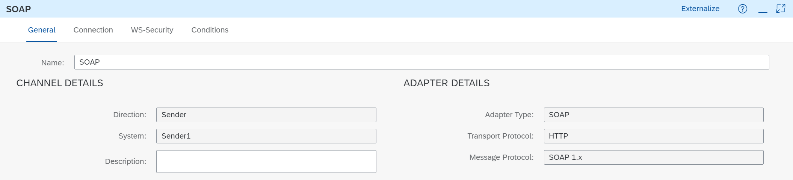

<!-- loio7b8f5fd1a1ef4096bb5386457dd85067 -->

# Create the SOAP Sender Channel

Create a SOAP channel to define how the sender calls the integration flow.

1.  Click the Sender shape. The context icons for the Sender appear.

    

    > ### Note:  
    > If you click the information icon, the version of the integration flow component is displayed.
    > 
    > Do not confuse the version of an individual integration flow component with the software version of SAP Cloud Integration. An integration flow component gets a new version each time a new feature is added to it by SAP. Let's imagine a situation where you started modeling an integration flow some time ago and now want to continue working on it. Let's assume that SAP has updated the software in the meantime. A new version of an integration flow step or shape that you have used is now available, containing a new feature. You can continue to use the old component version, but if you want to use the new feature you need to update to the new version.

2.  Click the arrow icon and drag and drop the cursor on the Start event.

    The list of available adapter types is displayed in a dialog.

3.  Choose the adapter type *SOAP* \> *SOAP 1.x*.

    The properties of the adapter are shown below the model.

    

4.  The *General* tab contains information such as the adapter type \(SOAP\), the direction \(sender\), and the message protocol \(SOAP 1.x\).

5.  Go to the *Connection* tab.

    Specify the following parameters:

    -   *Address*: This parameter defines the endpoint under which the integration flow can be called from the sender. Start the address with a slash, for example,`/FirstFlow`.

    -   *Service Definition*: Keep the option *Manual*. You would select the other option, *WSDL*, if you wanted to define your service based on an uploaded Web Service Description Language \(WSDL\) file.

        We do use a WSDL when setting up the SOAP sender, but this WSDL is only used to define the message structure. No further information from the WSDL is used to define the specifics of inbound message processing.

    -   *Message Exchange Pattern*: Keep *Request-Reply*, which means that the integration flow sends a response message to the sender.

    -   *Authorization* and *User Role*: You want to configure your first integration flow so that the inbound request is authenticated using basic authentication \(based on user credentials\). To keep it simple, you use your dialog user. During onboarding, you also made sure that the role `ESBMessaging.send` was assigned to your user \(and this setting was also used when configuring the SOAP client\).

        > ### Tip:  
        > Selecting *User Role* does not mean that you are determining the usage of basic authentication. *User Role* authorization only means that the permissions of the sender of the message are checked based on roles \(which are assigned to the user that is associated with the sender\).
        > 
        > However, note that if you select this authorization option, you can also configure other inbound authentication scenarios. You can, for example, configure client certificate authentication for the sender and add an additional step \(certificate-to-user mapping\) to map the certificate to a user whose permissions are checked \(based on the roles assigned to this user\).
        > 
        > Furthermore, *User Role* authorization is compatible with OAuth authentication.
        > 
        > For productive scenarios, we recommend using client certificate authentication with certificate-to-user mapping. However, to simplify the setup of this integration flow, we propose that you choose basic authentication - simply because it is much easier to configure the sender in this case.

        You can select other roles for inbound authentication \(if you have defined these roles for the runtime node in SAP BTP Cockpit\), but you don't use this option in this scenario.

    

**Related Information**  

[Authentication and Authorization Options \(Inbound\)](../40-RemoteSystems/authentication-and-authorization-options-inbound-983f2a5.md "When a client calls a server using a secure communication channel, two different kinds of checks are performed subsequently.")

