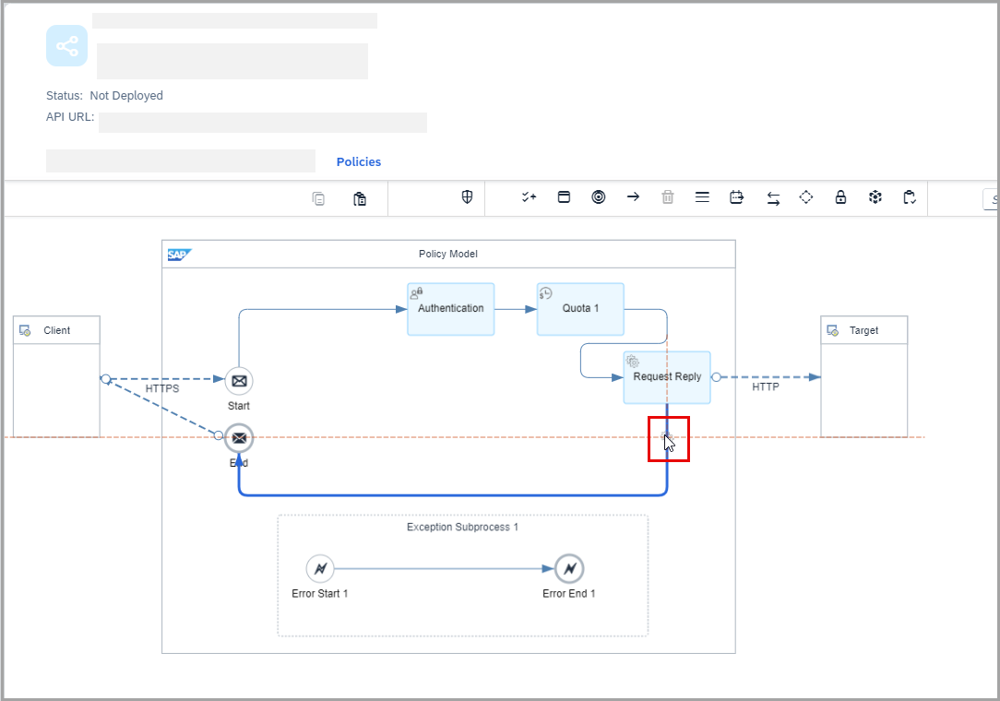

<!-- loiof08b0866f5ad404f98f16a4472fc8a63 -->

<link rel="stylesheet" type="text/css" href="../css/sap-icons.css"/>

# Creating Additional Request Reply Policy for API Artifact

If you are using Edge Integration Cell as your runtime profile, you can add an additional request reply policy to an API artifact to call an external HTTP\(S\) endpoint.

## Context

In certain scenarios, the API artifact may need to communicate with an external service. In such cases, you can use the request-reply policy as an exit point to connect to the external service.

By default, only one request reply policy is created when you create an API artifact. This initial request reply policy cannot be deleted. However, you can add more request reply policies to the request/response flow, enabling multiple service callouts.

## Procedure

1.  Log on to the Integration Suite.

2.  From the left navigation pane, choose *Design* \> *Integrations and APIs* to view the list of integration packages.

3.  Select the *<integration package\>* where you want to add an API artifact and choose *Edit*.

4.  On the*<integration package\>* details page, choose *Artifacts* and select an API artifact where you want to add the additional request reply policy.

5.  Select the *Policies* tab.

6.  To add a *Request Reply* policy to the API artifact, perform the following substeps.

    1.  In the palette, choose  \(Call\) and then choose :envelope:In the submenu, choose :gear:

        

    2.  Place the *Request Reply* shape in the policy model and connect it to the message path.

        To add this shape to the model, activate your pointing device somewhere inside the *Policy Model* box and release it. You can then further adjust the position of the shape. No further attributes are to be specified for this policy type.

        

        

7.  In the palette, select *Participants* \( icon\), select *Receiver*, and drop it outside the policy model.

    

8.  Create a connection between the request reply policy by selecting the :arrow_right:icon and connecting the arrow to the *Receiver*. Once the connection is established, configure the adapter type.

    Currently, only HTTP adapters are supported.

    

    

    

9.  Once you’ve added the additional request reply policy, you can select one of the following actions for the API:

    <table>
    <tr>
    <th valign="top">

    Action
    
    </th>
    <th valign="top">

    Description
    
    </th>
    </tr>
    <tr>
    <td valign="top">
    
    *Save* 
    
    </td>
    <td valign="top">
    
    Saves the artifact as *Draft* version.
    
    </td>
    </tr>
    <tr>
    <td valign="top">
    
    *Save as version* 
    
    </td>
    <td valign="top">
    
    Creates a new version of the artifact.

    Specify the version in the *Version Information* dialog. In the *Comment* section, you can add additional information specific to the artifact for later reference. This helps you determine the purpose of each version.
    
    </td>
    </tr>
    <tr>
    <td valign="top">
    
    *Deploy* 
    
    </td>
    <td valign="top">
    
    Deployes the API artifact.
    
    </td>
    </tr>
    <tr>
    <td valign="top">
    
    *Delete* 
    
    </td>
    <td valign="top">
    
    Deletes the API artifact from the package.
    
    </td>
    </tr>
    <tr>
    <td valign="top">
    
    *Cancel* 
    
    </td>
    <td valign="top">
    
    Ends your edit session without saving any of the changes you have made.
    
    </td>
    </tr>
    </table>
    
    > ### Caution:  
    > The request reply policy does not work with all available adapter types.
    > 
    > Adapters that can be used with additional request reply is:
    > 
    > -   HTTP — For more information, see [HTTP Receiver Adapter](https://help.sap.com/docs/integration-suite/sap-integration-suite/http-receiver-adapter?version=CLOUD).

    > ### Note:  
    > By default, headers present in the pipeline before the additional request reply policy are not propagated to the external callout.
    > 
    > If header propagation is required, the API developer must explicitly specify the desired headers in the Request Header section of the HTTP adapter configuration.
    > 
    > However, these pre-existing headers are still retained and remain accessible for any subsequent steps in the pipeline.
    > 
    > This behavior does not apply to the default request reply, where all headers are implicitly propagated to the backend by default.

    > ### Note:  
    > During resource path propagation, it is not propagated by default to any address configured in the additional request reply policy.
    > 
    > If a use case requires propagation of the resource path, the API developer must explicitly configure it by using a dynamic expression—such as `{property.camelhttppath}`—in the *Address* field of the additional request reply policy.
    > 
    > For example:`https://services.odata.org/V2/Northwind/Northwind.svc/Orders/{property.camelhttppath}`
    > 
    > This behavior does not apply to the default request reply, where the resource path is automatically propagated to the backend.

