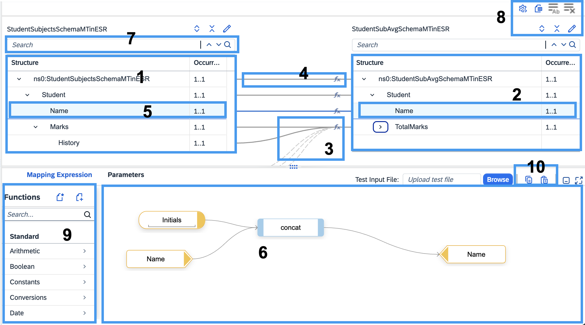

<!-- loio3d5cb7ff43fb4a4b9c28153472f6d0f1 -->

<link rel="stylesheet" type="text/css" href="../css/sap-icons.css"/>

# Creating Message Mapping as a Flow Step


<a name="loio3d5cb7ff43fb4a4b9c28153472f6d0f1__prereq_uzc_kfl_d2b"/>

## Prerequisites

You've added a message mapping step in the integration flow and defined the message paths.


## Context

> ### Remember:  
> There are currently certain limitations when working in the Cloud Foundry environment. For more information on the limitations, see SAP Note [2752867](https://me.sap.com/notes/2752867).

In this procedure, you understand the different ways of configuring a message mapping step and the associated mapping definition \(mmap\) file.

The supported file types for source and target messages are:

-   XML Schema Definitions \(XSD\)

-   OData V2/V4 metadata files with *.edmx* or *.xml* extensions

-   WSDL

    > ### Note:  
    > Reference to the remote resources isn't supported.
    > 
    > > ### Sample Code:  
    > > ```
    > > <?xml version="1.0" encoding="UTF-8"?>
    > > <wsdl:definitions xmlns:wsdl="http://schemas.xmlsoap.org/wsdl/" xmlns:bs="http://B.com" xmlns:ds="http://D.com" xmlns:emp="http://Employee.com" xmlns:p1="http://demoDisplayQueue" name="EmployeeDetails" targetNamespace="http://com.sap.copy.com">
    > >    <wsdl:documentation />
    > >    <wsdl:types>
    > >       <xsd:schema xmlns:xsd="http://www.w3.org/2001/XMLSchema" xmlns="http://com.sap.copy.com" targetNamespace="http://com.sap.copy.com">
    > >          <xsd:import namespace="http://Employee.com" schemaLocation="../../empWsdl/Employee.wsdl" />
    > >          <xsd:import namespace="http://B.com" schemaLocation="./mySchema/B.xsd" />
    > >          <xsd:import namespace="http://D.com" schemaLocation="mySchema/D.xsd" />
    > >          <xsd:complexType name="Employee">
    > >             <xsd:annotation>
    > >                <xsd:appinfo source="http://sap.com/xi/VersionID">abaed5bfea7111e4c82400000cbe4342</xsd:appinfo>
    > >             </xsd:annotation>
    > >             <xsd:sequence>
    > >                <xsd:element maxOccurs="unbounded" minOccurs="1" name="EmpAddress" type="Address" />
    > >                <xsd:element name="Id" type="emp:Employee" />
    > >                <xsd:element name="Name" type="bs:B" />
    > >                <xsd:element name="Dept" type="ds:D" />
    > >             </xsd:sequence>
    > >          </xsd:complexType>
    > >          <xsd:complexType name="Address">
    > >             <xsd:sequence>
    > >                <xsd:element maxOccurs="unbounded" minOccurs="1" name="Line" type="LineText" />
    > >             </xsd:sequence>
    > >             <xsd:attribute name="shelly" type="xsd:string" use="optional" />
    > >          </xsd:complexType>
    > >          <xsd:complexType name="LineText">
    > >             <xsd:sequence>
    > >                <!-- <xsd:element name="Text" type ="p2:Source_Person" />-->
    > >             </xsd:sequence>
    > >          </xsd:complexType>
    > >          <xsd:element name="EmployeeDetails" type="Employee" />
    > >       </xsd:schema>
    > >    </wsdl:types>
    > > </wsdl:definitions>
    > > ```

-   Swagger/OpenAPI Spec JSON file

    > ### Note:  
    > Before you upload the file, validate the schema of your Swagger/OpenAPI Spec JSON file using the [Swagger Editor](https://editor.swagger.io/).
    > 
    > JSON files based on Open API Spec versions 2.0 and 3.0 are supported.
    > 
    > -   The following message structures aren't supported while using Swagger/OpenAPI Spec JSON file:
    > 
    >     -   Object elements with no properties or with only additional properties
    > 
    >         > ### Sample Code:  
    >         > ```
    >         > "innererror": {
    >         > 			"description": "Object with empty properties"
    >         > 			"type": "object",
    >         > 			"properties": {}
    >         > 		}
    >         > ```
    >         > 
    >         > > ### Sample Code:  
    >         > > ```
    >         > > "message": {
    >         > > 			"description": "Object with no properties"
    >         > > 			"type": "object"
    >         > > 		}
    >         > > ```
    >         > 
    >         > > ### Sample Code:  
    >         > > ```
    >         > > "errorObj": {
    >         > > 			"description": "Object with only additional properties"
    >         > > 			"type": "object",
    >         > > 			"additionalProperties": {
    >         > > 				"type": "object"
    >         > > 			}
    >         > > 		}
    >         > > ```
    > 
    >     -   External references
    > 
    >     -   Composed schema
    > 
    >         > ### Sample Code:  
    >         > ```
    >         > "nodeName": {
    >         > 			"title": "Node Name"
    >         > 			"type": "object",
    >         > 			"anyOf": [...]
    >         > ```
    >         > 
    >         > > ### Sample Code:  
    >         > > ```
    >         > > "nodeName": {
    >         > > 			"title": "Node Name"
    >         > > 			"type": "object",
    >         > > 			"allOf": [...]
    >         > > 			}
    >         > > 
    >         > > ```
    >         > 
    >         > > ### Sample Code:  
    >         > > ```
    >         > > "nodeName": {
    >         > > 			"title": "Node Name"
    >         > > 			"type": "object",
    >         > > 			"other": [...]
    >         > > 			}
    >         > > 
    >         > > ```
    > 
    >     -   For OpenAPI Spec JSON, you can't use the *Duplicate Subtree* action for a node that is of the type array.
    > 
    >     -   Outputs are not produced for elements that begin with the character "`@`” and their child elements.
    > 
    > 
    >     Read the [blog](https://blogs.sap.com/2020/09/16/sap-cloud-integration-swagger-openapi-spec-json-in-message-mapping/) to know more about Swagger/OpenAPI Spec JSON in message mapping.


<a name="loio3d5cb7ff43fb4a4b9c28153472f6d0f1__steps_ir3_mfl_d2b"/>

## Procedure

1.  Add a *Message Mapping* flow step to your integration flow.

2.  If you want to assign an existing mapping definition \(.mmap file\) which is fixed, do the following substeps:

    1.  From [Manage Resources](manage-resources-b5968b2.md), add or refer existing mapping resources to your integration flow.

    2.  In the property sheet of the message mapping step, choose the *Processing* tab.

    3.  For the *Reference Type*, choose *Static*.

    4.  Choose *Select*. Based on your requirement, select a local or referenced message mapping file.


3.  If you want to dynamically assign existing mapping definitions, do the following substeps:

    As a prerequisite, complete [Creating Message Mapping as an Artifact](creating-message-mapping-as-an-artifact-1d52a7b.md).

    1.  In the property sheet of the message mapping step, choose the *Processing* tab.

    2.  For the *Reference Type*, choose *Dynamic*.

    3.  In the *Expression* field, enter the header or property name that would contain the identifier of the message mapping artifact.

        A reference to the message mapping artifact must be contained either in a header/property or via Partner Directory.

        For a header or property, the accepted format is "*<$\{header.header\_name\}\>*", or "*<$\{property.property\_name\}\>*", where the *<header\_name\>* or *<property\_name\>* is defined in the message exchange. Further, the *<header\_name\>* or *<property\_name\>* must contain the identifier \(ID\) of the message mapping artifact in the form "`ref:<message_mapping_ID>`". You can fetch the ID of the message mapping artifact by viewing its metadata.

        For partner directory, the accepted format is "*<pd:<Partner ID\>:<Parameter ID\>*", where the parameter ID refers to the identifier associated to the message mapping artifact ID in the form "`ref:<message_mapping_ID>`".


4.  If you want to create a new mapping definition \(mmap file\), perform the following substeps:

    1.  Select the mapping step and choose <span class="SAP-icons-V5"></span> \(Create\).

    2.  Specify a name for the mmap file and choose *Create*.

    3.  Add source and target messages. If you want to consume Message Types, see [Consuming Message Types in Message Mapping](consuming-message-types-in-message-mapping-34f6345.md).

    4.  Drag fields from the source to the required field in the target to create a mapping.

    5.  If you want to perform an operation, add the required function in the *Mapping Expression* screen area.

        > ### Note:  
        > To know more about the available built-in functions and their explanations, see: [Standard Functions](https://help.sap.com/docs/SAP_NETWEAVER_750/0b9668e854374d8fa3fc8ec327ff3693/4bfbd16f66d33de4e10000000a42189e.html).
        > 
        > While modeling message mapping, if you've nodes whose outputs aren't connected in the mapping expression then on saving the mapping, these nodes get removed automatically.


Now that you've defined the mapping, proceed with further actions.

5.  You can create your own custom mapping function. Here's how:

    1.  In the *Mapping Expression* screen area, choose <span class="SAP-icons-V5"></span> \(Create\) .

    2.  Enter the name of the script, which is the name of the custom function and choose *OK*.

        The script editor is launched.

    3.  Enter the script for the custom function you want to create and choose *OK*.

    4.  To assign a function library object as an user-defined function, see: [Consuming Function Library in Message Mapping](consuming-function-library-in-message-mapping-d4dcb4a.md).


6.  Configure the settings of the message mapping to handle basic data type and externally referenced schema in the target JSON schema.

    1.  Choose <span class="SAP-icons-V5"></span> \(Settings\).

    2.  Select the relevant mapping settings that you want.

        -   In the *Basic Data Type Handling* section, select the target output type that you want.

            If you select *\{“myDataTypeExample” : "true"\}* for an XML source schema, data type in the target value remains as a string. If source schema is JSON, the value is passed on as it is.

            If you select *\{“myDataTypeExample” : true\}*, data type in the target value is parsed as per the basic data type defined in the target JSON schema. In this example, it remains as a boolean.

        -   In the *External Namespace Handling* section, select how to configure the namespace and prefixes for externally referenced schema.

            If you select *Exclude namespace of referenced schema* for referenced schemas, namespace prefixes are excluded in the message mapping definition and the resulting output. In this scenario, all schema content must be combined into a single file schema.

            If you select *Include namespace of reference schema*, namespace prefixes are included as defined, in the message mapping definition.


<a name="loio3d5cb7ff43fb4a4b9c28153472f6d0f1__result_myv_d43_fhb"/>

## Results

After following the steps mentioned, the setup would be similar to the next screenshot.

The highlighted sections briefly explain the various features and behaviors of elements in the mapping viewer.




<table>
<tr>
<th valign="top">

Section in Screenshot

</th>
<th valign="top">

Description

</th>
</tr>
<tr>
<td valign="top">

1

</td>
<td valign="top">

Represents the source structure.

</td>
</tr>
<tr>
<td valign="top">

2

</td>
<td valign="top">

Represents the target structure.

</td>
</tr>
<tr>
<td valign="top">

3

</td>
<td valign="top">

If any of the entities \(source or target\) not visible, a dotted line indicates the calculated position of the invisible entity.

</td>
</tr>
<tr>
<td valign="top">

4

</td>
<td valign="top">

Solid lines represent visible source and target entities.

</td>
</tr>
<tr>
<td valign="top">

5

</td>
<td valign="top">

If you select a line, both source and target entities come to the center in the table, and the line becomes solid.

</td>
</tr>
<tr>
<td valign="top">

6

</td>
<td valign="top">

This section represents the functions of the selected mapping.

</td>
</tr>
<tr>
<td valign="top">

7

</td>
<td valign="top">

The Search option enables you to search for a particular entity within a source or target structure.

The search result highlights the nodes in the structure that match the search text that is in the visible area, and also displays the number of occurrences of that particular entity within the structure.

You can view the other occurrences by clicking the <span class="SAP-icons-V5"></span> \(Up\) or <span class="SAP-icons-V5"></span> \(Down\) button.

</td>
</tr>
<tr>
<td valign="top">

8

</td>
<td valign="top">

-   : This button maps all the entities of the selected node from the source structure with the target structure.

-   : This button clears all the mapping.

-   <span class="SAP-icons-V5"></span>: This button enables you to export your mapping as a spreadsheet.

    > ### Note:  
    > Order of mappings in the spreadsheet isn't guaranteed as seen in the mapping editor.

-   <span class="SAP-icons-V5"></span>: This button expands the entire source or target structure.

-   <span class="SAP-icons-V5"></span>: This button collapses the whole structure.

-   :pencil2:: This button allows you to edit the entities within the structure.

-   <span class="SAP-icons-V5"></span> : This button allows you to change the relevant mapping settings.


</td>
</tr>
<tr>
<td valign="top">

9

</td>
<td valign="top">

The *Functions* pane lists the standard functions that can be used in the Message Mapping expression.

You can also create a new script <span class="SAP-icons-V5"></span> or assign an existing script <span class="SAP-icons-V5"></span> to the mapping expression.

</td>
</tr>
<tr>
<td valign="top">

10

</td>
<td valign="top">

-   <span class="SAP-icons-V5"></span>: Copies the chain of elements in the expression without the target element.

-   <span class="SAP-icons-V5"></span>: Use it to paste the copied expression in the editor.


</td>
</tr>
</table>

