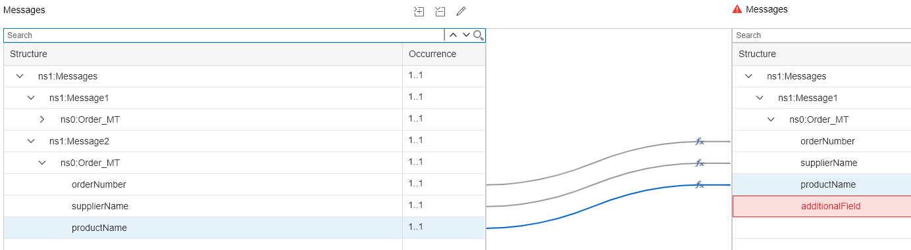

<!-- loio4af8ea7b46f74ae1894676f07c010748 -->

# Creating the Custom Mapping

It is a prerequisite for the custom mapping that you upload the WSDL files defining the source and target message structures to the *Resources* tab of the integration flow \(as shown for the standard mapping in [Defining the Standard Message Mapping](defining-the-standard-message-mapping-c0e0f6d.md)\). As you can see, three message structures, A, B, and C, are involved in the mapping, and the corresponding resource files \(WSDLs\) have to be made available to the integration flow.

To make it easy for you to define the mapping step, we provide the content of the WSDL files below.

You can use this content to create the WSDL file for the source and target message of the custom mapping:

For the source message, import two WSDL files:

-   The WSDL file describing the original **message A** \(as contained in the standard integration content\)

    Use file `A.wsdl` from [Defining the Standard Message Mapping](defining-the-standard-message-mapping-c0e0f6d.md).

-   The WSDL file describing the message structure after the standard mapping \(message B\)

    Use file `B.wsdl` from [Defining the Standard Message Mapping](defining-the-standard-message-mapping-c0e0f6d.md).

    However, note one important detail: In this WSDL file, you need the original namespace prefix `p1`. Otherwise, message processing results in a namespace conflict and the mapping step cannot be executed without an error.

    Correspondingly, to define the WSDL file for **message B** \(`B.wsdl`\), copy the following content:

    > ### Sample Code:  
    > ```
    > <?xml version="1.0" encoding="UTF-8"?>
    > <wsdl:definitions name="SendOrder_Async"
    > 	targetNamespace="http://cpi.sap.com/demo" xmlns:p1="http://cpi.sap.com/demo"
    > 	xmlns:wsp="http://schemas.xmlsoap.org/ws/2004/09/policy"
    > 	xmlns:wsu="http://docs.oasis-open.org/wss/2004/01/oasis-200401-wss-wssecurity-utility-1.0.xsd"
    > 	xmlns:wsdl="http://schemas.xmlsoap.org/wsdl/">
    > 	<wsdl:documentation />
    > 	<wsp:UsingPolicy wsdl:required="true" />
    > 	<wsp:Policy wsu:Id="OP_SendOrder_Async" />
    > 	<wsdl:types>
    > 		<xsd:schema targetNamespace="http://cpi.sap.com/demo"
    > 			xmlns:xsd="http://www.w3.org/2001/XMLSchema" xmlns="http://cpi.sap.com/demo">
    > 			<xsd:element name="Order_MT" type="Order_DT" />
    > 			<xsd:complexType name="Order_DT">
    > 				<xsd:sequence>
    > 					<xsd:element name="orderNumber" type="xsd:string" />
    > 					<xsd:element name="supplierName" type="xsd:string" />
    > 					<xsd:element name="productName" type="xsd:string" />
    > 				</xsd:sequence>
    > 			</xsd:complexType>
    > 		</xsd:schema>
    > 	</wsdl:types>
    > 	<wsdl:message name="Order_MT">
    > 		<wsdl:documentation />
    > 		<wsdl:part name="Order_MT" element="p1:Order_MT" />
    > 	</wsdl:message>
    > 	<wsdl:portType name="SendOrder_Async">
    > 		<wsdl:documentation />
    > 		<wsdl:operation name="SendOrder_Async">
    > 			<wsdl:documentation />
    > 			<wsp:Policy>
    > 				<wsp:PolicyReference URI="#OP_SendOrder_Async" />
    > 			</wsp:Policy>
    > 			<wsdl:input message="p1:Order_MT" />
    > 		</wsdl:operation>
    > 	</wsdl:portType>
    > 	<wsdl:binding name="SendOrder_AsyncBinding" type="p1:SendOrder_Async">
    > 		<soap:binding style="document"
    > 			transport="http://schemas.xmlsoap.org/soap/http" xmlns:soap="http://schemas.xmlsoap.org/wsdl/soap/" />
    > 		<wsdl:operation name="SendOrder_Async">
    > 			<soap:operation soapAction="http://sap.com/xi/WebService/soap1.1"
    > 				xmlns:soap="http://schemas.xmlsoap.org/wsdl/soap/" />
    > 			<wsdl:input>
    > 				<soap:body use="literal" xmlns:soap="http://schemas.xmlsoap.org/wsdl/soap/" />
    > 			</wsdl:input>
    > 		</wsdl:operation>
    > 	</wsdl:binding>
    > </wsdl:definitions>
    > ```


> ### Note:  
> Both WSDL files together define the structure of the merged message \(A, B\), which is passed on from the standard integration flow \(as you will see when defining the message mapping\).

For target **message C**, create a WSDL file with the following content and import it to the integration flow *Resources* tab:

> ### Sample Code:  
> ```
> <?xml version="1.0" encoding="UTF-8"?>
> <wsdl:definitions name="SendOrder_Async"
> 	targetNamespace="http://cpi.sap.com/demo" xmlns:p1="http://cpi.sap.com/demo"
> 	xmlns:wsp="http://schemas.xmlsoap.org/ws/2004/09/policy"
> 	xmlns:wsu="http://docs.oasis-open.org/wss/2004/01/oasis-200401-wss-wssecurity-utility-1.0.xsd"
> 	xmlns:wsdl="http://schemas.xmlsoap.org/wsdl/">
> 	<wsdl:documentation />
> 	<wsp:UsingPolicy wsdl:required="true" />
> 	<wsp:Policy wsu:Id="OP_SendOrder_Async" />
> 	<wsdl:types>
> 		<xsd:schema targetNamespace="http://cpi.sap.com/demo"
> 			xmlns:xsd="http://www.w3.org/2001/XMLSchema" xmlns="http://cpi.sap.com/demo">
> 			<xsd:element name="Order_MT" type="Order_DT" />
> 			<xsd:complexType name="Order_DT">
> 				<xsd:sequence>
> 					<xsd:element name="orderNumber" type="xsd:string" />
> 					<xsd:element name="supplierName" type="xsd:string" />
> 					<xsd:element name="productName" type="xsd:string" />
> 					<xsd:element name="additionalField" type="xsd:string" />
> 				</xsd:sequence>
> 			</xsd:complexType>
> 		</xsd:schema>
> 	</wsdl:types>
> 	<wsdl:message name="Order_MT">
> 		<wsdl:documentation />
> 		<wsdl:part name="Order_MT" element="p1:Order_MT" />
> 	</wsdl:message>
> 	<wsdl:portType name="SendOrder_Async">
> 		<wsdl:documentation />
> 		<wsdl:operation name="SendOrder_Async">
> 			<wsdl:documentation />
> 			<wsp:Policy>
> 				<wsp:PolicyReference URI="#OP_SendOrder_Async" />
> 			</wsp:Policy>
> 			<wsdl:input message="p1:Order_MT" />
> 		</wsdl:operation>
> 	</wsdl:portType>
> 	<wsdl:binding name="SendOrder_AsyncBinding" type="p1:SendOrder_Async">
> 		<soap:binding style="document"
> 			transport="http://schemas.xmlsoap.org/soap/http" xmlns:soap="http://schemas.xmlsoap.org/wsdl/soap/" />
> 		<wsdl:operation name="SendOrder_Async">
> 			<soap:operation soapAction="http://sap.com/xi/WebService/soap1.1"
> 				xmlns:soap="http://schemas.xmlsoap.org/wsdl/soap/" />
> 			<wsdl:input>
> 				<soap:body use="literal" xmlns:soap="http://schemas.xmlsoap.org/wsdl/soap/" />
> 			</wsdl:input>
> 		</wsdl:operation>
> 	</wsdl:binding>
> </wsdl:definitions>
> ```

Note that message structure C is similar to message structure B; it has one additional field `additionalField`. Save the file with the name `C.wsdl`.

Perform the following steps to define the mapping:

1.  Add a message mapping shape between the start message and the end message event.

    Choose the *\+* icon and define a name for the message mapping.

    

2.  Choose *Create*.

    The mapping editor opens.

3.  Select *Add source message* and browse to the file `A.wsdl`.

4.  Choose the *Edit message* icon.

    

    The *Source and Target Messages* editor opens.

    The structure of message A is already displayed under *Source Messages*.

5.  Choose the *\+* icon beneath *Source Messages* and add file `B.wsdl`.

6.  In the same way, choose the *\+* icon beneath *Target Messages* and add file `C.wsdl`.

    After this step, messages A and B are shown under *Source Messages* and message C is shown under *Target Messages*.

    

7.  Choose *OK* to go back to the mapping editor.

8.  In the source message structure on the left side, open the nodes under `ns1:Message2` \(the lower part of the source structure\), and on the right side open the nodes of the target structure. Then, connect each field of the source structure to the field with the same name in the target structure. Leave out the field `additionalField` in the target structure.

    

9.  Now, open the upper part of the source structure and connect the field `supplierSurname` in the source structure with the field `additionalField` in the target structure.

    The figure below shows the final mapping and also indicates which parts are associated with the messages A, B, and C.

    

10. Finally, to apply the mapping function for the connection of the fields `supplierSurname` \(source structure\) and `AdditionalField` \(target structure\), open the mapping expression *Text* \> *toLowerCase*. Connect the source and target field in the following way: `supplierSurname` with `toLowerCase` and connect the latter with `AdditionalField`.

11. Choose *OK* to return to the integration flow model.

12. Save and deploy the integration flow.


