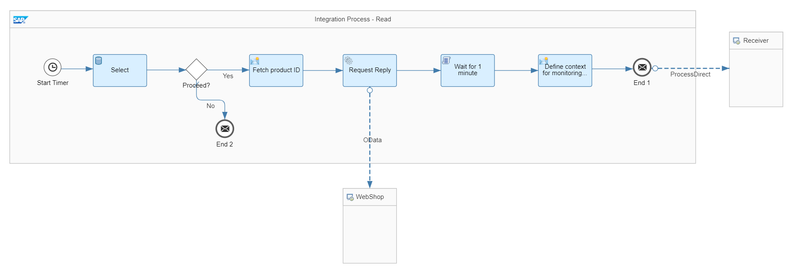

<!-- loio5467c77da3064f65a5b3a9351fed7d84 -->

# Decouple Sender and Flows Using Data Store


<a name="loio5467c77da3064f65a5b3a9351fed7d84__section_tmt_khf_ynb"/>

## Definition

In the current use case, the existing integration scenario that is described in [Decouple Sender and Flows Without Persistence](decouple-sender-and-flows-without-persistence-31d4dec.md) is to be enhanced in order to ensure reliability. Like in the previous use case, a long running service call or complex message processing is to be triggered whereas a response is to be sent back right away in order to not block the client while the service request is processed. Other than in the previous use case, here we ensure that no error situation can prevent the request from being processed successfully. By using a data store as persistency, we can guarantee an “at least once” delivery.


<a name="loio5467c77da3064f65a5b3a9351fed7d84__section_tvw_nhf_ynb"/>

## Prerequisites

To run the sample integration scenario that is provided within the *Integration Flow Design Guidelines - Learn the Basics* package, the generic receiver integration flow needs to be deployed. You can find the integration flow in the same package that contains the sample integration flow.


<a name="loio5467c77da3064f65a5b3a9351fed7d84__section_wjx_phf_ynb"/>

## Implementation

To illustrate this rule, see the *Modeling Basics – Decouple Flows Using Persistence* integration flow.

The integration flow consists of 2 integration processes:

-   The *Integration Process - Write* integration process receives the request from the client, writes the request in a data store, and sends back a response to the calling client.

-   The *Integration Process - Read* integration process polls the request from the same data store, and then performs the actual long running service call and \(eventually\) further message orchestration steps.


### Write integration process

The Write integration process is defined as follows:


The integration flow receives a message through an HTTP sender adapter from the external client. In the message header, a product identifier is provided.

In a content modifier step, *Define request*, the message body is defined as follows using the provided product identifier header:

> ### Sample Code:  
> ```
> <request>
>   <productId>${header.productId}</productId>
> </request>
> 
> ```

In a *Write* data store operations step, *Write payload*, the message is then stored in a data store with name **ModelingBasics-DecouplingPers-Request**, Global visibility, and empty entry ID. In this case, a unique entry ID is automatically generated.

Once the message has been stored successfully, a response is to be created and sent back to the calling client.

Hence, in a 2nd content modifier step, *Define response*, the body of the response is defined as follows:

> ### Sample Code:  
> ```
> <response>
>   <info>product ID ${header.productId} has been saved and will be picked up soon for processing</info>
> </response>
> 
> ```

Furthermore, on tab Message Header of the *content modifier*, we create a new header with name `CamelHttpResponseCode` and constant value 202. This ensures that an http response code 202 Accepted is sent back instead of an http 200 OK.


### Read integration process

The Read integration process is defined as follows:



The integration process polls the message from the same data store *ModelingBasics-DecouplingPers-Request* used before using a Data Store sender adapter. The *Visibility* parameter is set to *Global* so that the content can be accessed it from multiple integration flows.

> ### Note:  
> -   The integration process needs to hold a JDBC transaction to guarantee data consistency. To achieve this, in the integration process configuration, set the transaction handling parameter to Required for JDBC. By this, if an error happens during message processing, the deletion of the message from the data store will be rolled back, and in the next scheduler run the message is polled from the data store again.
> 
> -   As JDBC transactions require a database connection for the whole duration of the integration flow processing time, it makes sense to consider a different flow design in cases where the processing time exceeds 5 minutes, see [Control the Number of Simultaneously Opened Database Connections](control-the-number-of-simultaneously-opened-database-connections-90628e9.md).

The integration process carries out a couple of processing steps or service calls. In our sample scenario, in a *Request Reply* step, product data is read from an external source through the OData protocol \(using the OData receiver adapter\). For our scenario, we use the ESPM WebShop, which is based on the Enterprise Sales and Procurement Model \(ESPM\) provided by SAP. The demo application can be accessed at the following address: [https://refapp-espm-ui-cf.cfapps.eu10.hana.ondemand.com/webshop/index.html](https://refapp-espm-ui-cf.cfapps.eu10.hana.ondemand.com/webshop/index.html).

The query is defined as follows:

> ### Sample Code:  
> ```
> $select=ProductId,Category,Name,DimensionDepth,DimensionHeight,DimensionUnit,DimensionWidth&$filter=ProductId eq '${property.productId}'
> ```

In order to simulate further processing steps, the flow is put to sleep for 1 minute. This gives us the chance to see that the response doesn't take 1 minute to get back to the actual sender from the Write integration process, but rather gets back almost immediately.

For delaying the receiver flow processing, we use the following Groovy script:

> ### Sample Code:  
> ```
> import com.sap.gateway.ip.core.customdev.util.Message;
> import java.util.HashMap;
> def Message processData(Message message) {
> Thread.sleep(1*60*1000); //sleep for 1 minute
> return message;
> }
> 
> 
> ```

To call this integration scenario, provide a productId header together with the HTTP request \(from the HTTP client\) and give it any value for a product published in the WebShop catalog \(for example, the value HT-2002\). A custom response is sent back right away.

> ### Note:  
> When using Postman together with the Postman collections provided with the integration package, a value for this header is already specified for the request. You can, however, overwrite this value.

**Related Information**  


[Define Data Store Operations](define-data-store-operations-79f63a4.md "You can use the data store to temporarily store messages.")

[Define Router](define-router-d7fddbd.md "")

[Data Store Sender Adapter](data-store-sender-adapter-4f5ef3f.md "This adapter enables Cloud Integration to consume messages from a data store. This feature helps you to enable asynchronous decoupling of inbound and outbound processing by using the data store as temporary storage.")

