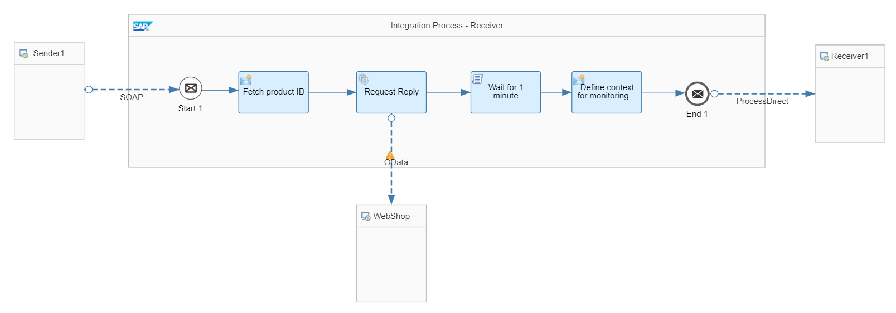
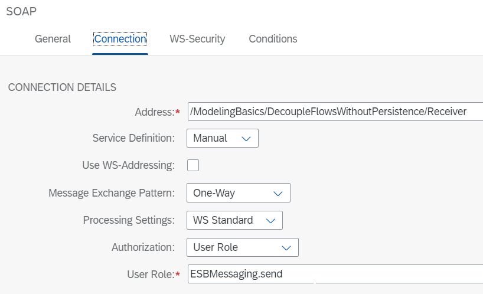
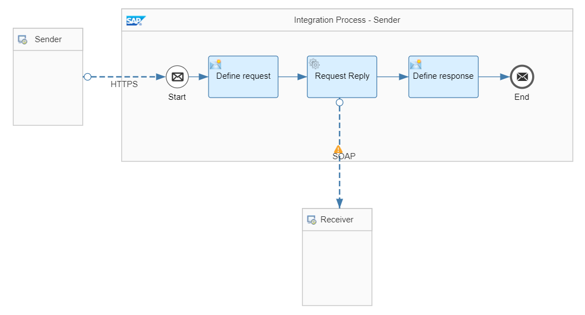

<!-- loio31d4dec814724e2b8b9fb7161c2c5adb -->

# Decouple Sender and Flows Without Persistence


<a name="loio31d4dec814724e2b8b9fb7161c2c5adb__section_vwg_3bn_wnb"/>

## Definition

Let’s assume you want to consume a service that takes some time: The service can be a long running service in your backend or complex message orchestration on SAP Integration Suite. However, the client calling the service can’t keep the connection open for too long. Hence, in order to not block the client while the service request is processed, the service call is to be triggered, and a response is to be sent back right away. The response doesn't have any information of the actual message processing status, though. The client receives an HTTP 202 Accepted response code to indicate that the request was successfully received, meaning that the request has been accepted but the processing of the message hasn’t been completed. The client won’t have any information whether and when the request has been successfully processed.


<a name="loio31d4dec814724e2b8b9fb7161c2c5adb__section_yrp_nbn_wnb"/>

## Prerequisites

In order to run the sample integration scenario that is provided within the *Integration Flow Design Guidelines - Learn the Basics* package, the following prerequisites apply:

-   The generic receiver integration flow needs to be deployed. You can find the integration flow in the same package that contains the sample integration flow.

-   Applicable to Variant 1 only: To allow the sender integration flow process to call the receiver integration flow, you need to configure and deploy a User Credentials artifact that contains the credentials of a user with the ESBMessaging.send user role assigned. You can use the same user used to run the Postman collection for the example integration flows. The name of the User Credentials must be named iFlowDesignGuidelineUser.


<a name="loio31d4dec814724e2b8b9fb7161c2c5adb__section_nbz_wbn_wnb"/>

## Implementation

To illustrate this rule, see the *Modeling Basics – Decouple Flows Without Persistence* integration flow.

We distinguish 2 variants: in the 1st variant, the reply to the sender can contain a response body that can be customized; whereas in the 2nd variant, no response body is returned. In both cases, an HTTP 202 response code is returned.


### Variant 1: Decoupling 2 integration processes

The integration flow consists of 2 integration processes:

-   The *Integration Process - Receiver* integration process performs the actual long running service call and \(eventually\) further message orchestration steps.

-   The *Integration Process - Sender* integration process receives the request from the client, passes it on to the receiver flow. A response is sent back in any case, one with body and one with HTTP code only.


> ### Note:  
> For connecting the two integration processes, it is recommended using the ProcessDirect adapter.
> 
> In our case however, the One-Way message exchange pattern is required which is supported by the SOAP adapter only. Therefore, in this case the SOAP adapter is used.
> 
> When using the SOAP adapter, the *Integration Process - Sender* integration process \(short: Sender\) calls the *Integration Process - Receiver* integration process \(short: Receiver\) using the HTTP protocol. Although Sender and Receiver are running on the same tenant in this case, the load balancer is interposed in this call. The Sender calls the load balancer *from the outside*, which forwards the request to the Receiver \(on the same tenant\).
> 
> In scenarios where integration flows communicate using the ProcessDirect adapter, the call isn't bypassed through the load balancer.
> 
> See: [Decouple Sender and Flows Without Persistence](decouple-sender-and-flows-without-persistence-31d4dec.md)

**Receiver integration process**

The receiver integration process is defined as follows:



The sender channel, which connects the sender integration process with the receiver integration process, is of type SOAP 1.x.

The address, that is, the endpoint of the receiver integration process is maintained as follows: `/ModelingBasics/DecoupleFlowsWithoutPersistence/Receiver`.

To ensure that the sender integration process can continue processing once the message has been passed to the receiver integration process, the Message Exchange Pattern needs to be set to One-Way. For the processing settings, set to One-Way, and the processing settings to WS Standard.



In the following, the receiver integration process would carry out a couple of processing steps or service calls.

In our sample scenario, in a *Request Reply* step, product data is read from an external source through the OData protocol \(using the OData receiver adapter\). For our scenario, we use the ESPM WebShop, which is based on the Enterprise Sales and Procurement Model \(ESPM\) provided by SAP. The demo application can be accessed at the following address: [https://refapp-espm-ui-cf.cfapps.eu10.hana.ondemand.com/webshop/index.html](https://refapp-espm-ui-cf.cfapps.eu10.hana.ondemand.com/webshop/index.html).

The query is defined as follows:

`$select=ProductId,Category,Name,DimensionDepth,DimensionHeight,DimensionUnit,DimensionWidth&$filter=ProductId eq '${property.productId}'`

In order to simulate further processing steps, the flow is put to sleep for one minute. This gives us the chance to see that the response doesn't take one minute to get back to the actual client from the sender integration process, but rather almost immediately.

For delaying the receiver flow processing, we use the following Groovy script:

> ### Sample Code:  
> ```
> import com.sap.gateway.ip.core.customdev.util.Message;
> import java.util.HashMap;
> def Message processData(Message message) {
> Thread.sleep(1*60*1000); //sleep for 1 minute
> return message;
> }
> 
> ```

**Sender integration flow and integration process**

The sender integration process is defined as follows:



The integration flow receives a message through an HTTP adapter from the external client. In the message header, a product identifier is provided.

In a content modifier step, *Define request*, the message body that is then passed to the receiver integration process is defined as follows using the provided product identifier header:

> ### Sample Code:  
> ```
> <request>
>   <productId>${header.productId}</productId>
> </request>
> 
> ```

In a *Request Reply* step, the receiver integration process is called via the SOAP adapter.

In the *SOAP channel*, the address points to the endpoint of the receiver integration process as it was configured and deployed in accordance with the settings above, here `https://${header.host}/cxf/ModelingBasics/DecoupleFlowsWithoutPersistence/Receiver`.

> ### Note:  
> For convenience reasons, the sample request message of the provided Postman collection contains the header field *Host* that holds the host name of your tenant runtime node. The host name needs to be maintained as Postman environment variable anyway, so by using `${header.host}` in the URL you don’t need to change the address of the SOAP channel to be able to run the scenario on your own landscape.

We use basic authentication with credential name `iFlowDesignGuidelineUser`, see prerequisites above.

Once the message has been accepted by the receiver integration process, the sender integration process gets back the control, and a response is created and sent back to the calling client.

In a content modifier step, *Define response*, the body of the response is defined as follows:

> ### Sample Code:  
> ```
> <response>
>   <info>product ID ${header.productId} has been passed to the receiver process flow</info>
> </response>
> 
> ```

Furthermore, on the tab Message Header of the content modifier, we create a new header with name `CamelHttpResponseCode` and constant value 202. This ensures that an HTTP response code 202 Accepted is sent back instead of an HTTP 200 OK.

To call this integration scenario, use the Postman request, provide a productId header together with the HTTP request \(from the HTTP client\) and assign any value for a product published in the WebShop catalog \(for example, the value HT-2001\). A custom response as defined above is sent back right away.

> ### Note:  
> When you use Postman together with the Postman collections provided with the integration package, a value for this header is already specified for the request. You can, however, overwrite this value.


### Variant 2: Decoupling sender from integration flow

In case the sender doesn't need any response and the response code 202 is enough, you can directly call the receiver integration process via a SOAP call. Make sure that your request contains a proper SOAP XML body.

In this case, you need to pass the following request to the end point of the receiver integration process, here with product ID HT-2001 for instance:

> ### Sample Code:  
> ```
> <soapenv:Envelope xmlns:soapenv="http://schemas.xmlsoap.org/soap/envelope/" xmlns:cxf="http://cxf.component.camel.apache.org/">
>    <soapenv:Header/>
>    <soapenv:Body>
>     <request>
>          <productId>HT-2001</productId>
>     </request>
>    </soapenv:Body>
> </soapenv:Envelope>
> 
> ```

Since the SOAP end point is defined as One-Way, an HTTP status code 202 Accepted is returned. Other than for variant 1, here the response doesn't contain any body.

**Related Information**  


[SOAP \(SOAP 1.x\) Adapter](soap-soap-1-x-adapter-b847968.md "With this adapter, the tenant can exchange messages with another system that supports Simple Object Access Protocol (SOAP) 1.1 or SOAP 1.2.")

