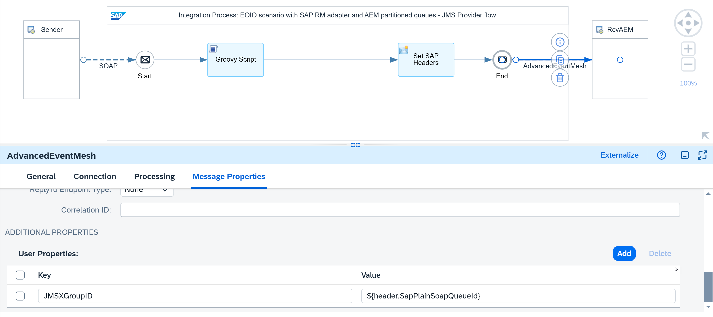
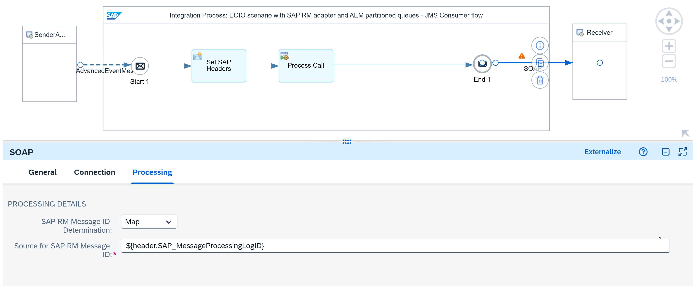

<!-- loiodf7b4728094447ed8a5ce30be1e29338 -->

# Decoupling Using SAP Integration Suite, Advanced Event Mesh

The following scenario uses the SAP RM protocol for both the sender and receiver. For decoupling the integration flows, a queue on SAP Integration Suite, advanced event mesh is used.

The following assumptions apply for the design of this scenario:

-   The SAP RM sender adapter is used to reliably exchange messages with the sender using the SAP RM protocol.
-   The SAP RM receiver adapter is used to reliably exchange messages with the receiver using the SAP RM protocol.
-   The receiver is idempotent, which means it can detect and ignore duplicate messages.
-   The sender ensures that a message is only sent when the predecessor message has been acknowledged by a technical success response.
-   The sender can pass a queue ID to the Cloud Integration.

The SAP RM protocol extends the plain SOAP protocol to support Exactly Once and Exactly Once In Order delivery by providing SAP proprietary SOAP headers or query parameters, namely a message ID and a queue ID. See [Sender with SAP RM Protocol and Receiver with XI Protocol](sender-with-sap-rm-protocol-and-receiver-with-xi-protocol-5f35b5c.md).

A queue on SAP Integration Suite, advanced event mesh is used where the messages are directly stored once they reach the middleware, Cloud Integration.

-   By persisting the messages in a queue, Cloud Integration can carry out the retry of the message delivery if an error occurs.
-   You can either use a queue with access type exclusive or a partitioned queue with access type non-exclusive to guarantee the message order.
    -   With an exclusive queue, only one consumer can receive a message at any one time.
    -   Partitioned queues are of access type non-exclusive which allows parallel consumption. However, only one consumer can consume from a partition at any given time so that messages within a partition are maintained in order.

See [Queues](https://docs.solace.com/Messaging/Guaranteed-Msg/Queues.htm).

> ### Note:  
> As a prerequisite for In Order processing, ensure that in the advanced settings of the queue on the advanced event mesh broker, the *Maximum Delivered Unacknowledged Messages per Flow* parameter is set to `1`.

<a name="loiodf7b4728094447ed8a5ce30be1e29338__section_z1m_m3b_y2c"/>

## Example Scenario

The following example integration flow consists of two integration processes.

The first integration process contains an SAP RM sender adapter. If you pass a value for the query parameter `QueueId` when calling the SAP RM end point, the SAP RM adapter sets the value of the header `SapPlainSoapQoS` to *ExactlyOnceInOrder* and the value of the header `SapPlainSoapQueueId` to the value of the parameter *QueueId*.

See [Configure the SOAP \(SAP RM\) Sender Adapter](configure-the-soap-sap-rm-sender-adapter-6962234.md).

Once we receive the message from the SAP RM adapter, directly write the message into a queue on SAP Integration Suite, advanced event mesh using an AdvancedEventMesh receiver adapter. This example uses a partitioned queue. On the tab Processing of the AdvancedEventMesh receiver adapter, define the delivery mode as *Persistent \(Guaranteed\)*. On the tab Message Properties, define the additional property `JMSXGroupID` with the value of the header `SapPlainSoapQueueId` to write the message into a partitioned queue. Here, messages with the same group ID always end up in the same partition of the queue.

See [Configure the Advanced Event Mesh Receiver Adapter](configure-the-advanced-event-mesh-receiver-adapter-881f656.md).

The Groovy script and the content modifier in the integration process model are only used to store the Quality of Service as custom header property and to define the headers `SAP_Sender` and `SAP_Receiver`, respectively, for an improved monitoring.

The second integration process reads the message from the queue on SAP Integration Suite, advanced event mesh using an AdvancedEventMesh sender adapter. On the tab Processing of the AdvancedEventMesh sender adapter, define the consumer mode as *Guaranteed*, the acknowledgement mode as *Automatic On Exchange Complete*, and the settlement outcome after maximum attempts to *Failed*. Furthermore, maintain a maximum message processing attempts value greater than 0.

See [Configure the Advanced Event Mesh Sender Adapter](configure-the-advanced-event-mesh-sender-adapter-abd2efc.md).

In the integration process handling the Exactly Once In Order case, the header `SapPlainSoapQoS` must be set to ensure that the SAP RM receiver adapter passes the queue ID to the receiving system.

On the Processing tab of the SAP RM receiver adapters, the SAP RM Message ID Determination property is set to *Map*. As source for SAP RM Message ID, the header `SAP_MessageProcessingLogID` with the expression `${header.SAP_MessageProcessingLogID}` is used, which is constant throughout all potential retries from the JMS queues. Cloud Integration uses the mapped unique ID as SAP RM message ID.

> ### Note:  
> Here, use the message processing log ID for duplicate handling in case the sender adapter is not of type SAP RM. In our specific case with SAP RM as sender adapter, you could have passed through the message ID and used the message ID instead.

See [Configure the SOAP \(SAP RM\) Receiver Adapter](configure-the-soap-sap-rm-receiver-adapter-8366495.md).

These integration flow settings ensure that Cloud Integration passes on a unique ID to the receiver system. If an error occurs during message processing, Cloud Integration retries the message from the JMS queue. Since the retry is performed within the same instance of the message processing log, the message processing log ID and, as a result, the mapped unique ID remain the same.

Furthermore, when reading from the partitioned queue, only one consumer can access the partition at any time. Therefore, all successor messages keep waiting until the predecessor message was processed successfully. This setting guarantees that messages are processed in the exact order in which they're stored on the partitioned queue.

