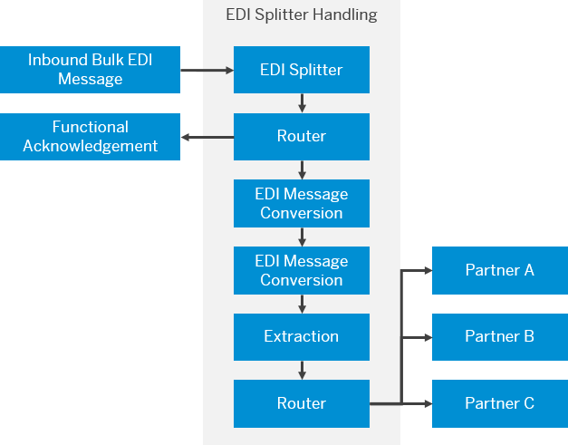

<!-- loio584a3beb81454d40acb052ae371c7063 -->

<link rel="stylesheet" type="text/css" href="../css/sap-icons.css"/>

# Define EDI Splitter

Validate and split \(into multiple documents\) different inbound EDI document formats.

## Context

You use the EDI splitter to split inbound bulk EDI messages, and configure the splitter to validate and acknowledge the inbound messages. If you choose to acknowledge the EDI message, then the splitter transmits a functional acknowledgement after processing the bulk EDI message. A bulk EDI message can contain one or more EDI formats, such as EDIFACT, ODETTE, EANCOM, TRADACOMS, and ASC-X12. You can configure the EDI splitter to process different EDI formats depending on the business requirements of the trading partners.

> ### Note:  
> Availability of this feature depends upon the SAP Integration Suite service plan that you use. For more information about different service plans and their supported feature set, see SAP Note [2903776](https://launchpad.support.sap.com/#/notes/2903776).

> ### Note:  
> -   Any EDIFACT message is an interchange. An interchange can have functional group, which in-turn can have messages. The EDI Splitter supports only one functional group with multiple homogeneous messages.
> -   EDI Splitter version 1.8 and above supports EDIFACT Syntax versions 2, 3, and 4, while version 2.8 and above additionally supports EDIFACT Syntax versions 1 and x.
> -   EDI Splitter version 1.9 and above supports LS/LE segments.
> -   Using the EDI Splitter in combination with the Gather, Join, or Aggregator steps in the integration flow is not supported.
> -   EDI Splitter version 2.0 and above supports the TRADACOMS standard \(*TRADACOMS* tab; available only for dedicated service plans, see [2903776](https://me.sap.com/notes/2903776)\).

## Procedure

1.  In the palette, choose , and then *Splitter* \> *EDI Splitter*.

2.  Choose *EDI Splitter* and provide values in property sheet based on the descriptions in the table.

    **General**

    <table>
    <tr>
    <th valign="top">

    Field
    
    </th>
    <th valign="top">

    Description
    
    </th>
    </tr>
    <tr>
    <td valign="top">
    
    Name
    
    </td>
    <td valign="top">
    
    Define a relevant name for the EDI splitter or use the default name.
    
    </td>
    </tr>
    </table>
    
    **Processing**

    <table>
    <tr>
    <th valign="top">

    Field
    
    </th>
    <th valign="top">

    Description
    
    </th>
    </tr>
    <tr>
    <td valign="top">
    
    Parallel Processing
    
    </td>
    <td valign="top">
    
    This mode creates multiple processes for each split message, and individual EDI messages are processed simultaneously.
    
    </td>
    </tr>
    <tr>
    <td valign="top">
    
    Timeout \(in sec\)
    
    </td>
    <td valign="top">
    
    Set the time limit in seconds for the EDI splitter to process individual split messages. If there are any processes still pending once the time has lapsed, the splitter terminates the processes and updates the MPL status.
    
    </td>
    </tr>
    </table>
    
    **EDIFACT**

    <table>
    <tr>
    <th valign="top">

    Field
    
    </th>
    <th valign="top">

    Description
    
    </th>
    </tr>
    <tr>
    <td valign="top">
    
    *Source Encoding* 
    
    </td>
    <td valign="top">
    
    Use the appropriate encoding format of the inbound EDIFACT interchange. The following encoding formats are available in the EDI splitter:

    -   *UTF-8*

    -   *ISO-8859-1*

    You can also set this field using the header `SAP_EDISPLITTER_EDIFACT_SOURCE_ENCODING`. The values for the headers can be one of the following:

    -   `UTF-8`
    -   `ISO-8859-1`

    
    </td>
    </tr>
    <tr>
    <td valign="top">
    
    *Validate Message* 
    
    </td>
    <td valign="top">
    
    This mode initiates the validation of the split EDI messages.

    You can also set this field using the header `SAP_EDISPLITTER_EDIFACT_VALIDATE_MESSAGE`. The values for the headers can be one of the following:

    -   `true`
    -   `false`

    
    </td>
    </tr>
    <tr>
    <td valign="top">
    
    *Validate* 
    
    </td>
    <td valign="top">
    
    The EDI splitter performs validation of either *Envelope* or *Envelope and Message* for the EDI content.

    You can also set this field using the header `SAP_EDISPLITTER_EDIFACT_VALIDATION_METHOD`. The values for the headers can be one of the following:

    -   `envelop`
    -   `envelopAndMessage`

    
    </td>
    </tr>
    <tr>
    <td valign="top">
    
    *Decimal Character*
    
    </td>
    <td valign="top">
    
    Choose the decimal character to be used during message validation:

    -   Dot \(.\)
    -   Dynamic: Define the value 'dot' or 'fromIncomingPayload' in `SAP_EDISPLITTER_DECIMAL_CHARACTER` header.
    -   From Incoming Payload: The decimal characater is read from the incoming payload.

    
    </td>
    </tr>
    <tr>
    <td valign="top">
    
    *Transaction Mode*

    \(Only if *Validate* is selected as *Envelope and Message*
    
    </td>
    <td valign="top">
    
    Choose how to validate the EDI message transaction. The following two options are available:

    -   *Interchange*

    -   *Message*: Allows the splitter to validate the entire EDI interchange as independent individual entities.

    > ### Example:  
    > Consider a scenario where you receive a bulk EDI message containing five purchase orders. In *Interchange* mode, if a single EDI message fails, the entire interchange is rejected. However, in *Message* mode, if a single EDI message fails, only the invalid message is rejected and the valid messages are dispatched for further processing.

    You can also set this field using the header `SAP_EDISPLITTER_EDIFACT_TRANSACTION_MODE`. The values for the headers can be one of the following:

    -   `interchange`
    -   `message`

    
    </td>
    </tr>
    <tr>
    <td valign="top">
    
    *EDI Schema Definition* 
    
    </td>
    <td valign="top">
    
    Validates an EDI interchange against the XSD schema for conversion. Deploy the schema by selecting it from an integration flow or by defining the location of the schema.

    Follow the steps here to add an `*.xsd` file to the integration flow:

    1.  In the *EDI Schema Definition*, select *Integration Flow*.

    2.  Choose *Add*.

    3.  Choose *Select*, to add a file from the XSD folder found in the same integration project.

        > ### Note:  
        > During runtime only XSD’s from Integration Advisor \(IA\) are supported.

    The file name of the xml schema for **EDI** payloads should have the following format:

    -   EDIFACT: `UN-EDIFACT_ORDERS_D96A.xsd`

    -   ODETTE: `ODETTE_ORDERR_2.xsd`

    -   ODETTE EDIFACT: `UN-EDIFACT_ORDERS_D96A_A18051.xsd`

    -   EANCOM: `UN-EDIFACT_ORDERS_D96A_EAN008.xsd`

    You can also set this field using the header `SAP_EDISPLITTER_EDIFACT_SCHEMA_SOURCE`. The values for the headers can be one of the following:

    -   `Header`
    -   `IntegrationProject`

    
    </td>
    </tr>
    <tr>
    <td valign="top">
    
    *Process Invalid Messages*

    \(Only if *Transaction Mode* is selected as *Mesaage*\)
    
    </td>
    <td valign="top">
    
    This feature is available only for *Message* option in transaction mode. If you select this option, you must use a router after the splitter to process the split messages.

    Use the following conditions to configure the router to:

    -   `${header.SAP_EDI_MESSAGE_STATUS}= 'failure'` : Route all invalid messages.

    -   `${header.SAP_EDI_INTERCHANGE_STATUS}= 'failure'` : Route all interchanges that has error.

    
    </td>
    </tr>
    <tr>
    <td valign="top">
    
    *Header Name* 
    
    </td>
    <td valign="top">
    
    If you select `Header` as *EDI Schema Definition*, then you can see the field *HeaderName*, in *Properties* view. Enter a valid header name for the field.

    > ### Note:  
    > This header name is fetched from camel header. The header is added in script element. This script element is added before converter element. You can add value for this header in the script element.
    > 
    > For example, you can add the value, `/xsd/UN-EDIFACT_ORDERS_D96A.xsd` for EDIFACT.
    > 
    > For example, you can add the value, `/xsd/ASC-X12_810_004010.xsd` for ASC-X12.

    
    </td>
    </tr>
    <tr>
    <td valign="top">
    
    *Create Acknowledgement* 
    
    </td>
    <td valign="top">
    
    The following options are available to process the functional acknowledgement:

    -   *Not Required*: Does not transmit the functional acknowledgement.
    -   *Check EDI Envelop*: Allows the splitter to check the request for a functional acknowledgement in the UNB segment of an EDI interchange.
    -   *Required*: The splitter creates and transmits a functional acknowledgement.

        > ### Note:  
        > Configure a router and apply the routing condition `${header.SAP_EDI_ACKNOWLEDGEMENT} = 'true'` to route the functional acknowledgement.

    You can also set this field using the header `SAP_EDISPLITTER_EDIFACT_CREATE_ACK`. The values for the headers can be one of the following:

    -   `required`
    -   `notRequired`
    -   `checkEDIEnvelop`

    > ### Note:  
    > In case of rules violation, you see the acknoedgement in a specific format. Here's how the acknowledge is formatted:
    > 
    > AK4 is represented only for the first element of the conditional rule. For example, *AK4\*2\*358\*2*.
    > 
    > If there are two or more violations for a single element, the same AK4 segment is repeated for each violation. For example, *AK4\*2\*358\*2* *AK4\*2\*358\*2*
    > 
    > If there is an exclusive violation, AK4 is represented for only the first element. For example, *AK4\*2\*358\*10*.

    
    </td>
    </tr>
    <tr>
    <td valign="top">
    
    *Customize Envelope*

    \(Only if *Create Acknowledgment* is selected anything except *Not Required*\)
    
    </td>
    <td valign="top">
    
    You can choose either of the following options to specify the modification in the envelope of CONTRL acknowledgement message.

    -   *From Incoming Payload*: It retains the same envelope format and values as the incoming payload.
    -   *Dynamic*: Use the `SAP_EDISPLITTER_EDIFACT_CUSTOMIZE_ENVELOPE` header to set either of the values dynamically:
        -   `fromIncomingPayload`
        -   `overwriteWithExchangeHeaders`
        -   `removeOptionalTrailingField`

    -   *Overwrite with Exchange Headers*: The acknowledgement message is generated with all values retrieved from the exchange headers. You must provide following headers: SAP\_EDI\_CONTRL\_Service\_Code\_Directory\_Version, SAP\_EDI\_CONTRL\_Character\_Encoding, SAP\_EDI\_CONTRL\_Syntax\_Release\_Number, SAP\_EDI\_CONTRL\_Recipient\_Reference\_Password, SAP\_EDI\_CONTRL\_Recipient\_Reference\_Qualifier, SAP\_EDI\_CONTRL\_Application\_Reference, SAP\_EDI\_CONTRL\_Processing\_Priority\_Code, SAP\_EDI\_CONTRL\_Communications\_Agreement\_Id, SAP\_EDI\_CONTRL\_Test\_Indicator
    -   *Remove Optional Trailing Field*: It will remove the additional optional fields available in the incoming payload while generatiing envelope of the acknowledgmenet message.

    
    </td>
    </tr>
    <tr>
    <td valign="top">
    
    *Interchange Number* 
    
    </td>
    <td valign="top">
    
    The splitter added the interchange number in the fucntional acknowledgmenet of an EDImessage. It can be set in either of these ways:

    -   *Dynamic*: You can also set this field using the header `SAP_EDISPLITTER_EDIFACT_INTERCHANGE_NUMBER`. The values for the headers can be one of the following:
        -   `useFromEDIMessage`
        -   `numberRange`

    -   *Number Range*: Redas the interchange number from an assigned set of number ranges.
    -   *Use from EDI Message*: Reads the interchange number either from the EDI message

    .
    
    </td>
    </tr>
    <tr>
    <td valign="top">
    
    *Unique Interchange Number*

    \(Only if you select *Interchange Number* as *Number Range*\)
    
    </td>
    <td valign="top">
    
    Following are the options to generate a unique interchange number while generating a acknowledgment message:

    -   *Required*: EDI Splitter can generate a unique interchange number, which is the incremented value from the number range object and does not depend on the interchange number of the incoming payload.
    -   *Not Required*: Does not generate a unique interchange number.
    -   *Dynamic*: You can also set this field using the header `SAP_EDISPLITTER_EDIFACT_UNIQUE_INTERCHANGE_NUMBER`. The values for the headers can be one of the following:
        -   `required`
        -   `notRequired`

    
    </td>
    </tr>
    <tr>
    <td valign="top">
    
    *Number Range* 
    
    </td>
    <td valign="top">
    
    Define the number range assigned to an interchange number in the functional acknowledgement.

    If *Unique Interchange Number* is set as:

    -   *Required*: A new interchange number is generated for every incoming message.

    -   *Not Required*: A new interchange number is generated only for unique incoming message. A duplicate incoming message is assigned with same interchange number for 30 days.

    You can also set this field using the header `SAP_EDISPLITTER_EDIFACT_NUMBER_RANGE`.
    
    </td>
    </tr>
    <tr>
    <td valign="top">
    
    *CONTRL Message Version*
    
    </td>
    <td valign="top">
    
    Determine the appropriate EDIFACT CONTRL message version to be transmitted to the trading partner.. The value for the header should be the number range artifact name.

    You can also set this field using the header `SAP_EDISPLITTER_EDIFACT_CONTRL_MSG_VERSION`. The values for the headers can be one of the following:

    -   `defaultVersion`
    -   `useFromEDIMessage`

    
    </td>
    </tr>
    <tr>
    <td valign="top">
    
    *Include UNA Segment*
    
    </td>
    <td valign="top">
    
    The trading partner uses the UNA segment in the CONTRL message to define special characters, such as separators and indicators. This option enables the splitter to include special characters in the CONTRL message. If not selected, the UNA segment is not included in the CONTRL message.

    You can also set this field using the header `SAP_EDISPLITTER_EDIFACT_INCLUDE_UNA`. The values for the headers can be one of the following:

    -   `true`
    -   `false`

    
    </td>
    </tr>
    </table>
    
    **X12**

    > ### Note:  
    > -   Any X12 message is an interchange. An interchange can have functional group, which in-turn can have transactional sets. The EDI Splitter supports only one functional group with multiple homogeneous transactional sets.
    > -   EDI Splitter v1.12.0 and v2.2.0 onwards support same group name with different definition in XSD.

    ****

    <table>
    <tr>
    <th valign="top">

    Field
    
    </th>
    <th valign="top">

    Description
    
    </th>
    </tr>
    <tr>
    <td valign="top">
    
    *Source Encoding* 
    
    </td>
    <td valign="top">
    
    Use the appropriate encoding format of the inbound X12 interchange. The following encoding formats are available in the EDI splitter:

    -   *UTF-8*

    -   *ISO-8859-1*

    You can also set this field using the header `SAP_EDISPLITTER_X12_SOURCE_ENCODING`. The values for the headers can be one of the following:

    -   `UTF-8`
    -   `ISO-8859-1`

    
    </td>
    </tr>
    <tr>
    <td valign="top">
    
    *Validate Message* 
    
    </td>
    <td valign="top">
    
    The EDI splitter performs validation on incoming ASC X12 message against the XSD scheme, and has the following options available during validation:

    -   *No Validation*: Validation is not performed on the incoming payload.

    -   *Standard Validation*: Validates the incoming payload for the structural violations defined in XSD schema.

    You can also set this field using the header `SAP_EDISPLITTER_X12_VALIDATE_MESSAGE_OPTION`. The values for the headers can be one of the following:

    -   `none`
    -   `basic`

    
    </td>
    </tr>
    <tr>
    <td valign="top">
    
    *Transaction Mode* 
    
    </td>
    <td valign="top">
    
    The splitter has two modes for validating a transaction:

    -   *Interchange*: Allows the splitter to validate the entire EDI interchange as a single entity.

    -   *Message*: Allows the splitter to validate the entire EDI interchange as independent individual entities.

    You can also set this field using the header `SAP_EDISPLITTER_X12_TRANSACTION_MODE`. The values for the headers can be one of the following:

    -   `interchange`
    -   `message`

    
    </td>
    </tr>
    <tr>
    <td valign="top">
    
    *EDI Schema Definition* 
    
    </td>
    <td valign="top">
    
    Follow the steps here to add an `*.xsd` file to the integration flow: You can also set this field using the header

    1.  In the *EDI Schema Definition**Integration Flow*.

    2.  Choose *Add* from the from the choose the schema\). *Schemas* table.

    3.  Choose *Select* choose the schema\). to add an XML Schema file from the XSD folder found in the integration project.

        > ### Note:  
        > -   You can also set this field using the headerDuring runtime only XSD’s from Integration Advisor \(IA\) are supported.
        > 
        > -   If you wish to remove an XSD file from the project, then select the relevant XSD file and choose *Remove*.

    `SAP_EDISPLITTER_X12_SCHEMA_SOURCE`. The values for the headers can be one of the following:

    -   `Header`
    -   `IntegrationProject`

    
    </td>
    </tr>
    <tr>
    <td valign="top">
    
    *Header Name* 
    
    </td>
    <td valign="top">
    
    If you select `Header` as *EDI Schema Definition*, then you can see the field *HeaderName*, in *Properties* view. Enter a valid header name for the field.

    > ### Note:  
    > This header name is fetched from camel header. The header is added in script element. This script element is added before converter element. You can add value for this header in the script element.
    > 
    > For example, you can add the value, `/xsd/UN-EDIFACT_ORDERS_D96A.xsd` for EDIFACT.
    > 
    > For example, you can add the value, `/xsd/ASC-X12_810_004010.xsd` for ASC-X12.

    
    </td>
    </tr>
    <tr>
    <td valign="top">
    
    *Create Acknowledgement* 
    
    </td>
    <td valign="top">
    
    The following options are available for processing a functional acknowledgement:

    -   *Not Required*: Does not transmit the functional acknowledgement.
    -   *Check EDI Envelop*: Allows the splitter to check the request for a functional acknowledgement in the UNB segment of an EDI interchange.
    -   *Required*: The splitter creates and transmits a functional acknowledgement.

        > ### Note:  
        > -   Configure a router and apply the routing condition `${header.EDI_ACKNOWLEDGEMENT}='true'` to process the functional acknowledgement.
        > -   A unique interchange number is generated for every unique incoming message. A duplicate incoming message is assigned with same interchange number for 30 days.

    You can also set this field using the header `SAP_EDISPLITTER_X12_CREATE_ACK`. The values for the headers can be one of the following:

    -   `required`
    -   `notRequired`
    -   `checkEDIEnvelop`

    
    </td>
    </tr>
    <tr>
    <td valign="top">
    
    *Exclude AK3 and AK4* 
    
    </td>
    <td valign="top">
    
    Notifies the splitter to exclude the AK3 and AK4 segments from the functional acknowledgement message. However, it retains the details of the AK1, AK2, AK5, and AK9 segments in the functional acknowledgement.

    You can also set this field using the header `SAP_EDISPLITTER_X12_EXCLUDE_AK3_AK4`. The values for the headers can be one of the following:

    -   `true`
    -   `false`

    
    </td>
    </tr>
    <tr>
    <td valign="top">
    
    *Customize Envelope*

    Only if *Create Acknowledgment* is selected anything except *Not Required* 
    
    </td>
    <td valign="top">
    
    You can choose either of the following options to specify the modification in the envelope of 997 acknowledgement message.

    -   *From Incoming Payload*: It retains the same envelope format and values as the incoming payload.
    -   *Dynamic*: Use the `SAP_EDISPLITTER_X12_CUSTOMIZE_ENVELOPE` header to set either of the values dynamically:
        -   `fromIncomingPayload`
        -   `overwriteWithExchangeHeaders`

    -   *Overwrite with Exchange Headers*: The acknowledgement message is generated with all values retrieved from the exchange headers. You must provide `SAP_EDI_997_Usage_Indicator` header.

    
    </td>
    </tr>
    <tr>
    <td valign="top">
    
    *Interchange Number* 
    
    </td>
    <td valign="top">
    
    The splitter adds the interchange number in the functional acknowledgment of an EDI message. The interchange number can be read in either of these ways:

    -   *Use from EDI Message*: Reads the interchange number from the incoming payload
    -   *Number Range*: Reads the interchange number from an assigned set of number ranges.
    -   *Dynamic*: You can also set this field using the header `SAP_EDISPLITTER_X12_INTERCHANGE_NUMBER`. The value of the header can be one of the following:
        -   `useFromEDIMessage`
        -   `numberRange`

    
    </td>
    </tr>
    <tr>
    <td valign="top">
    
    *Unique Interchange Number*

    Only if *Interchange Number* is selected as anything except *Use from EDI Message*.
    
    </td>
    <td valign="top">
    
    Following are the options to generate a unique interchange number while generating an acknowledgment message:

    -   *Required*: EDI Splitter can generate a unique interchange number, which is the incremented value from the defined *Number Range* object and does not depend on the interchange number of the incoming payload.
    -   *Not Required*: Does not generate a unique interchange number.
    -   *Dynamic*: You can also set this field using the header `SAP_EDISPLITTER_X12_UNIQUE_INTERCHANGE_NUMBER`. The value of the headers can be one of the following:
        -   `required`
        -   `notRequired`

    
    </td>
    </tr>
    <tr>
    <td valign="top">
    
    *Number Range* 
    
    </td>
    <td valign="top">
    
    Define the number range assigned to an interchange number in the functional acknowledgement.

    If *Unique Interchange Number* is set as:

    -   *Required*: A new interchange number is generated for every incoming message.

    -   *Not Required* A new interchange number is generated only for unique incoming message. A duplicate incoming message is assigned with same interchange number for 30 days.

    You can also set this field using the header `SAP_EDISPLITTER_X12_NUMBER_RANGE`. The value for the header should be the number range artifact name.

    You can also set this field using the header or property. The syntax is `${header.<header-name>}` and `${property.<property-name>`.
    
    </td>
    </tr>
    <tr>
    <td valign="top">
    
    *Group Number*
    
    </td>
    <td valign="top">
    
    The splitter adds the group segment number in the functional acknowledgment of an EDI message. This number can be set in either of these ways:

    -   *Dynamic*: You can set this field using the header `SAP_EDISPLITTER_997_GROUP_CONTROL_NUMBER`. The values for the headers can be:
        -   numberRange
        -   useFromEDIMessage
        -   predefined

    -   *Predefined \(1\)*: Sets the group segment number to 1 irrespective of the number in incoming payload.
    -   *Number Range*: Reads from the assigned set of number ranges.
    -   *Use from EDI Message*: Uses the same group segment number from the incoming payload.

    
    </td>
    </tr>
    <tr>
    <td valign="top">
    
    *Unique Group Number*

    Only if *Group Number* is selected as *Dynamic* or *Number Range*.
    
    </td>
    <td valign="top">
    
    Following are the options to generate a unique group segment number while generating a acknowledgment message:

    -   *Required*: EDI Splitter can generate a unique group segment number, which is the incremented value from the number range object and does not depend on the number of the incoming payload.
    -   *Not Required*: Does not generate a unique group segment number.
    -   *Dynamic*: You can also set this field using the header `SAP_EDISPLITTER_997_UNIQUE_GROUP_CONTROL_NUMBER`. The values for the headers can be one of the following:
        -   `required`
        -   `notRequired`

    
    </td>
    </tr>
    <tr>
    <td valign="top">
    
    *Group Number Range*
    
    </td>
    <td valign="top">
    
    Define the number range assigned to an group segment number in the functional acknowledgement.

    If *Unique Group Number* is set as:

    -   *Required*: A new group number is generated for every incoming message.

    -   *Not Required* A new group number is generated only for unique incoming message. A duplicate incoming message is assigned with same group number for 30 days.

    You can also set this field using the header or property. The syntax is `${header.<header-name>}` and `${property.<property-name>`.
    
    </td>
    </tr>
    <tr>
    <td valign="top">
    
    *Transaction Set Number*
    
    </td>
    <td valign="top">
    
    The splitter adds the transaction segment number in the functional acknowledgment of an EDI message. This number can be set in either of these ways:

    -   *Dynamic*: You can set this field using the header`SAP_EDISPLITTER_997_TRANSACTION_SET_NUMBER`. The values for the headers can be::
        -   numberRange
        -   predefined

    -   *Predefined \(0001\)*: Sets the transaction set number to 0001 irrespective of the number in incoming payload.
    -   *Number Range*: Reads from the assigned set of number ranges.

    
    </td>
    </tr>
    <tr>
    <td valign="top">
    
    *Unique Transaction Set Number*

    Only if *Transaction Set Number* is selected as *Dynamic* or *Number Range*.
    
    </td>
    <td valign="top">
    
    Following are the options to generate a unique transaction set number while generating an acknowledgment message:

    -   *Required*: EDI Splitter can generate a unique transaction set number, which is the incremented value from the *Number Range* object and does not depend on the number of the incoming payload.
    -   *Not Required*: Does not generate a unique transaction set number.
    -   *Dynamic*: You can also set this field using the header `SAP_EDISPLITTER_997_UNIQUE_TRANSACTION_SET_NUMBER`. The values for the headers can be one of the following:
        -   `required`
        -   `notRequired`

    
    </td>
    </tr>
    <tr>
    <td valign="top">
    
    *Transaction Set Number Range*
    
    </td>
    <td valign="top">
    
    Define the number range assigned to an transaction set number in the functional acknowledgement.

    If *Unique Transaction Set Number* is set as:

    -   *Required*: A new transaction set number is generated for every incoming message.

    -   *Not Required* A new transaction set number is generated only for unique incoming message. A duplicate incoming message is assigned with same transaction set number for 30 days.

    You can also set this field using the header or property. The syntax is `${header.<header-name>}` and `${property.<property-name>`.
    
    </td>
    </tr>
    </table>
    
    **TRADACOMS**

    > ### Note:  
    > Availability of this feature depends upon the SAP Integration Suite service plan that you use. For more information about different service plans and their supported feature set, see SAP Note [2903776](https://launchpad.support.sap.com/#/notes/2903776).

    ****

    <table>
    <tr>
    <th valign="top">

    Field
    
    </th>
    <th valign="top">

    Description
    
    </th>
    </tr>
    <tr>
    <td valign="top">
    
    *Source Encoding* 
    
    </td>
    <td valign="top">
    
    Use the appropriate encoding format of the inbound TRADACOMS interchange.

    The following encoding formats are available:

    -   UTF-8

    -   ISO-8859-1

    -   Dynamic

        If selected, the encoding format is set dynamically at runtime using the headernullnullnull`SAP_EDISPLITTER_TRADACOMS_SOURCE_ENCODING` \(possible values: `UTF-8`, `ISO-8859-1`\).

    
    </td>
    </tr>
    <tr>
    <td valign="top">
    
    *Split Preference* 
    
    </td>
    <td valign="top">
    
    Specify the split preference for the TRADACOMS message.

    There are the following options:

    -   NoSplit

    -   WithoutValidation

    -   Dynamic

        If selected, this parameter is set dynamically at runtime using the header `SAP_EDISPLITTER_TRADACOMS_SPLIT_PREFERENCE` \(possible values: `NoSplit`, `WithoutValidation`\).

    
    </td>
    </tr>
    <tr>
    <td valign="top">
    
    *EDI Schema Definition* 
    
    </td>
    <td valign="top">
    
    Validates an EDI interchange against the XSD schema for the split.

    To specify the schema definition, there are the following options:

    -   Dynamic

        If selected, this parameter is set dynamically at runtime based on the value of the header `SAP_EDISPLITTER_TRADACOMS_SCHEMA_SOURCE` \(possible values: `Header`, `IntegrationProject`\).

    -   Header

        If selected, the location of the schema definition is set at runtime based on the value of a header \(header name to be defined using the *Header Name* parameter\).

    -   Integration Flow

        If selected, the schema definition is specified from a resource file of the integration flow \(use the parameter *Schemas*

    
    </td>
    </tr>
    <tr>
    <td valign="top">
    
    *Header Name*

    \(only available if for *EDI Schema Definition* the option *Header* is selected\)
    
    </td>
    <td valign="top">
    
    Define the name of the header that contains the location of the EDI schema definition.

    > ### Note:  
    > You can define the header in a Script step that is to be added before the EDI Converter step of your integration flow.
    > 
    > For example, you can add the following header value:
    > 
    > `/xsd/TRADACOMS_ORDHDR_FILE_9.xsd for TRADACOMS`

    
    </td>
    </tr>
    <tr>
    <td valign="top">
    
    *Schemas*

    \(only available if for *EDI Schema Definition* the option *Integration Flow* is selected\)
    
    </td>
    <td valign="top">
    
    Select the schema definition from an XSD file added as resource to the integration flow.

    Perform the following steps:

    1.  Choose *Add*.

    2.  Choose *Select* to add a file from the XSD folder found in the same integration project.

        Only XSD files from Integration Advisor are supported.

    > ### Note:  
    > Apply the following naming convention for the file name of the XML schema:
    > 
    > `TRADACOMS: TRADACOMS_ORDHDR_FILE_9.xsd`

    
    </td>
    </tr>
    </table>
    
    **Error Codes for EDI Splitter**

    The error codes for UN-EDIFACT interchange and message levels are given below:

    **Interchange Level**

    <table>
    <tr>
    <th valign="top">

    Error Code
    
    </th>
    <th valign="top">

    Error Text NotifiesThat...
    
    </th>
    </tr>
    <tr>
    <td valign="top">
    
    2
    
    </td>
    <td valign="top">
    
    Syntax version and/or level is not supported by the recipient.
    
    </td>
    </tr>
    </table>
    
    > ### Note:  
    > If you select *Interchange* transaction mode, the splitter treats the entire EDI interchange as a single entity, and includes interchange errors in the acknowledgement.

    **Interchange and Message Level**

    <table>
    <tr>
    <th valign="top">

    Error Code
    
    </th>
    <th valign="top">

    Error Text NotifiesThat...
    
    </th>
    </tr>
    <tr>
    <td valign="top">
    
    18
    
    </td>
    <td valign="top">
    
    An error has been identified, but the nature of the error is not reported.
    
    </td>
    </tr>
    <tr>
    <td valign="top">
    
    28
    
    </td>
    <td valign="top">
    
    The control reference in UNB, UNG, or UNH does not match the one in UNZ, UNE, or UNT respectively.
    
    </td>
    </tr>
    <tr>
    <td valign="top">
    
    29
    
    </td>
    <td valign="top">
    
    The number of groups, messages, or segments does not match the number given in the UNZ, UNE, or UNT segment.
    
    </td>
    </tr>
    <tr>
    <td valign="top">
    
    30
    
    </td>
    <td valign="top">
    
    Groups have been mixed with messages/packages outside of groups in the interchange.
    
    </td>
    </tr>
    </table>
    
    **Message Level**

    <table>
    <tr>
    <th valign="top">

    Error Code
    
    </th>
    <th valign="top">

    Error Text Notifies That...
    
    </th>
    </tr>
    <tr>
    <td valign="top">
    
    12
    
    </td>
    <td valign="top">
    
    The value of a stand-alone data element, composite data element, or component data element does not conform to the relevant specifications for the value.
    
    </td>
    </tr>
    <tr>
    <td valign="top">
    
    13
    
    </td>
    <td valign="top">
    
    Mandatory \(or otherwise required\) service or user segment, data element, composite data element, or component data element is missing.
    
    </td>
    </tr>
    <tr>
    <td valign="top">
    
    16
    
    </td>
    <td valign="top">
    
    The identified segment contains too many data elements or the identified composite data element contains too many component data elements.
    
    </td>
    </tr>
    <tr>
    <td valign="top">
    
    31
    
    </td>
    <td valign="top">
    
    Different message types are contained in a functional group.
    
    </td>
    </tr>
    <tr>
    <td valign="top">
    
    35
    
    </td>
    <td valign="top">
    
    A segment was repeated too many times.
    
    </td>
    </tr>
    <tr>
    <td valign="top">
    
    36
    
    </td>
    <td valign="top">
    
    A segment group is repeated to many times.
    
    </td>
    </tr>
    <tr>
    <td valign="top">
    
    37
    
    </td>
    <td valign="top">
    
    One or more numeric characters were used in an alphabetic \(component\) data element or one or more alphabetic characters were used in a numeric \(component\) data element.
    
    </td>
    </tr>
    <tr>
    <td valign="top">
    
    38
    
    </td>
    <td valign="top">
    
    A decimal sign is not preceded by one or more digits.
    
    </td>
    </tr>
    <tr>
    <td valign="top">
    
    39
    
    </td>
    <td valign="top">
    
    The length of the data element received exceeds the maximum length specified in the data element description.
    
    </td>
    </tr>
    <tr>
    <td valign="top">
    
    40
    
    </td>
    <td valign="top">
    
    The length of the data element received is shorter than the minimum length specified in the data element description.
    
    </td>
    </tr>
    </table>
    
    The error codes for ASC-X12 are given below:

    **AK3 Segment Level Error Codes**

    <table>
    <tr>
    <th valign="top">

    Error Codes
    
    </th>
    <th valign="top">

    Error Text Notifies That...
    
    </th>
    </tr>
    <tr>
    <td valign="top">
    
    3
    
    </td>
    <td valign="top">
    
    Mandatory segment is missing.
    
    </td>
    </tr>
    <tr>
    <td valign="top">
    
    4
    
    </td>
    <td valign="top">
    
    Maximum number of loops exceeded.
    
    </td>
    </tr>
    <tr>
    <td valign="top">
    
    5
    
    </td>
    <td valign="top">
    
    Segment exceeds maximum use.
    
    </td>
    </tr>
    <tr>
    <td valign="top">
    
    6
    
    </td>
    <td valign="top">
    
    Segment is not defined in transaction set.
    
    </td>
    </tr>
    <tr>
    <td valign="top">
    
    7
    
    </td>
    <td valign="top">
    
    Segment is not in proper sequence.
    
    </td>
    </tr>
    </table>
    
    **AK4 Data Element Level Error Codes**

    <table>
    <tr>
    <th valign="top">

    Error Code
    
    </th>
    <th valign="top">

    Error Text Notifies That...
    
    </th>
    </tr>
    <tr>
    <td valign="top">
    
    1
    
    </td>
    <td valign="top">
    
    Mandatory data element is missing.
    
    </td>
    </tr>
    <tr>
    <td valign="top">
    
    3
    
    </td>
    <td valign="top">
    
    Too many data elements.
    
    </td>
    </tr>
    <tr>
    <td valign="top">
    
    4
    
    </td>
    <td valign="top">
    
    Data element is too short.
    
    </td>
    </tr>
    <tr>
    <td valign="top">
    
    5
    
    </td>
    <td valign="top">
    
    Data element is too long.
    
    </td>
    </tr>
    <tr>
    <td valign="top">
    
    6
    
    </td>
    <td valign="top">
    
    Invalid character in data element.
    
    </td>
    </tr>
    <tr>
    <td valign="top">
    
    7
    
    </td>
    <td valign="top">
    
    Invalid code value.
    
    </td>
    </tr>
    <tr>
    <td valign="top">
    
    8
    
    </td>
    <td valign="top">
    
    Invalid date.
    
    </td>
    </tr>
    </table>
    
    **AK5 Transaction Set Level Error Codes**

    <table>
    <tr>
    <th valign="top">

    Error Code
    
    </th>
    <th valign="top">

    Error Text Notifies That...
    
    </th>
    </tr>
    <tr>
    <td valign="top">
    
    3
    
    </td>
    <td valign="top">
    
    Transaction set control number in header and trailer do not match.
    
    </td>
    </tr>
    <tr>
    <td valign="top">
    
    4
    
    </td>
    <td valign="top">
    
    Number of included segments does not match actual count.
    
    </td>
    </tr>
    </table>
    
    **AK9 Functional Group Level Error Codes**

    <table>
    <tr>
    <th valign="top">

    Error Code
    
    </th>
    <th valign="top">

    Error Text Notifies That...
    
    </th>
    </tr>
    <tr>
    <td valign="top">
    
    4
    
    </td>
    <td valign="top">
    
    Group control number in the functional group header and trailer do not match.
    
    </td>
    </tr>
    <tr>
    <td valign="top">
    
    5
    
    </td>
    <td valign="top">
    
    Number of included transaction sets does not match actual count.
    
    </td>
    </tr>
    </table>
    

## Example

**EANCOM Document Standard**

The following segments are part of message payload of EANCOM, and the table below mentions the headers and values for the given payload.

UNB+UNOC:3+**4006501000002**:**14**+**5790000016839**:**14**+100818:0028+**0650**+++++XXXXX'

UNH+1+**INVOIC**:**D**:**96A**:**EN:EAN008**'

**Value for EANCOM Document Standard**

<table>
<tr>
<th valign="top">

Header Name

</th>
<th valign="top">

Value

</th>
</tr>
<tr>
<td valign="top">

SAP\_EDI\_Document\_Standard

</td>
<td valign="top">

UN-EDIFACT

</td>
</tr>
<tr>
<td valign="top">

SAP\_EDI\_Interchange\_Control\_Number

</td>
<td valign="top">

1

</td>
</tr>
<tr>
<td valign="top">

SAP\_EDI\_Message\_Association\_Assign\_Code

</td>
<td valign="top">

EAN008

</td>
</tr>
<tr>
<td valign="top">

SAP\_EDI\_Message\_Control\_Number

</td>
<td valign="top">

1

</td>
</tr>
<tr>
<td valign="top">

SAP\_EDI\_Message\_Controlling\_Agency

</td>
<td valign="top">

UN

</td>
</tr>
<tr>
<td valign="top">

SAP\_EDI\_Message\_Release

</td>
<td valign="top">

96A

</td>
</tr>
<tr>
<td valign="top">

SAP\_EDI\_Message\_Type

</td>
<td valign="top">

ORDERS

</td>
</tr>
<tr>
<td valign="top">

SAP\_EDI\_Message\_Version

</td>
<td valign="top">

D

</td>
</tr>
<tr>
<td valign="top">

SAP\_EDI\_Payload\_Format

</td>
<td valign="top">

EDI\_FLAT

</td>
</tr>
<tr>
<td valign="top">

SAP\_EDI\_Processing\_Priority\_Code

</td>
<td valign="top">

A

</td>
</tr>
<tr>
<td valign="top">

SAP\_EDI\_Receiver\_ID

</td>
<td valign="top">

RECIPIENT ID

</td>
</tr>
<tr>
<td valign="top">

SAP\_EDI\_Receiver\_Routing\_Address

</td>
<td valign="top">

INT ROUT

</td>
</tr>
<tr>
<td valign="top">

SAP\_EDI\_Recipient\_Reference\_Password

</td>
<td valign="top">

PASSWORD RCV

</td>
</tr>
<tr>
<td valign="top">

SAP\_EDI\_Receiver\_ID\_Qualifier

</td>
<td valign="top">

14

</td>
</tr>
<tr>
<td valign="top">

SAP\_EDI\_Sender\_ID

</td>
<td valign="top">

SENDER ID

</td>
</tr>
<tr>
<td valign="top">

SAP\_EDI\_Sender\_ID\_Qualifier

</td>
<td valign="top">

14

</td>
</tr>
<tr>
<td valign="top">

SAP\_EDI\_Sender\_Reverse\_Routing\_Address

</td>
<td valign="top">

REV ROUT

</td>
</tr>
<tr>
<td valign="top">

SAP\_EDI\_Syntax\_Identifier

</td>
<td valign="top">

UNOC

</td>
</tr>
<tr>
<td valign="top">

SAP\_EDI\_Syntax\_Version\_Number

</td>
<td valign="top">

3

</td>
</tr>
<tr>
<td valign="top">

SAP\_EDI\_Test\_Indicator

</td>
<td valign="top">

1

</td>
</tr>
</table>

**EDIFACT Document Standard**

The element creates camel headers and populates it with respective extracted values. For example, if following segments are part of message payload of EDIFACT, then respective headers and values for the same are given in the table below.

UNB+UNOC:3+**4006501000002**:**14**+**5790000016839**:**14**+100818:0028+**0650**+++++XXXXX'

UNH+1+**INVOIC**:**D**:**96A**:**UN**'

**Value for EDIFACT Document Standard**

<table>
<tr>
<th valign="top">

Header Name

</th>
<th valign="top">

Value

</th>
</tr>
<tr>
<td valign="top">

SAP\_EDI\_Payload\_Format

</td>
<td valign="top">

XML or Flat-File

</td>
</tr>
<tr>
<td valign="top">

SAP\_EDI\_Document\_Standard

</td>
<td valign="top">

UN-EDIFACT

</td>
</tr>
<tr>
<td valign="top">

SAP\_EDI\_Sender\_ID

</td>
<td valign="top">

4006501000002

</td>
</tr>
<tr>
<td valign="top">

SAP\_EDI\_Sender\_ID\_Qualifier

</td>
<td valign="top">

14

</td>
</tr>
<tr>
<td valign="top">

SAP\_EDI\_Receiver\_ID

</td>
<td valign="top">

5790000016839

</td>
</tr>
<tr>
<td valign="top">

SAP\_EDI\_Receiver\_ID\_Qualifier

</td>
<td valign="top">

14

</td>
</tr>
<tr>
<td valign="top">

SAP\_EDI\_Interchange\_Control\_Number

</td>
<td valign="top">

0650

</td>
</tr>
<tr>
<td valign="top">

SAP\_EDI\_Message\_Type

</td>
<td valign="top">

INVOIC

</td>
</tr>
<tr>
<td valign="top">

SAP\_EDI\_Message\_Version

</td>
<td valign="top">

D

</td>
</tr>
<tr>
<td valign="top">

SAP\_EDI\_Message\_Release

</td>
<td valign="top">

96A

</td>
</tr>
<tr>
<td valign="top">

SAP\_EDI\_Message\_Controlling\_Agency

</td>
<td valign="top">

UN

</td>
</tr>
</table>

**ASC-X12 Document Standard**

If following segments are part of message payload of ASC-X12 , then respective headers and values for the same are given in the table below.

ISA\*00\* \*00\* \***ZZ**\***WWRESNDR** \***ZZ**\***WWRERCVR** \*020709\*0816\*U\*00401\***000046668**\*0\*P\*:~

GS\*IN\*GSRESNDR\*GSRERCVR\*20030709\*0816\*12345\*X\***004010**~

**810**\*0001~

**Value for ASC-X12 Document Standard**

<table>
<tr>
<th valign="top">

Header Name

</th>
<th valign="top">

Value

</th>
</tr>
<tr>
<td valign="top">

SAP\_EDI\_Payload\_Format

</td>
<td valign="top">

XML or Flat-File

</td>
</tr>
<tr>
<td valign="top">

SAP\_EDI\_Document\_Standard

</td>
<td valign="top">

ASC-X12

</td>
</tr>
<tr>
<td valign="top">

SAP\_EDI\_Sender\_ID

</td>
<td valign="top">

WWRESNDR

</td>
</tr>
<tr>
<td valign="top">

SAP\_EDI\_Sender\_ID\_Qualifier

</td>
<td valign="top">

ZZ

</td>
</tr>
<tr>
<td valign="top">

SAP\_EDI\_Receiver\_ID

</td>
<td valign="top">

WWRERCVR

</td>
</tr>
<tr>
<td valign="top">

SAP\_EDI\_Receiver\_ID\_Qualifier

</td>
<td valign="top">

ZZ

</td>
</tr>
<tr>
<td valign="top">

SAP\_EDI\_Interchange\_Control\_Number

</td>
<td valign="top">

000046668

</td>
</tr>
<tr>
<td valign="top">

SAP\_EDI\_Message\_Type

</td>
<td valign="top">

810

</td>
</tr>
<tr>
<td valign="top">

SAP\_EDI\_Message\_Version

</td>
<td valign="top">

004010

</td>
</tr>
<tr>
<td valign="top">

SAP\_EDI\_GS\_Sender\_ID

</td>
<td valign="top">

GSRESNDR

</td>
</tr>
<tr>
<td valign="top">

SAP\_EDI\_Receiver\_ID

</td>
<td valign="top">

GSRERCVR

</td>
</tr>
<tr>
<td valign="top">

SAP\_EDI\_GS\_Control\_Number

</td>
<td valign="top">

12345

</td>
</tr>
<tr>
<td valign="top">

SAP\_GS\_Functional\_Id\_Code

</td>
<td valign="top">

IN

</td>
</tr>
<tr>
<td valign="top">

SAP\_GS\_Responsible\_Agency\_Code

</td>
<td valign="top">

X

</td>
</tr>
<tr>
<td valign="top">

SAP\_ISA\_Acknowledgment\_Requested

</td>
<td valign="top">

0

</td>
</tr>
<tr>
<td valign="top">

SAP\_ISA\_Auth\_Information\_Qualifier

</td>
<td valign="top">

00

</td>
</tr>
<tr>
<td valign="top">

SAP\_ISA\_Control\_Standards\_Identifier

</td>
<td valign="top">

</td>
</tr>
<tr>
<td valign="top">

SAP\_ ISA\_Security\_Information\_Qualifier

</td>
<td valign="top">

00

</td>
</tr>
<tr>
<td valign="top">

SAP\_ISA\_Usage\_Indicator

</td>
<td valign="top">

P

</td>
</tr>
<tr>
<td valign="top">

SAP\_ISA\_Version\_Number

</td>
<td valign="top">

004010

</td>
</tr>
<tr>
<td valign="top">

SAP\_MessageProcessingLogID

</td>
<td valign="top">

</td>
</tr>
<tr>
<td valign="top">

SAP\_ST\_Control\_Number

</td>
<td valign="top">

</td>
</tr>
</table>

