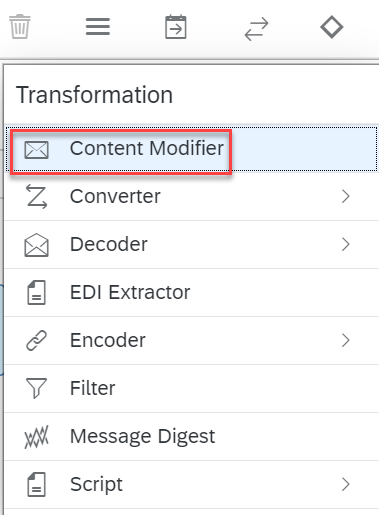
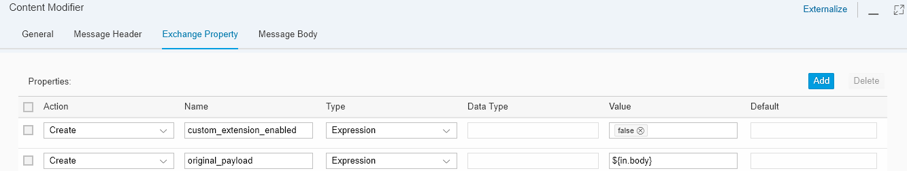

<!-- loioa51751f9c647451b85745417732d1de0 -->

# Defining the Content Modifier

1.  Add a Content Modifier after the start message event.

    You find the Content Modifier shape in the palette under *Message Transformation* \> *Content Modifier*.

    

2.  On the *Exchange Property* tab, enter the following property \(by selecting *Add* and specifying the property\):

    ****

    <table>
    <tr>
    <th valign="top">

    Parameter
    
    </th>
    <th valign="top">

    Select Option/Enter
    
    </th>
    </tr>
    <tr>
    <td valign="top">
    
    *Name* 
    
    </td>
    <td valign="top">
    
    Enter `original_payload`
    
    </td>
    </tr>
    <tr>
    <td valign="top">
    
    *Type* 
    
    </td>
    <td valign="top">
    
    Select *Expression*
    
    </td>
    </tr>
    <tr>
    <td valign="top">
    
    *Value* 
    
    </td>
    <td valign="top">
    
    Enter `${in.body}`
    
    </td>
    </tr>
    </table>
    
    This property stores the content of the inbound message \(message A, which is retrieved from the WebShop\) by dynamically evaluating the Camel simple expression `${in.body}` at runtime.

We define the second property as an externalized parameter.

1.  Select *Externalize*.

2.  Go to the *Exchange Property* tab.

3.  Enter `custom_extension_enabled` under *Name*, select *Expression* as the *Type*, , and enter `{{ custom_extension_enabled }}` in the *Value* field.

    

4.  Click `Define Value` \(in the *Value* field\), and on the next screen enter `false`. Then, choose *OK*

The final Content Modifier has the following settings:

When the integration flow is being processed, the Content Modifier does the following:

-   It writes the complete message body \(retrieved from the external OData API\) into the property `original_payload`.

-   Secondly, it writes the value specified during integration flow configuration for the externalized parameter `custom_extension_enabled` into the Exchange property. This property is used in the subsequent routing step to determine whether the default route is taken \(where only the SAP mapping is processed and nothing else is done to the message\) or whether the customer exit is taken \(if the value of `custom_extension_enabled` is set to `true`\).

**Related Information**  

[Define Content Modifier](define-content-modifier-8f04a70.md "")

