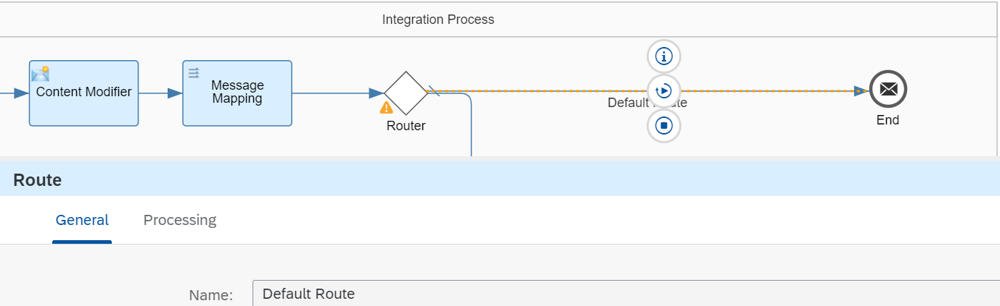

<!-- loio6e5b9f6031bc4e8cbe35ac2679a1bc00 -->

# Defining the Router, Process Call, and Filter Steps

Now that you have defined the local integration process, you can continue with the design of the main integration process.

1.  In the main integration process, add a Router step to the right of the message mapping. You can find the step type in the palette under *Message Routing* \> *Router*.

2.  Add another end message event \(from the palette under *Events*\) and place it below the existing one.

3.  Connect the Router step with the second end message event.

4.  Click the upper route \(connection of router step and upper end message event\) and, on the *Processing* tab, select *Default Route*.

    

5.  Click the lower route and, on the *Processing* tab, specify the following:

    -   Select *Non-XML* as *Expression Type*.

    -   Under *Condition*, enter the following routing condition:

        `${property.custom_extension_enabled} = 'true'`

        This condition will be evaluated at runtime in the following way: The value of the \(externalized\) parameter `custom_extension_enabled` is checked. If the value is `true`, this route will be processed. If not, the default route is processed \(which means that message is not subjected to any further processing after the standard mapping step\).

    

6.  In the lower route, add a Process Call step \(which you can find in the palette under *Call* \> *Local Call*\).

    Select the Process Call shape and, on the *Processing* tab, choose *Select*. You can now select the local integration process that you have already defined in a preceding step.

7.  In the lower route, after the Process Call shape, add a Filter step \(you can find this in the palette under *Transformation* \> *Filter*\).

    This part of the integration flow model should now look like this:

    

8.  On the properties sheet of the Filter step. under *Processing*, add the following expressing in the *XPath Expression* field:

    `/p2:Messages/p2:Message1/p1:Order_MT`

    Note that this setting contains two different namespace prefixes, `p1` and `p2`. The mapping of these prefixes with the relevant namespaces is defined on the *Runtime Configuration* tab of the integration flow \(as shown in [Defining the Standard Message Mapping](defining-the-standard-message-mapping-c0e0f6d.md)\).

    Using different namespace prefixes and addressing them correctly as described is necessary to make sure that the correct parts of the message are filtered. Note that this Filter step comes after the Process Call step, and so it gets the message processed in the post-exit integration flow as input.

