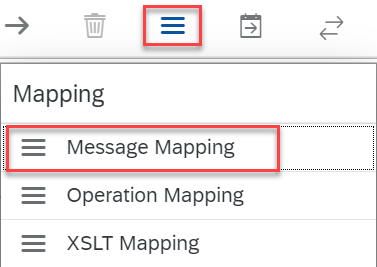
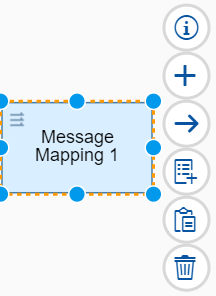
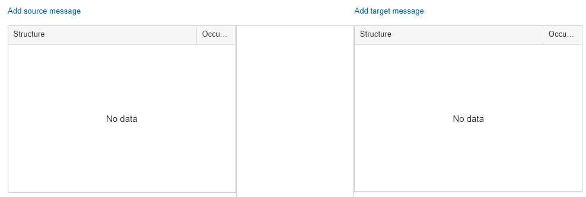
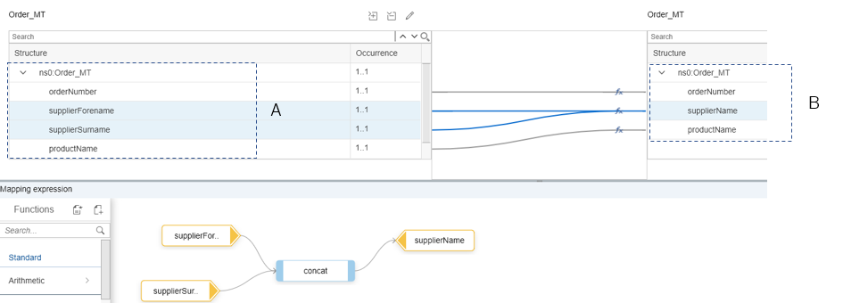

<!-- loioc0e0f6d3905b48e0afa317f9abbcc48c -->

# Defining the Standard Message Mapping

Before defining the standard mapping, you need to upload to the tenant certain resource files \(Web Services Definition Language, or WSDL files for short\) that define the structure of source message \(A\) and target message \(B\) of the mapping. To facilitate the design of the demo scenario, we provide you with the content of the WSDL files in this section.

To upload the WSDL files, perform the following steps:

1.  Copy the content of the following coding example into a text editor and save it as a file with extension `.wsdl` \(for example, `A.wsdl`\).

    This WSDL file defines the structure of the source message of the standard mapping \(corresponding to the original **message A**, which is sent to the integration flow through the SOAP client\).

    > ### Sample Code:  
    > ```
    > <?xml version="1.0" encoding="UTF-8"?>
    > <wsdl:definitions name="SendOrder_Async"
    > 	targetNamespace="http://cpi.sap.com/demo" xmlns:p1="http://cpi.sap.com/demo"
    > 	xmlns:wsp="http://schemas.xmlsoap.org/ws/2004/09/policy"
    > 	xmlns:wsu="http://docs.oasis-open.org/wss/2004/01/oasis-200401-wss-wssecurity-utility-1.0.xsd"
    > 	xmlns:wsdl="http://schemas.xmlsoap.org/wsdl/">
    > 	<wsdl:documentation />
    > 	<wsp:UsingPolicy wsdl:required="true" />
    > 	<wsp:Policy wsu:Id="OP_SendOrder_Async" />
    > 	<wsdl:types>
    > 		<xsd:schema targetNamespace="http://cpi.sap.com/demo"
    > 			xmlns:xsd="http://www.w3.org/2001/XMLSchema" xmlns="http://cpi.sap.com/demo">
    > 			<xsd:element name="Order_MT" type="Order_DT" />
    > 			<xsd:complexType name="Order_DT">
    > 				<xsd:sequence>
    > 					<xsd:element name="orderNumber" type="xsd:string" />
    > 					<xsd:element name="supplierForename" type="xsd:string" />
    > 					<xsd:element name="supplierSurname" type="xsd:string" />
    > 					<xsd:element name="productName" type="xsd:string" />
    > 				</xsd:sequence>
    > 			</xsd:complexType>
    > 		</xsd:schema>
    > 	</wsdl:types>
    > 	<wsdl:message name="Order_MT">
    > 		<wsdl:documentation />
    > 		<wsdl:part name="Order_MT" element="p1:Order_MT" />
    > 	</wsdl:message>
    > 	<wsdl:portType name="SendOrder_Async">
    > 		<wsdl:documentation />
    > 		<wsdl:operation name="SendOrder_Async">
    > 			<wsdl:documentation />
    > 			<wsp:Policy>
    > 				<wsp:PolicyReference URI="#OP_SendOrder_Async" />
    > 			</wsp:Policy>
    > 			<wsdl:input message="p1:Order_MT" />
    > 		</wsdl:operation>
    > 	</wsdl:portType>
    > 	<wsdl:binding name="SendOrder_AsyncBinding" type="p1:SendOrder_Async">
    > 		<soap:binding style="document"
    > 			transport="http://schemas.xmlsoap.org/soap/http" xmlns:soap="http://schemas.xmlsoap.org/wsdl/soap/" />
    > 		<wsdl:operation name="SendOrder_Async">
    > 			<soap:operation soapAction="http://sap.com/xi/WebService/soap1.1"
    > 				xmlns:soap="http://schemas.xmlsoap.org/wsdl/soap/" />
    > 			<wsdl:input>
    > 				<soap:body use="literal" xmlns:soap="http://schemas.xmlsoap.org/wsdl/soap/" />
    > 			</wsdl:input>
    > 		</wsdl:operation>
    > 	</wsdl:binding>
    > </wsdl:definitions>
    > ```

    You will notice that the WSDL contains exactly the same fields that are shown in the topic [Standard Mapping](standard-mapping-56c3bf5.md) for message A.

2.  Do the same with the following code sample, but save it under a different name, for example, `B.wsdl`.

    This WSDL file defines the structure of the target **message B** of the standard mapping.

    > ### Sample Code:  
    > ```
    > <?xml version="1.0" encoding="UTF-8"?>
    > <wsdl:definitions name="SendOrder_Async"
    > 	targetNamespace="http://cpi.sap.com/demo" xmlns:p2="http://cpi.sap.com/demo"
    > 	xmlns:wsp="http://schemas.xmlsoap.org/ws/2004/09/policy"
    > 	xmlns:wsu="http://docs.oasis-open.org/wss/2004/01/oasis-200401-wss-wssecurity-utility-1.0.xsd"
    > 	xmlns:wsdl="http://schemas.xmlsoap.org/wsdl/">
    > 	<wsdl:documentation />
    > 	<wsp:UsingPolicy wsdl:required="true" />
    > 	<wsp:Policy wsu:Id="OP_SendOrder_Async" />
    > 	<wsdl:types>
    > 		<xsd:schema targetNamespace="http://cpi.sap.com/demo"
    > 			xmlns:xsd="http://www.w3.org/2001/XMLSchema" xmlns="http://cpi.sap.com/demo">
    > 			<xsd:element name="Order_MT" type="Order_DT" />
    > 			<xsd:complexType name="Order_DT">
    > 				<xsd:sequence>
    > 					<xsd:element name="orderNumber" type="xsd:string" />
    > 					<xsd:element name="supplierName" type="xsd:string" />
    > 					<xsd:element name="productName" type="xsd:string" />
    > 				</xsd:sequence>
    > 			</xsd:complexType>
    > 		</xsd:schema>
    > 	</wsdl:types>
    > 	<wsdl:message name="Order_MT">
    > 		<wsdl:documentation />
    > 		<wsdl:part name="Order_MT" element="p2:Order_MT" />
    > 	</wsdl:message>
    > 	<wsdl:portType name="SendOrder_Async">
    > 		<wsdl:documentation />
    > 		<wsdl:operation name="SendOrder_Async">
    > 			<wsdl:documentation />
    > 			<wsp:Policy>
    > 				<wsp:PolicyReference URI="#OP_SendOrder_Async" />
    > 			</wsp:Policy>
    > 			<wsdl:input message="p2:Order_MT" />
    > 		</wsdl:operation>
    > 	</wsdl:portType>
    > 	<wsdl:binding name="SendOrder_AsyncBinding" type="p2:SendOrder_Async">
    > 		<soap:binding style="document"
    > 			transport="http://schemas.xmlsoap.org/soap/http" xmlns:soap="http://schemas.xmlsoap.org/wsdl/soap/" />
    > 		<wsdl:operation name="SendOrder_Async">
    > 			<soap:operation soapAction="http://sap.com/xi/WebService/soap1.1"
    > 				xmlns:soap="http://schemas.xmlsoap.org/wsdl/soap/" />
    > 			<wsdl:input>
    > 				<soap:body use="literal" xmlns:soap="http://schemas.xmlsoap.org/wsdl/soap/" />
    > 			</wsdl:input>
    > 		</wsdl:operation>
    > 	</wsdl:binding>
    > </wsdl:definitions>
    > ```

    > ### Tip:  
    > You might have noticed that in this WSDL document the namespace prefix `p2` is used instead of the namespace prefix `p1` \(used in the WSDL for message A\). For example, note the following entry: `p2="http://cpi.sap.com/demo`.
    > 
    > This is an important detail. Using the correct namespace prefixes \(and making some further related settings in the integration flow as shown below\) makes sure that the merged message that is passed on to the post-exit mapping can be interpreted in the right way. Using namespaces correctly is critical because the merged message contains the structures of messages A and B, which have many elements with the same name.
    > 
    > We map the namespaces in the next step to complete this configuration.

3.  In the integration flow editor, click somewhere outside the *Integration Process* shape and select *Runtime Configuration*. In field *Namespace Mapping* enter the following:

    `xmlns:p1=http://cpi.sap.com/demo;xmlns:p2=http://sap.com/xi/XI/SplitAndMerge`

    The namespace mapped to the prefix `p2` relates to the final merged message.

4.  In the integration flow editor, click somewhere outside the *Integration Process* shape and select *Resources*.

5.  Choose *Add* \> *Schema* \> *WSDL* and browse to the `A.wsdl` file.

    

6.  Repeat these steps for the `B.wsdl` file.


Now you can define the mapping step.

1.  In the integration flow model, select the *Message Mapping* shape from the palette \(under *Mapping*\) and place it in the model after the second Content Modifier.

    

2.  Choose the *\+* icon next to the message mapping shape and enter a name for the message mapping \(for example, `standardmapping`\).

    

3.  Choose *Create*.

4.  The graphical mapping editor is opened.

5.  Choose *Add source message* and browse to the WSDL file of the source message \(in our example, the file `A.wsdl`\). Choose *Upload from file system*.

    

6.  Choose *Add target message* and repeat the steps with the WSDL file for the target message \(`B.wsdl`\).

7.  Connect the fields of the source and target message in the following way using the cursor:

    -   Connect `orderNumber` in the source message with `orderNumber` in the target message.

    -   Connect `supplierForename` in the source message with `supplierName` in the target message.

    -   Connect `supplierSurname` in the source message with `supplierName` in the target message.

    -   Connect `productName` in the source message with `productName` in the target message.


8.  Click `supplierForename` in the source message. The connectors between `supplierForename` and `supplierSurname` \(in the source message\) and `supplierName` \(in the target message\) are highlighted.

9.  In the section below the graphical mapping editor, select the function *Text* \> *Concat*. Connect the source and target fields in the following way:

    Connect `supplierForename` with `string1` and `supplierSurname` with `string2`. Connect `concat` with `supplierName`.

    Furthermore, you can add a delimiter string \(for example, `/` or an empty space\).

    

    Your mapping should now look like this:

    

    This mapping function merges the fields `supplierForename` and `supplierSurname` from the source message to one single field `supplierName` in the target message \(where the values are separated in the target field by the delimiter string\).

10. Choose *OK*. The integration flow model is displayed again.


