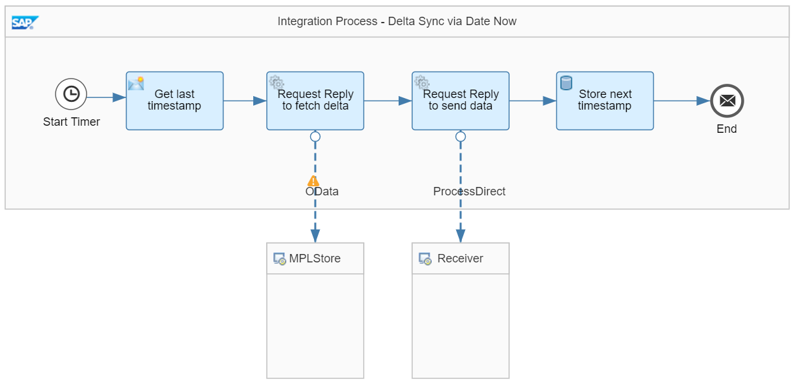

<!-- loio698307ad7f924c6f8069cbaadcf24180 -->

# Delta Synchronization Via Date Now XPath

The *Modeling Basics - DeltaSync Timestamp via Date Now* example integration flow is designed in the following way:

It works as follows:

1.  The integration flow starts with a Timer event.

    Usually, you schedule the timer on a regular basis. For demo purposes, the timer is scheduled to run once. The message is triggered immediately after the integration flow is deployed. For the 2nd and all subsequent runs, the integration flow must be deployed again.

2.  In the *Get last timestamp* Content Modifier step, the `lastSync` and `dateNow` exchange properties are specified in the following way:

    ****

    <table>
    <tr>
    <th valign="top">

    Name
    
    </th>
    <th valign="top">

    Type
    
    </th>
    <th valign="top">

    Value
    
    </th>
    <th valign="top">

    Default Value
    
    </th>
    </tr>
    <tr>
    <td valign="top">
    
    lastSync
    
    </td>
    <td valign="top">
    
    Local Variable
    
    </td>
    <td valign="top">
    
    timestamp\_DS\_DateNow
    
    </td>
    <td valign="top">
    
    \{\{defaultDate\}\}
    
    </td>
    </tr>
    <tr>
    <td valign="top">
    
    dateNow
    
    </td>
    <td valign="top">
    
    Expression
    
    </td>
    <td valign="top">
    
    $\{date:now:yyyy-MM-dd'T'HH:mm:ss.000\}
    
    </td>
    <td valign="top">
    
     
    
    </td>
    </tr>
    </table>
    
    The value of the `timestamp_DS_DateNow` local variable is written into the `lastSync` property. During the first run of the process, the `timestamp_DS_DateNow` local variable doesn't exist yet. Therefore, the default value is assigned to the property. In this case, a default timestamp is used that must not be too far in the past in order to avoid a huge amount of data being retrieved.

    In order to be able to persist the timestamp of the current integration flow execution, the current timestamp is stored in the `dateNow` property. Once everything is processed successfully, this is the timestamp that is persisted and, therefore, used in the next call.

    As a result, the first run picks up all records from the source system. For all subsequent scheduled executions of the process, a timestamp stored in the `timestamp_DS_DateNow` variable is used.

3.  In the next step, the OData channel requests message processing logs via the OData API.

    The OData receiver channel contains the following details:

    ****

    <table>
    <tr>
    <th valign="top">

    Parameter
    
    </th>
    <th valign="top">

    Value
    
    </th>
    </tr>
    <tr>
    <td valign="top">
    
    Operation Details
    
    </td>
    <td valign="top">
    
    GET
    
    </td>
    </tr>
    <tr>
    <td valign="top">
    
    Resource Path
    
    </td>
    <td valign="top">
    
    MessageProcessingLogs
    
    </td>
    </tr>
    <tr>
    <td valign="top">
    
    Query Options
    
    </td>
    <td valign="top">
    
    $select=MessageGuid, Status, LogStart&$filter=LogStart gt datetime'$\{property.lastSync\}' and LogStart lt datetime'$\{property.dateNow\}'
    
    </td>
    </tr>
    </table>
    
4.  In the 2nd call, the result set is sent to the receiver integration flow where it is stored in the *DeltaSync* Data Store.

5.  Once the data exchange is complete, the *Store next timestamp* Write Variables step persists the timestamp of the `dateNow` property in the `timestamp_DS_DateNow` variable.

    > ### Note:  
    > The *Store next timestamp* step \(that stores data in the tenant database\) is placed at the very end of the overall process to guarantee data consistency. This also avoids keeping the database transaction open for too long. If an exception occurs during integration flow processing, the old timestamp isn't overwritten, and a subsequent integration flow execution fetches the same data again. With this setup, *at least once* quality of service is implemented. With respect to the database transaction, *Transaction Handling* for the Integration Process is set to *Not Required*. Otherwise, a database transaction is already opened at the beginning of the overall process and kept open until the whole process ends. For large messages, this can cause transaction log issues on the database.

