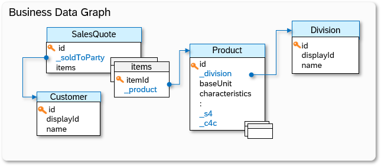
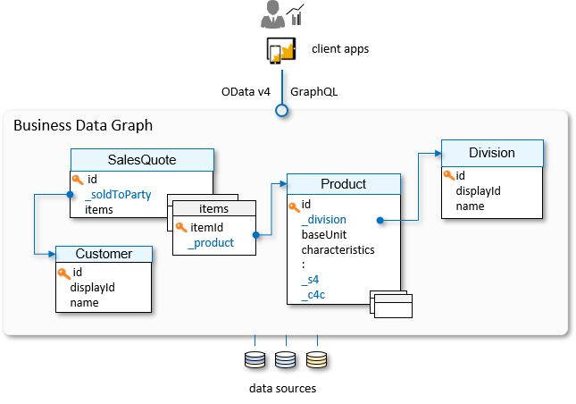

<!-- loio93b23dfa78fa4927ab99fcfa9ef090b4 -->

# Develop

As a developer, you want to build applications that consume data from business data graphs. This guide provides all the information you need to start developing.

This section provides:

-   Conceptual information you need to connect Graph APIs to your applications.

-   Information about how to connect and use:

    -   [Graph Navigator on Developer Hub](graph-navigator-on-developer-hub-8e75d31.md).

        This tool is available in Graph on the SAP Integration Suite home page. You can inspect your configured business data graphs and try them out on your own system, including custom services, model extensions, and more.

    -   [Graph Navigator](https://api.sap.com/graph) on SAP Business Accelerator Hub.

        A public listing of all supported entities from SAP business systems in a business data graph. You can try out the [Graph APIs](https://api.sap.com/api/Graph_ConfigurationAPI/overview) using the provided sandbox system.

    -   [Graph Syntax Diagrams](graph-syntax-diagrams-86101be.md) that give you a graphical representation of the APIs.

SAP is famous for its ERP software, but today SAP customers have increasingly complex requirements and are managing intricate and hybrid on-premise and cloud solutions. Customers want to become intelligent enterprises. To support their journey, SAP has augmented its ERP-centric business suite with substantial additional functions through the acquisition of cloud solutions like SAP SuccessFactors, SAP Concur, SAP Ariba, and SAP Customer Experience \(SAP CX\). SAP’s Intelligent Suite portfolio now supports all key business processes and spans all enterprise functions, but this expanded role and diversity of solutions has introduced some complexity and heterogeneity.

From the perspective of a software developer, this means that accessing SAP-managed data is complex. Data may be federated across hybrid networks of on-premise and cloud systems with different security protocols, replication processes, and multiple master data copies. You don’t only have to worry about the data you are interested in, you have to know exactly where that data is located, and how to deal with connecting to these different customer systems. Different products have different connection protocols, security requirements and APIs, and those APIs expose data using different and application-specific data models. Developing SAP extension apps requires mastering a broad set of skills, and the applications you develop are sensitive to the smallest product and landscape configuration changes.

This is the problem that Graph addresses.

Graph is a  unified API for SAP. It addresses this run-away API complexity and integration challenge by providing developers a single connected and unified view of all their business data, consolidating the data models of data sources like SAP S/4HANA, SAP Sales Cloud, and SAP SuccessFactors into one, unified and connected data model of the data in a specific landscape. We call this the *Business Data Graph*.

A data graph is a connected graph, with data entities serving as the nodes of the graph and edges that represent relationships \(which we call associations\) between those entities. The nodes of the business data graph are the common enterprise business objects, like `Customer`, `Supplier`, `Product`, `Sales`, `Purchase Order`, `General Ledger`, and so forth.

As a developer, you face a dilemma. The concept of a `Product` or a `Customer` is common to many of the business systems that make up a landscape. Which of these definitions should you use? Where in the landscape is this data managed? Graph resolves this dilemma by introducing unified entities that provide the most common attributes of a business model for easy consumption and connect to the corresponding system-specific business objects for a full 360° view of the business object. You can use the unified entities for simple use-cases, and easily access over 4,500 additional mirrored entities, via over 2,000 root entities, for advanced usage.

To illustrate these aspects of the data business graph, it is best if we use a simple example taken from the enterprise world of sales.

A salesperson entered a quote on behalf of a customer. This quote is represented by a unified `SalesQuote` entity. The quote has an association to a `Customer` entity. The quote also has multiple items, each of which refer to a `Product` entity, which in turn has multiple associations to other entities, like `Division`.

Each entity has many additional *attributes*, such as a key \(called `id` in unified entities\), and various other attributes, which can be flat, arrays, or more complex structured compositions of other attributes. For instance, `items` is an array of a structured type.

With Graph you navigate to and access the data you need, regardless of where this data resides. Graph abstracts the physical landscape and the details of the different product stacks and offers you a simple view of the SAP-managed data, which you can access through a single API, spanning all key use cases. Graph accesses the data in the customer-configured landscape on your users’ behalf, technically acting as middleware. Graph itself doesn’t store or cache any data.

The illustration shows your \(client\) app accessing quote, product, customer, and supplier data – but the app cannot tell if this data is accessed from an on-premise SAP S/4HANA system, SAP Sales Cloud, or another system. This is determined by the specific landscape configuration that Graph accesses on behalf of the app. As a developer, you are exempted from knowing these system details, or how to access data in these heterogeneous systems. More importantly, your application is portable across multiple and diverse landscapes without changes to your code.

But what if your app requires detailed attribute information that is not modeled in the unified entity? For instance, your app may be interested in `Product` inventory information, that is unique to data sources of type *SAP S/4HANA*. No problem, just navigate to the * \_s4* association to access the required system-specific information, like the `CountryOfOrigin` of the product, or navigate further to the product storage.

[Graph Navigator](https://api.sap.com/graph) is the single source of information about the collection of over 2200 root entities that you can access via Graph. It lists the unified entities, as well as the system-specific entities.

