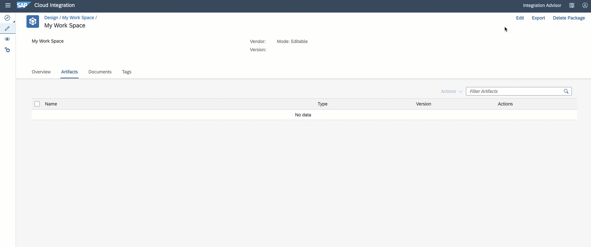

<!-- loio1d52a7ba8c71438d90f3ea0d8e13a052 -->

<link rel="stylesheet" type="text/css" href="../css/sap-icons.css"/>

# Developing Message Mapping As An Artifact

Helps you to reuse message mapping resources in different integration scenarios by directly accessing the mapping artifacts.

Message mapping as an artifact consists of a mapping definition \(\*.mmap\) file that is created or imported by a user. When you build your integration scenario, you can refer these artifacts to the message mapping step configured in the integration flow.

<a name="loio1d52a7ba8c71438d90f3ea0d8e13a052__section_z5m_lbb_bqb"/>

## Adding Message Mapping Artifact in an Integration Package

<a name="loio1d52a7ba8c71438d90f3ea0d8e13a052__table_k5h_3ks_ypb"/>These are the following options available to define a message mapping artifact:

<table>
<tr>
<th valign="top">

Action

</th>
<th valign="top">

Description

</th>
</tr>
<tr>
<td valign="top">

*Create*

</td>
<td valign="top">

You use it to create new message mapping artifact project that consists of source and target schema files. With the help of the mapping editor you can add schema files, define mapping between source and target messages and create a groovy script to consume User Defined Functions \(UDFs\). See: [Creating Message Mapping As A Flow Step](creating-message-mapping-as-a-flow-step-3d5cb7f.md).

</td>
</tr>
<tr>
<td valign="top">

*Upload*

</td>
<td valign="top">

You use this option to upload a message mapping artifact stored on your computer. Once selected, you can upload a message mapping definition as a zip file from your file system.

</td>
</tr>
<tr>
<td valign="top">

*ES Repository*

</td>
<td valign="top">

You use this option to import the a message mapping created in the the Enterprise Services Repository \(ES Repository\). For more information on importing such content see [Importing Mapping Content from ES Repository](importing-mapping-content-from-es-repository-e18fc05.md).

</td>
</tr>
</table>

<a name="loio1d52a7ba8c71438d90f3ea0d8e13a052__section_wx1_jnh_xpb"/>

## How to refer a message mapping artifact in an integration flow?

We assume that you've added a mapping step in your integration flow. See: [Working with Mapping](working-with-mapping-68d816a.md).

Consuming a mapping artifact is a two-step process in your integration flow.

1.  To add message mapping artifacts as reference resources in your integration flow, perform the following steps:

    1.  Open your integration flow in edit mode.

    2.  In the property sheet, choose *Resources* \> *References* \> *Add References* \> *Message Mapping*.

    3.  Select one or more message mapping artifacts that you like to reuse in your integration scenario.

    4.  Choose *OK*.

2.  To reuse mapping artifacts in a message mapping step, perform the following steps:

    1.  Choose the quick action in the *Message Mapping* step, and then choose  .

    2.  In the *Select Mapping Resource* dialog box, choose the *Referenced Resources* tab.

    3.  In the message mapping resources list, select the referenced mapping artifact.

    4.  Choose *OK*.

Make sure that you first deploy the message mapping artifact and thereafter the integration flow that reuses the message mapping artifact. For more information, check out the following SAP Community blog: [Message Mapping as Artifact](https://blogs.sap.com/2021/06/17/sap-cloud-integration-message-mapping-as-artifact/).

<a name="loio1d52a7ba8c71438d90f3ea0d8e13a052__section_izl_glr_4pb"/>

## Benefits of Using Message Mapping Artifacts

-   **Reusability** – Refer the mapping artifacts in multiple integration scenarios instead of manually uploading them every time and avoid duplicates.

-   **Reduce Maintenance Efforts** – By referring the artifact from a single place, you only have to edit the artifact once if there are changes needed.

-   **Reduce File Size and Memory Usage** – By avoiding multiple upload instances you can get extra storage space.

