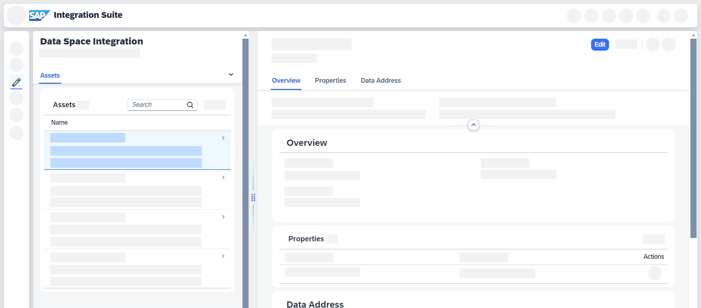

<!-- loio5f2d07d21bca4f008cc35e47b6883eb2 -->

# Editing Assets

Edit an existing asset in Data Space Integration.

## Context

You want to edit an existing asset by changing information about properties or the data address. For information about creating a new asset, see [Creating Assets](creating-assets-5e051be.md).

## Procedure

1.  In SAP Integration Suite, go to *Design* \> *Data Spaces* \> *Assets*.

2.  From the list of assets, select the asset that you want to edit. A detail screen opens.

3.  Choose *Edit*.

    

4.  You can now make your changes, for instance, adding properties or providing a new description.

    > ### Note:  
    > You can't change the unique ID. To change the unique ID, you need to create an entirely new asset.

5.  Choose *Save* to confirm your changes. Your asset is now listed in the table view. See [Working with Assets](working-with-assets-fa84319.md).

