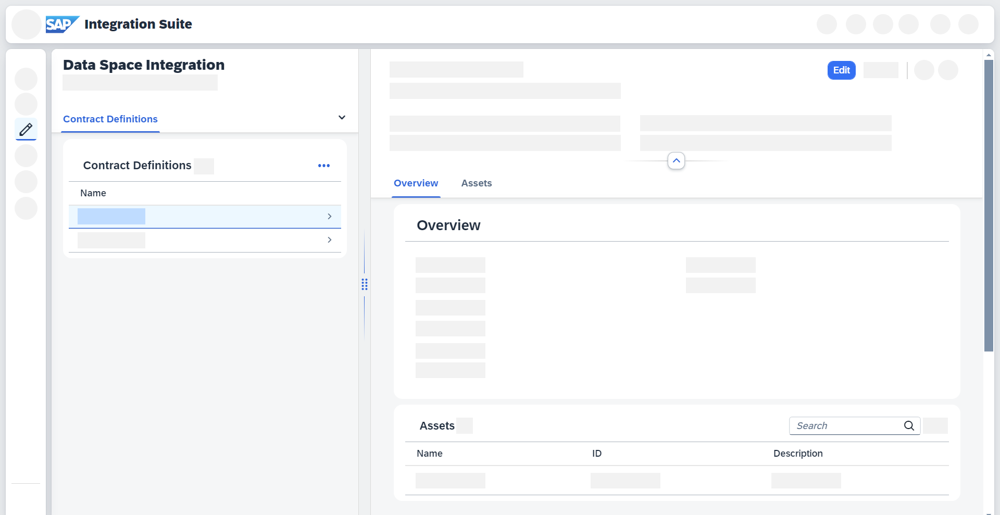

<!-- loio38d141bed01e44b7b763625d30659b44 -->

# Editing Contract Definitions

Edit a contract definition in Data Space Integration.

## Context

You want to edit an existing contract definition or the assets and policies associated with it. If you want to create a new contract definition, see [Creating Contract Definitions](creating-contract-definitions-7746d65.md).

## Procedure

1.  In SAP Integration Suite, go to *Design* \> *Data Spaces* \> *Contract Definitions*.

2.  Select the contract definition you want to edit from the list. A detail screen opens.

    

3.  Choose *Edit*:

    1.  If you want to edit the*Name*, *Description*, or the associated policies, make your changes in the *Overview* section.

    2.  If you want to edit the assets, go to the *Asset* section and click *Edit* next to the search bar.

4.  Choose *Save*. Your contract definition is now listed the overview list. See [Working with Contract Definitions](working-with-contract-definitions-f136d72.md).

