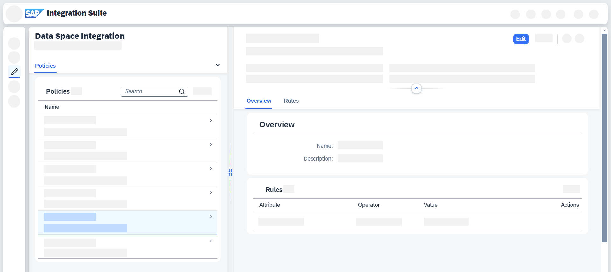

<!-- loio5ea31f2a0feb444c9aed1fb1b552da58 -->

# Editing Policies

Edit a policy in Data Space Integration.

<a name="loio5ea31f2a0feb444c9aed1fb1b552da58__context_whq_rgm_2yb"/>

## Context

You want to edit an existing policy.

<a name="loio5ea31f2a0feb444c9aed1fb1b552da58__steps_akn_qbf_2yb"/>

## Procedure

1.  In SAP Integration Suite, go to *Design* \> *Data Spaces* \> *Policies*.

2.  Select the policy that you want to edit from the list of policies. A details screen opens.

3.  Choose *Edit*.

    

4.  Edit the *Name*, *Description*, and add or delete rules.

5.  Confirm your changes by choosing *Save*. See [Working with Policies](working-with-policies-c930aed.md).

