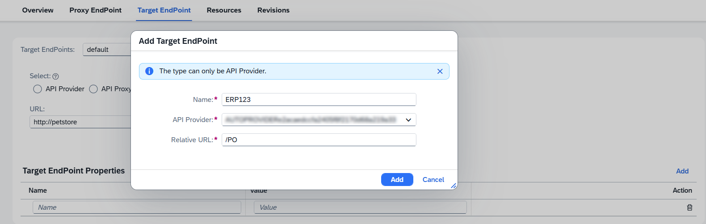
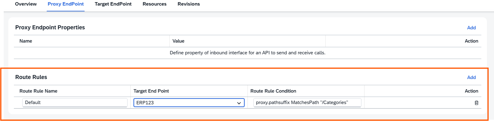

<!-- loio49cbe91782a34f8996204eb16c237204 -->

# Enable Dynamic Routing

Define route rules to enable dynamic routing in an API proxy.

## Context

A route connects an API proxy endpoint to an API target endpoint. It governs the path of a request from proxy endpoint to target endpoint and determines which target endpoint to invoke based on the condition defined in proxy EndPoint definition. Typically, a route includes a URL used to access the API proxy endpoint and a URL of the backend service defined in target endpoint definition.

In Integration Suite, when you create an API proxy, a deafult route rule is set and it always forwards the request to the default target endpoint defined in target endpoint definition. When more than one target endpoint is defined, the route rule evaluates the condition set in proxy endpoint definition. If the condition evaluates to true, it forwards the request to the named target endpoint.

The following procedure describes how to achieve dynamic routing in Integration Suite. Let’s say you want to route an API proxy request to two different target endpoints, a default target endpoint and a new target endpoint based on a condition set in the proxy endpoint definition.

For our implementation, let’s consider the following two target endpoints:

-   Target\_Endpoint\_1 \(default\)

    `https://services.odata.org/V2/Northwind/Northwind.svc/`

-   Target\_Endpoint\_2

    `https://services.odata.org/V2/OData/OData.svc/`

## Procedure

**Creating a simple API proxy**

1.  Navigate to Integration Suite.

2.  Choose the navigation icon on the left and choose *Configure* \> *APIs*.

3.  Under *APIs*, choose *Create* to create a simple API proxy.

4.  In the *Create API* wizard, choose the *URL* radio button.

    > ### Note:  
    > You can also choose to create an API by choosing the *API Provider* option. For more information, see [Create an API Proxy](create-an-api-proxy-c0842d5.md) 

5.  In the *URL* field, enter the target URL of your backend service. In this case, URL pointing to Target\_Endpoint\_1 \(default\).

6.  Enter a name and a title for your API proxy. In this case, let’s enter the API proxy name as `Dynamic_Routing`.

7.  Scroll down the wizard and enter the base path of your API proxy in the *API Base Path* field. In this case, let’s enter the base path as `/multitargets`.

8.  Choose *Create*.

9.  Save and deploy your API proxy.

    > ### Note:  
    > When the API proxy is created, the default route rule is set. It points to the default target endpoint and no rule is attached to it.

10. Navigate to the *Configure* \> *APIs* tab. From the *APIs* list, choose the API proxy that you deployed.

**Steps for defining new target endpoint manually**

11. Choose *Target Endpoint* and choose *Edit*.

12. Choose *Add* and in the *Add Target Endpoint* dialog, :

13. Enter the *Name*, select the *API Provider* from the dropdown and provide a *Relative URL* and choose *Add*.

    

    > ### Note:  
    > In the *Add Target Endpoint* dialog, you can only add a target endpoint that is accessible via an API provider. Once the target endpoint is added, you can choose how you want to access it—either through an API Proxy or a URL.
    > 
    > -   If you select *API Proxy*, choose *Discover* and choose the desired API proxy.
    > -   If you select *URL*, you must manually enter the target URL in the textbox.

14. You can also choose to define the *Target Endpoint Properties* by choosing *Add*. See [Target Endpoint Properties](target-endpoint-properties-edeed6a.md) for the property name and the default values.

15. Now choose *Save* and navigate to the *Proxy Endpoint* tab.

16. Choose *Edit* and choose *Add* below the *Route Rules* section.

17. Provide a name for the route rule, select the target endpoint you created from the dropdown menu, and enter the route rule condition.

    Define a condition based on which you want to route the request dynamically. In this case, let’s add a `proxy.pathsuffix MatchesPath` condition under the default route rule and set it to the path called `/Categories` as shown below:

    > ### Note:  
    > If you have defined more than one route rule in the proxy endpoint as shown in the above codeblock, their sequence in the XML configuration is important. The first router rule to match gets executed. \(Route rules with no condition always match\) Hence, it is always recommended to list your conditional route rules before an unconditional route rule.

18. Choose *Save*.

19. Now, click on the API proxy URL.

    The request must be routed to the default target endpoint.

20. Append `/Categories` to the API proxy URL in your browser.

    The request must be routed dynamically to the new target endpoint.

    > ### Note:  
    > All the policies that you attach in the target endpoint via the API portal user interface are applied only to the default target endpoint. In case, if you need to enforce policies on the non-default target endpoint, then you must import the API proxy bundle and manually add the policies in the required target endpoint definition file.

