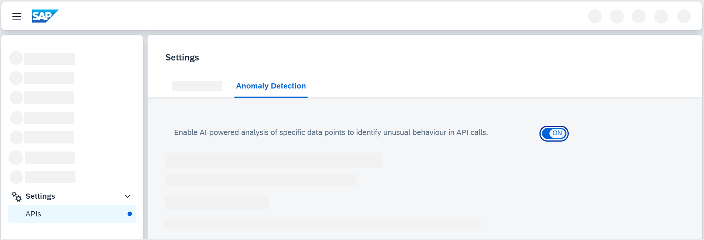

<!-- loio98534a0f8d1d4c4d98bea4b84e762787 -->

# Enabling Anomaly Detection

To detect anomalies for API proxy calls, you need to enable the anomaly detection setting.

<a name="loio98534a0f8d1d4c4d98bea4b84e762787__prereq_pkk_gsy_31c"/>

## Prerequisites

The role collection *APIPortal.Administrator* should be assigned to you.

> ### Note:  
> The availability of the anomaly detection feature is dependent on your SAP Integration Suite service plan. For more information about different service plans and their supported feature set, see SAP Notes [2903776](https://me.sap.com/notes/2903776) and [3463620](https://me.sap.com/notes/3463620).

<a name="loio98534a0f8d1d4c4d98bea4b84e762787__context_ncd_4rs_21c"/>

## Context

To enable anomaly detection through the SAP Integration Suite, follow the steps below:

## Procedure

1.  Log on to the **SAP Integration Suite**.

2.  From the left navigation pane, choose *Settings* \> *APIs*.

3.  Go to the *Anomaly Detection* tab.

4.  Toggle the radio button to the *ON* position.

    

    > ### Note:  
    > Disabling the Anomaly Detection feature will delete all associated anomaly data.

<a name="loio98534a0f8d1d4c4d98bea4b84e762787__result_jpj_rrs_21c"/>

## Results

Anomaly Detection for API proxy calls is now enabled.

**Related Information**  

[Configuring APIs for Anomaly Detection](configuring-apis-for-anomaly-detection-9e7e5d1.md "View or configure APIs for anomaly detection.")

[Working with Detected Anomalies](working-with-detected-anomalies-1c677b2.md "Access and analyze anomalies in the analytics dashboard. Discover details about the various types of anomalies, evaluate and resolve them.")

[Subscribing to Notification Alerts](subscribing-to-notification-alerts-88e96f4.md "Receive real-time alerts for anomaly detection services, delivered to your preferred communication channel.")

