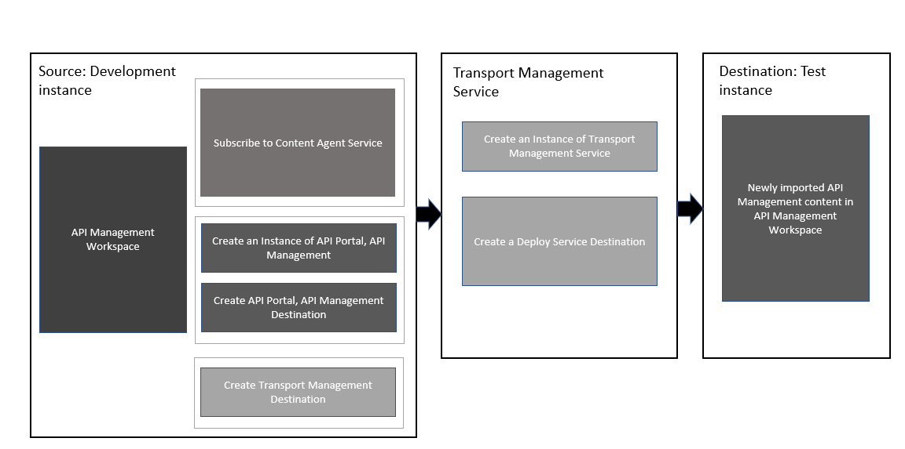

<!-- loio4f5544162d1b480eae3b70368e32aef7 -->

# Enabling Content Transport Using SAP Cloud Transport Management Service

Configure the service instances and destinations, and establish a route between the source and destination nodes to enable transportation of APIs and its related artifacts.

<a name="loio4f5544162d1b480eae3b70368e32aef7__prereq_exx_yyt_n4b"/>

## Prerequisites

-   Create a source subaccount and subscribe to API portal, API Management. For more information, see [Set Up API Portal Application](https://help.sap.com/viewer/66d066d903c2473f81ec33acfe2ccdb4/Cloud/en-US/29c281b4a002404eba44e91c6fad0d34.html "To create APIs, products, import policy templates, and view applications, set up the API portal application.") :arrow_upper_right:.

-   Create a **transport** subaccount and subscribe to SAP Cloud Transport Management service. Set up and subscribe to SAP Cloud Transport Management service as described in [Set Up the Environment to Transport Content Archives directly in an Application](https://help.sap.com/viewer/7f7160ec0d8546c6b3eab72fb5ad6fd8/Cloud/en-US/8d9490792ed14f1bbf8a6ac08a6bca64.html).

    To view and access the SAP Cloud Transport Management service, assign TMS\_ADMIN and TMS\_VIEWER roles to yourself. To set the roles, scroll down to "Steps to Assign User Roles and Permissions" section in [Set Up the Environment to Transport Content Archives directly in an Application](https://help.sap.com/viewer/7f7160ec0d8546c6b3eab72fb5ad6fd8/Cloud/en-US/8d9490792ed14f1bbf8a6ac08a6bca64.html).

-   Create a **Destination** subaccount and subscribe to API portal, API Management. For more information, see [Set Up API Portal Application](https://help.sap.com/viewer/66d066d903c2473f81ec33acfe2ccdb4/Cloud/en-US/29c281b4a002404eba44e91c6fad0d34.html "To create APIs, products, import policy templates, and view applications, set up the API portal application.") :arrow_upper_right:.

<a name="loio4f5544162d1b480eae3b70368e32aef7__context_k4x_vs3_v4b"/>

## Context

Let us consider a scenario where you want to transport the API Management content from your source subaccount \(which is your Development instance\) to your destination subaccount \(which is your test instance\). You must configure the following in the source and the Transport Management subaccounts as shown in the block diagram:

Source subaccount

-   An instance of Content Agent

-   An instance of API Management, API Portal

-   ContentAssembly Service destination

-   API Management, API Portal destination

-   Transport Management destination

Transport Management service subaccount

-   An instance of Transport Management service

-   Deploy Service destination

> ### Note:  
> In case the Transport Management service is already enabled for other SAP offerings, and you’re trying to use it for transporting APIs and its related artifacts, then you don't have to create a separate subaccount for the Transport Management service. You can continue to use the Transport Management service in your source subaccount.

Further, if you want to transport APIs and its related artifacts from the test to your production instance, your test instance will now become your source. Therefore, you must make all the necessary configurations that you previously made in your development instance in your test instance.

Enabling Content Transport in Cloud Foundry involves the following steps:

<table>
<tr>
<th valign="top">

Steps

</th>
<th valign="top">

Action

</th>
<th valign="top">

Videos

</th>
</tr>
<tr>
<td valign="top">

1

</td>
<td valign="top">

Create an instance of Content Agent.

You can transport the API Management artifacts, such as API products, API proxies, KVMs, certificates, and API providers by creating a service instance and a service key of content agent in your source subaccount. See, [Create Service Key](https://help.sap.com/docs/CONTENT_AGENT_SERVICE/ae1a4f2d150d468d9ff56e13f9898e07/c0ec2ba3016644a19cd6322fbc72ea2a.html?version=Latest) and [Creating an Instance of Content Agent](creating-an-instance-of-content-agent-359ecd7.md). You can also refer to the video in the next column.

> ### Note:  
> Alternatively, you can transport only the API products and the API proxies using the Content Agent service user interface. To do this, you need to **subscribe** to the free plan of Content Agent application. For more information, see [Subscribe to Content Agent Service](https://help.sap.com/docs/CONTENT_AGENT_SERVICE/ae1a4f2d150d468d9ff56e13f9898e07/fe2599a57535408ebf1596854fbe6043.html?version=Latest).

</td>
<td valign="top">

</td>
</tr>
<tr>
<td valign="top">

2

</td>
<td valign="top">

Create a ContentAssemblyService destination in source subaccount to make API calls to the Content Assembly Service. See, [Create SAP Content Agent Service Destination](https://help.sap.com/docs/CONTENT_AGENT_SERVICE/ae1a4f2d150d468d9ff56e13f9898e07/a4da0c26ced74bbfbc60e7f607dc05ab.html?version=Latest).

> ### Note:  
> If you’ve already subscribed to the Content Agent service as mentioned in Step 1, you can skip creating destination ContentAssemblyService in source subaccount.

</td>
<td valign="top">

</td>
</tr>
<tr>
<td valign="top">

3

</td>
<td valign="top">

Create an instance of API portal, API Management in your source subaccount and create a service key. See, [Creating an Instance of API portal, API Management](creating-an-instance-of-api-portal-api-management-6129172.md)

</td>
<td valign="top">

</td>
</tr>
<tr>
<td valign="top">

4

</td>
<td valign="top">

Create destination APIManagement in your source subaccount to make API calls for fetching the API content from the API portal workspace. See, [Creating API Management Destination](creating-api-management-destination-3fd86c7.md)

</td>
<td valign="top">

</td>
</tr>
<tr>
<td valign="top">

5

</td>
<td valign="top">

Create a service instance and a service key of Transport Management service in your transport subaccount. See, [Creating an Instance of SAP Cloud Transport Management Service](creating-an-instance-of-sap-cloud-transport-management-service-69a41e2.md) 

</td>
<td valign="top">

</td>
</tr>
<tr>
<td valign="top">

6

</td>
<td valign="top">

Add a *Source* node in Transport Management Applications. See, [Adding a Source Node in Transport Management Applications](adding-a-source-node-in-transport-management-applications-dc24ea2.md)

</td>
<td valign="top">

</td>
</tr>
<tr>
<td valign="top">

7

</td>
<td valign="top">

Create destination TransportManagement in your source subaccount to make API calls to the Transport Management service \(TMS\). See, [Creating Transport Management Destination](creating-transport-management-destination-6c94d89.md) 

</td>
<td valign="top">

</td>
</tr>
<tr>
<td valign="top">

8

</td>
<td valign="top">

Create a destination in Transport subaccount for the deploy service. See, [Create a Deploy Service Destination in Cloud Transport Management Service Subaccount](create-a-deploy-service-destination-in-cloud-transport-management-service-subaccount-09b1eec.md)

</td>
<td valign="top">

</td>
</tr>
<tr>
<td valign="top">

9

</td>
<td valign="top">

Add a Destination node in Transport Management Applications. See, [Adding a Destination Node in Cloud Transport Management Applications](adding-a-destination-node-in-cloud-transport-management-applications-681bb1a.md)

</td>
<td valign="top">

</td>
</tr>
<tr>
<td valign="top">

10

</td>
<td valign="top">

Create a transport route to connect the source tenant to the destination tenant. See, [Connecting the Source and the Destination Nodes](connecting-the-source-and-the-destination-nodes-4840f03.md)

</td>
<td valign="top">

</td>
</tr>
</table>

