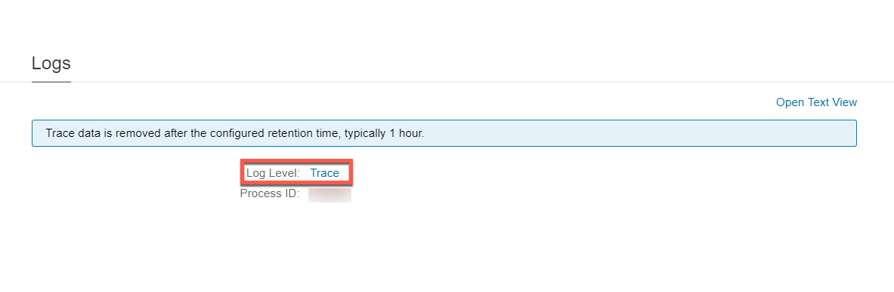

<!-- loioa7cafa63a2b844a8ad9051cc42976371 -->

# Enabling Tracing for Custom Adapter

Configure a custom adapter with a tracing feature that records the processing of the incoming and outgoing messages in an adapter.

In the integration flow model, the logs generated by the adapter tracing help you to do the following:

-   Monitor the overall status of the incoming or outgoing messages

-   Troubleshoot specific errors encountered by the adapter during runtime


> ### Note:  
> The incoming or outgoing messages in an adapter are only recorded if you have set the log level to *Trace* in the Cloud Integration Web application.


<a name="loioa7cafa63a2b844a8ad9051cc42976371__section_nrh_4xt_vdb"/>

## Adding Libraries

You can find the latest ADK API in the [Adapter Development Kit](https://tools.hana.ondemand.com/#cloudintegration) section. After downloading the `*.zip` files, add the following libraries to the *src* \> *main* \> *resources* folder that is in your ADK project:

-   `com.sap.it.public.adapter.api.jar`

-   `com.sap.it.public.generic.api.jar`

For successful code compilation, right-click the `*.jar` file and choose *Build Path* \> *Add to Build Path* to add the jar file to the `Referenced Libraries` of the adapter project.


<a name="loioa7cafa63a2b844a8ad9051cc42976371__section_vpb_yyt_vdb"/>

## Adding Dependencies

Open the `pom.xml` file and add the following dependencies to enable the tracing feature:

> ### Source Code:  
> ```xml
> <dependency>
>     <groupId>com.sap.it.public</groupId>
>     <artifactId>generic.api</artifactId>
>     <version>2.12.0</version>
>     <scope>system</scope>
>     <systemPath>${project.basedir}/src/main/resources/com.sap.it.public.generic.api-2.12.0.jar</systemPath>
> </dependency>
> <dependency>
>     <groupId>com.sap.it.public</groupId>
>     <artifactId>adapter.api</artifactId>
>     <version>2.12.0</version>
>     <scope>system</scope>
>     <systemPath>${project.basedir}/src/main/resources/com.sap.it.public.adapter.api-2.12.0.jar</systemPath>
> </dependency>
> ```

> ### Note:  
> Make sure that the version of the `*.jar` files is greater than **2.12.0**.

After adding the dependency, add the `com.sap.it.public` group ID to the `<excludeGroupIds>` tag.


<a name="loioa7cafa63a2b844a8ad9051cc42976371__section_hcc_hb2_xdb"/>

## Enabling Tracing

The tracing feature is only relevant for adapters that transform the message either before sending or upon reception.

> ### Recommendation:  
> -   Inbound messages are traced before the transformation takes place, which means that the user can see the incoming message with its original payload and headers. Outbound messages \(headers and payload\) are traced after the transformation has taken place.
> 
> -   The trace data is written even if errors occur. This can help the user to analyze transformation errors for inbound messages or connection errors for outbound messages.
> 
> -   The inbound message is traced after authentication and authorization have taken place. This is to prevent denial-of-service attacks that flood the trace database table.
> 
> -   Security-relevant header values must be obfuscated.
> 
> -   Trace data is only written if the adapter trace is enabled for the integration flow.
> 
> -   If possible, also set the character encoding for the trace payload.

The following procedure helps you to implement adapter tracing in either Consumer or Producer component:

1.  Use the following code snippet to retrieve the `Adapter Message Log Factory` from your endpoint:

    > ### Source Code:  
    > ```java
    > 
    > /** get Adapter Message Log Factory */
    >  AdapterMessageLogFactory msgLogFactory = (AdapterMessageLogFactory) this.endpoint.getCamelContext().getRegistry()
    > .lookupByName(com.sap.it.api.msglog.adapter.AdapterMessageLogFactory.class.getName());
    > ```

2.  Use the following code snippet to create the `Adapter Message Log` instance from the `Adapter Message Log Factory`:

    > ### Source Code:  
    > ```java
    > AdapterMessageLog mplLog = adapterMessageLogFactory.getMessageLog(exchange, description, "<CMD component ID of the adapter>",
    >             UUID.randomUUID().toString());
    > ```

3.  Use the snippet to create the trace message:

    > ### Source Code:  
    > ```java
    > AdapterTraceMessage traceMessage = mplLog.createTraceMessage(type, body, truncated );
    > ```

4.  Use the snippet to write the trace message to the MPL log:

    > ### Source Code:  
    > ```java
    > mplLog.writeTrace(traceMessage);
    > ```

    The interfaces available for `Adapter Message Log` are:

    ```java
    /**
        * Returns <code>true</code> if the adapter tracing for the integration flow to
        * which this message log belongs is active, otherwise <code>false</code>.
        */
       boolean isTraceActive();
     
       /**
        * Creates a trace message which can be used in the method
        * {@link #writeTrace(AdapterTraceMessage)}.
        *
        * The supplied message body shall not exceed 25 MB = 25 * 1024 * 1024 bytes =
        * 26214400 bytes. We strongly recommend to supply a truncated copy of the
        * original message body if the original message body exceeds 25 MB. If, despite
        * of this rule, the supplied message body still exceeds 25 MB, then the body
        * will be truncated internally and the property <tt>isBodyTruncated</tt> will
        * be set to <code>true</code>.
        *
        * @param traceMessageType
        *            type of the trace message
        * @param body
        *            message body, shall not exceed 25 MB, truncate the body if
        *            necessary
        * @param isBodyTruncated
        *            indicator whether the supplied message body is truncated
        * @throws IlleagalArgumentException
        *             if <tt>traceMessageType</tt> or <tt>body</tt> is
        *             <code>null</code>
        *
        */
       AdapterTraceMessage createTraceMessage(AdapterTraceMessageType traceMessageType, byte[] body, boolean isBodyTruncated);
     
       /**
        * Writes a trace message into the adapter trace if the trace for the
        * integration flow of the adapter is active.
        * <p>
        * <b>Attention:</b>Camel endpoints, which are used in several from elements of
        * different Camel routes cannot write traces. This method will not have any
        * effect for such kind of endpoints.
        * <p>
        * Messages incoming to the adapter (inbound messages) shall be traced, if the
        * adapter transforms the message before it is handled over to the Camel route;
        * the trace shall be written <b>before</b> the transformation takes place.
        * Transformation here means changes to the message body or headers.
        * <p>
        * Messages outgoing from the adapter (outbound messages) shall be traced if the
        * adapter transforms the message before it is sent out; the trace shall be
        * written <b>after</b> the transformation.
        * <p>
        * Typical usage:
        *
        * <pre>
        * {@code
        *    if (this.isTraceActive()){        
        *          byte[] body = getTraceBody(originalMessage);
        *          boolean isBodyTruncated = isBodyTruncated(body,originalMessage);
        *          // specify the correct adapter message type, in this example we use AdapterTraceMessageType.SENDER_INBOUND
        *          AdapterTraceMessage traceMessage = this.createTraceMessage(AdapterTraceMessageType.SENDER_INBOUND, body, isBodyTruncated);
        *          // fill the optional properties of the trace message: encoding and headers
        *          traceMessage.setEncoding(getEncoding());
        *          traceMessage.setHeaders(getHeaders());
        *          this.writeTrace(traceMessage);
        *    }
        * </pre>
        *
        * @param traceMessage trace message
        */
       void writeTrace(AdapterTraceMessage traceMessage);
    ```

    Write the trace data. You can use the following example for reference:

    > ### Example:  
    > > ### Sample Code:  
    > > ```java
    > > import org.apache.camel.Exchange;
    > > import com.sap.it.api.msglog.adapter.AdapterMessageLog;
    > > import com.sap.it.api.msglog.adapter.AdapterMessageLogFactory;
    > > import com.sap.it.api.msglog.adapter.AdapterTraceMessage;
    > > import com.sap.it.api.msglog.adapter.AdapterTraceMessageType;
    > >  
    > > // OSGi service
    > > private final AdapterMessageLogFactory adapterMessageLogFactory;
    > >  
    > > void writeTrace(Exchange exchange, byte[] traceData, boolean isOutbound) {
    > >     // replace "<adapter type>" by your adapter type!
    > >     String text = isOutbound ? "Sending <adapter type> message" : "Receiving <adapter type> message";
    > >     // replace "<CMD component ID of the adapter>" by your CMD component ID
    > >     AdapterMessageLog mplLog = adapterMessageLogFactory.getMessageLog(exchange, text, "<CMD component ID of the adapter>",
    > >             UUID.randomUUID().toString());
    > >     if (!mplLog.isTraceActive()) {
    > >         return;
    > >     }
    > >     // if you have a fault inbound message then specify AdapterTraceMessageType.RECEIVER_INBOUND_FAULT,
    > >     // if you have a fault outbound message then specify AdapterTraceMessageType.SENDER_OUTBOUND_FAULT
    > >     // for synchronous adapters you may also need AdapterTraceMessageType.SENDER_OUTBOUND and AdapterTraceMessageType.RECEIVER_INBOUND
    > >     AdapterTraceMessageType type = isOutbound ? AdapterTraceMessageType.RECEIVER_OUTBOUND : AdapterTraceMessageType.SENDER_INBOUND;
    > >    
    > >     AdapterTraceMessage traceMessage = mplLog.createTraceMessage(type, traceData, false );//Setting isTruncated as false assuming traceData is less than 25MB.
    > >     // Encoding is optional, but should be set if available.
    > >     traceMessage.setEncoding("UTF-8");
    > >     // Headers are optional and do not forget to obfuscate security relevant header values.
    > >     mplLog.writeTrace(traceMessage);
    > > }
    > > ```

5.  Build and deploy the adapter.


<a name="loioa7cafa63a2b844a8ad9051cc42976371__section_ohp_txt_xdb"/>

## Viewing the Trace Data

To show the trace information details, select an integration flow from the overview list, go to the *Log* section, and open the link by clicking the *Trace*. For more information, see [Message Processing Log - Adapter Tracing](message-processing-log-adapter-tracing-a9db4ea.md).



**Related Information**  


[Setting Log Levels](setting-log-levels-4e6d3fc.md "The log level for the message processing log specifies the granularity of information collected by the message processing log")

