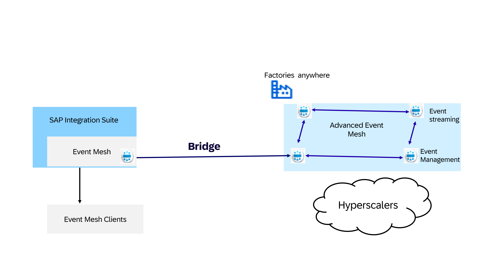

<!-- loio936057f6f3524f8a9136f82252af844f -->

# Event Mesh Bridge

SAP Integration Suite has two event offerings for organizations adopting Event-Driven Architecture.

The SAP Integration Suite, advanced event mesh offers a distributed event mesh, with a number of brokers and works for high event volumes.

The Event Mesh capability on SAP Integration Suite works with a single broker and with low and moderate event volumes.

As organizations gain experiences with Event-Driven Architecture and their implementations mature, they need to handle higher event volumes and require broader coverage across the enterprise IT landscape.

Bridging the two event offerings enables customers to retain the broker in SAP Integration Suite but exchange events with other broker nodes in the SAP Integration Suite, advanced event mesh network. This process allows organizations to expand their event landscape, and the broker in Event Mesh in SAP Integration Suite acts as a node in the network of brokers available in SAP Integration Suite, advanced event mesh. Organizations can then let existing scenarios continue with the broker in Integration Suite and exchange events with Advanced Event Mesh for other eventing scenarios. All broker control and data plane features remain in the respective products, SAP Integration Suite, and SAP Integration Suite, advanced event mesh.

**Related Information**  

[Activating Event Mesh Bridge](activating-event-mesh-bridge-3e814ae.md "Activating the Event Mesh bridge to allow flow of events between Event Mesh capability on SAP Integration Suite to SAP Integration Suite, advanced event mesh.")

