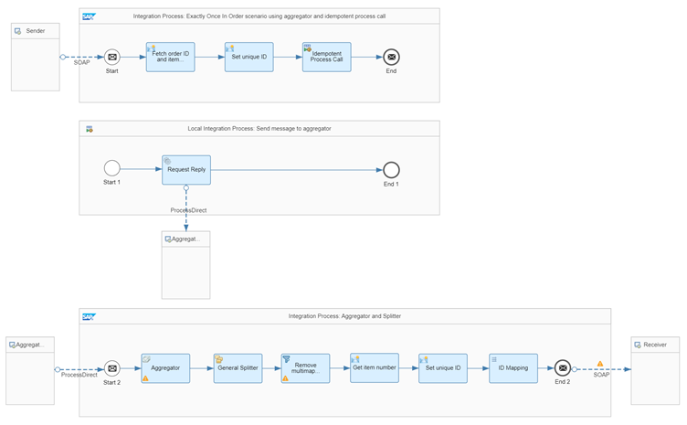

<!-- loio1a8aa2acda704ca8b13b3832aa29168b -->

# Exactly Once in Order via Aggregator

In this example, we've enhanced the **In Order via Aggregator** scenario to support the quality of service Exactly Once In Order: On top of processing individual messages in order, we also like to avoid sending duplicate messages to the receiver.

We achieve the quality of service Exactly Once In Order by combining the three patterns **Aggregator**, **In Order via Aggregator**, and **ID Mapping \(with Splitter\)** as follows:

-   We use an Aggregator pattern which allows us to collect individual messages in bulks, sorted by sequence number.

-   When collecting the individual messages, we need to avoid that a single message is added to the aggregated message multiple times. This is ensured by an idempotent process call.

-   To revert the message bulks into multiple individual messages again, we use the Splitter pattern and send the individual messages to the receiver.

-   Assuming that the receiver is idempotent, we use an ID mapper to ensure that duplicate messages can be identified and discarded by the receiver.

<a name="loio1a8aa2acda704ca8b13b3832aa29168b__section_vtc_2jg_tsb"/>

## Implementation

The **Pattern Quality Of Service - Scenario 08a** integration flow illustrates how to implement this use case.

The *Integration Process: Exactly Once In Order scenario using aggregator and idempotent process call* integration process receives the individual product items. Each single message contains the same order number and a unique item number.

The *Fetch order ID and item number* content modifier step stores the item number in an exchange property with the name `itemNumber` using the following settings \(*Exchange Property* tab\):

<table>
<tr>
<th valign="top">

Parameter

</th>
<th valign="top">

Setting

</th>
</tr>
<tr>
<td valign="top">

Name

</td>
<td valign="top">

itemNumber

</td>
</tr>
<tr>
<td valign="top">

Source Type

</td>
<td valign="top">

XPath

</td>
</tr>
<tr>
<td valign="top">

Data Type

</td>
<td valign="top">

java.lang.String

</td>
</tr>
<tr>
<td valign="top">

Source Value

</td>
<td valign="top">

//@ItemNumber

</td>
</tr>
</table>

Furthermore, the same content modifier stores the order number in a header with name `orderNumber` using the following settings \(*Message Header* tab\):

<table>
<tr>
<th valign="top">

Parameter

</th>
<th valign="top">

Setting

</th>
</tr>
<tr>
<td valign="top">

Name

</td>
<td valign="top">

orderNumber

</td>
</tr>
<tr>
<td valign="top">

Source Type

</td>
<td valign="top">

XPath

</td>
</tr>
<tr>
<td valign="top">

Data Type

</td>
<td valign="top">

java.lang.String

</td>
</tr>
<tr>
<td valign="top">

Source Value

</td>
<td valign="top">

//@PurchaseOrderNumber

</td>
</tr>
</table>

> ### Note:  
> We use a header as order number instead of an exchange property to pass on the value to the second integration process. For this purpose, the value `orderNumber` is maintained in the *Allowed Header\(s\)*list of the integration flow \(*Runtime Configuration* tab\).

The *Set unique ID* content modifier step creates a unique ID as a combination of the order number and the item number. This step creates an exchange property with name uniqueID by using the following settings \(*Exchange Property* tab\):

<table>
<tr>
<th valign="top">

Parameter

</th>
<th valign="top">

Setting

</th>
</tr>
<tr>
<td valign="top">

Name

</td>
<td valign="top">

uniqueID

</td>
</tr>
<tr>
<td valign="top">

Source Type

</td>
<td valign="top">

Expression

</td>
</tr>
<tr>
<td valign="top">

Data Type

</td>
<td valign="top">

java.lang.String

</td>
</tr>
<tr>
<td valign="top">

Source Value

</td>
<td valign="top">

$\{header.orderNumber\}\_$\{property.itemNumber\}

</td>
</tr>
</table>

To avoid any duplicates, the *Idempotent Process Call* step sends the message to the *Local Integration Process: Send message to aggregator* subprocess. This step uses the following settings:

<table>
<tr>
<th valign="top">

Parameter

</th>
<th valign="top">

Setting

</th>
</tr>
<tr>
<td valign="top">

Message ID

</td>
<td valign="top">

$\{property.uniqueID\}

</td>
</tr>
<tr>
<td valign="top">

Skip Process Call for Duplicates.

</td>
<td valign="top">

Selected

</td>
</tr>
</table>

The *Local Integration Process: Send message to aggregator subprocess* passes on the single message to the *Integration Process: Aggregator and Splitter* integration process by using a *Request Reply* step and a ProcessDirect adapter.

The *Integration Process: Aggregator and Splitter* integration process contains the *Aggregator* step with the correlation expression //@PurchaseOrderNumber. That means that all product items with the same order number are combined into an aggregated message. The *Aggregation Algorithm* ‘Combine in Sequence’ is used to store the incoming messages sorted by *Message Sequence Expression:* `//@ItemNumber`.

The *Last Message Condition* isn't defined in the message body. Therefore, we set the *Completion Timeout* to define the maximum time between two messages before the aggregation is stopped.

The following aggregation strategy has been defined for the Aggregator step:

<table>
<tr>
<th valign="top">

Attribute

</th>
<th valign="top">

Value

</th>
</tr>
<tr>
<td valign="top">

Incoming Format

</td>
<td valign="top">

XML \(Same Format\)

</td>
</tr>
<tr>
<td valign="top">

Aggregation Algorithm

</td>
<td valign="top">

Combine in Sequence

</td>
</tr>
<tr>
<td valign="top">

Message Sequence Expression \(XPath\)

</td>
<td valign="top">

//@ItemNumber

</td>
</tr>
<tr>
<td valign="top">

Last Message Condition \(XPath\)

</td>
<td valign="top">

0

</td>
</tr>
<tr>
<td valign="top">

Completion Timeout \(in min\)

</td>
<td valign="top">

28

</td>
</tr>
<tr>
<td valign="top">

Data Store Name

</td>
<td valign="top">

Aggregator-EOIO

</td>
</tr>
</table>

As a result, the messages are combined into one message and are sorted by item number.

To break up the message back into single Item messages, we use a *General splitter* step with the *XPath* expression type and the following *XPath expression*:`//ns0:Item`.

> ### Note:  
> Deselect the flag *Parallel Processing* of the splitter to keep the order of the split messages.

The subsequent *Filter step* removes the multimapping from the message by using the following *XPath expression:* `//ns0:Item`.

Next, we need to ensure that the individual messages are sent to the receiver only once. This is done analogously to the exactly once delivery of the messages to the aggregator, see above. Here, we use an ID mapper to temporarily store a generated ID in the tenant database. When executed with the same combination again, the ID mapping provides the same previously generated ID.

The *Get item number* content modifier step stores the item number in an exchange property with the name *itemNumber* by using the following settings \(*Exchange Property* tab\):

<table>
<tr>
<th valign="top">

Parameter

</th>
<th valign="top">

Setting

</th>
</tr>
<tr>
<td valign="top">

Name

</td>
<td valign="top">

itemNumber

</td>
</tr>
<tr>
<td valign="top">

Source Type

</td>
<td valign="top">

XPath

</td>
</tr>
<tr>
<td valign="top">

Data Type

</td>
<td valign="top">

java.lang.String

</td>
</tr>
<tr>
<td valign="top">

Source Value

</td>
<td valign="top">

//@ItemNumber

</td>
</tr>
</table>

The *Set unique ID* content modifier step creates a unique ID as a combination of the order number and the item number. This step creates an exchange property with the name `SplitMessageID` by using the following settings \(*Exchange Property* tab\):

<table>
<tr>
<th valign="top">

Parameter

</th>
<th valign="top">

Setting

</th>
</tr>
<tr>
<td valign="top">

Name

</td>
<td valign="top">

SplitMessageID

</td>
</tr>
<tr>
<td valign="top">

Source Type

</td>
<td valign="top">

Expression

</td>
</tr>
<tr>
<td valign="top">

Data Type

</td>
<td valign="top">

java.lang.String

</td>
</tr>
<tr>
<td valign="top">

Source Value

</td>
<td valign="top">

$\{header.orderNumber\}\_$\{property.itemNumber\}

</td>
</tr>
</table>

The *ID Mapping step* is defined in the following way:

<table>
<tr>
<th valign="top">

Parameter

</th>
<th valign="top">

Setting

</th>
</tr>
<tr>
<td valign="top">

Source Message ID

</td>
<td valign="top">

$\{property.SplitMessageID\}

The source message ID is defined using the property defined in the previous Content Modifier.

</td>
</tr>
</table>

<table>
<tr>
<th valign="top">

Parameter

</th>
<th valign="top">

Setting

</th>
</tr>
<tr>
<td valign="top">

Target Header Name

</td>
<td valign="top">

SapMessageIdEx

For each split item, the header SapMessageIdEx is overwritten with a newly generated ID.

</td>
</tr>
<tr>
<td valign="top">

Context

</td>
<td valign="top">

IDMapperContext\_01

You define a unique context for each ID Mapping step within your integration flow. For any further ID Mapping steps, you simply increment the number in the context name. In this scenario, there's only 1 single ID Mapping step anyway. Therefore, we could have omitted the number without any unwanted side effects on the scenario.

</td>
</tr>
<tr>
<td valign="top">

Visibility

</td>
<td valign="top">

Integration Flow

The generated IDs are unique within the same integration flow model. If your ID mapping is to be used across different integration flows, you need to select Global.

</td>
</tr>
<tr>
<td valign="top">

Expiration Period \(in d\)

</td>
<td valign="top">

30

</td>
</tr>
</table>

At the receiver side, the scenario uses the SOAP \(SAP RM\) Receiver Adapter. On the *Processing* tab of the adapter, the `SAP RM Message ID Determination` property is set to `Reuse`. This setting ensures that Cloud Integration uses the value of header *SapMessageIdEx* to set the SAP RM Message ID that is then passed on to the receiver system. See [Configure the SOAP \(SAP RM\) Receiver Adapter](configure-the-soap-sap-rm-receiver-adapter-8366495.md).

To test the scenario, perform the following steps:

1.  Set up inbound **Basic** authentication for integration flow endpoints. See: [Setting Up Basic Inbound Authentication with clientId and clientsecret from a Service Key, Cloud Foundry Environment](../40-RemoteSystems/basic-authentication-with-clientid-and-clientsecret-for-integration-flow-processing-647eeb3.md)[Setting Up Inbound HTTP Connections (with Basic Authentication), Neo Environment](https://help.sap.com/viewer/368c481cd6954bdfa5d0435479fd4eaf/IAT/en-US/391c45cfcd0f4435952ab085283b7f7d.html "") :arrow_upper_right:
2.  Deploy a **User Credentials** artifact with the following parameters, using the *Monitor* application \(*Security Material* tile under *Manage Security*\).

    <table>
    <tr>
    <th valign="top">

    Parameter

    
    </th>
    <th valign="top">

    Setting

    
    </th>
    </tr>
    <tr>
    <td valign="top">

    Name

    
    </td>
    <td valign="top">

    OWN

    
    </td>
    </tr>
    <tr>
    <td valign="top">

    User

    
    </td>
    <td valign="top">

    Enter the user as specified during the setup of the inbound basic authentication.

    
    </td>
    </tr>
    </table>
    

    <table>
    <tr>
    <th valign="top">

    Parameter

    
    </th>
    <th valign="top">

    Setting

    
    </th>
    </tr>
    <tr>
    <td valign="top">

    Password

    
    </td>
    <td valign="top">

    Enter the password as specified during the setup of the inbound basic authentication.

    
    </td>
    </tr>
    </table>
    
    > ### Note:  
    > When you check out the integration flows Pattern Quality Of Service – Mocked Sender and Pattern Quality Of Service - Scenario 08a, you notice that the receiver adapters refer to a User Credentials artifact by the name of OWN.
    > 
    > Both integration flows operate on the same tenant and use the same user credentials for inbound requests.

3.  Deploy the integration flows *Generic Receiver, Pattern Quality Of Service – Mocked Sender* and *Pattern Quality Of Service - Scenario 08a*.
4.  In the Postman client, open the *QualityOfService* \> *QualityOfService – Scenario 08a* folder of the Postman collection that has been provided with the *Integration Flow Design Guidelines - Enterprise Integration Patterns* package. There, you find four POST requests, each with a unique item number. The requests are sorted in the wrong order. If you set the request parameter sendDuplicates to `true` \(in the *Params* tab of Postman\), the Pattern Quality Of Service – Mocked Sender integration flow sends a second message to the Pattern Quality Of Service - Scenario 08a integration flow with a delay of 5 seconds.
5.  Run all four requests.
6.  Once the system has processed all messages successfully and the completion timeout condition of the aggregator has been met, check the data store *Pattern-QualityOfService* \(open the *Monitor* application and select the *Data Stores* tile under *Manage Stores*\).

    > ### Tip:  
    > You see four entries each with an entry ID that concatenates the order id with the respective item id. The order of the entries should be sorted by the item id.

7.  Before re the test, change the purchase order number. You notice that in the request body, a Postman collection variable is used instead of the purchase order number in the request body. You can change the value of the variable on the Prerequest Script tab of the first POST request before rerunning the scenario.
8.  Optionally, you can switch on the trace to verify the overall behavior.

**Related Information**  

[Aggregator](aggregator-86f97fd.md "")

[In Order via Aggregator](in-order-via-aggregator-068cfc7.md "If you want to process individual messages in order, you can use an Aggregator pattern which allows you to collect individual messages in bulks, sorted by sequence number. To revert the message bulks into multiple individual messages again, use the Splitter pattern and send the individual messages to the receiver.")

[ID Mapping \(with Splitter\)](id-mapping-with-splitter-441e51d.md "")

