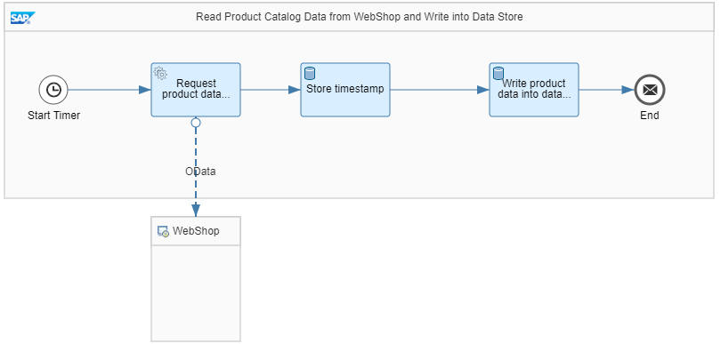
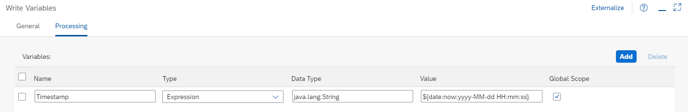

<!-- loio303562cfe0d7409caf1aabbfb54d74ec -->

# Example Scenario: Sharing a Variable Across Two Integration Flows

To share data across multiple integration flows, you can use a global variable.


The following example integration flows use a global variable to share data:

-   *Integration Flow 1 - Write Variable*

    This integration flow is initiated by a timer. It connects to an external WebShop and reads data from there to store it on the tenant database \(as Data Store entry\). The data comprises the list of available products at the time when the integration is operated.

    This integration flow also stores the actual timestamp as variable.

-   *Integration Flow 2 - Read Variable*

    This integration flow is also initiated by a timer and runs independently from the first one. It reads the product data \(provided by the first integration flow\) from the tenant database.

    This integration flow also reads the timestamp associated with the latest execution of the first integration flow.


As motivation for this design, consider the case that you like to anticipate in your scenario the case that the external component \(WebShop\) is temporarily not available. The first integration flow creates the Data Store entry as fallback for the error case \(in a productive environment, on a regular basis\). The second integration flow always accesses the most up-to-date product data stored on the tenant database. To make transparent the up-to-dateness of the data stored on the tenant database, the second integration flow gets the timestamp stored by the first one.

The timestamp needs to be shared between the two integration flows. As both integration flows run independently from each other, data can only be shared through a global variable.

If you like to imagine a more realistic scenario, consider that the steps processed by the second integration flow are part of error handling design of your main scenario: In case the WebShop is temporarily not available \(connection broken\), the steps from the second integration flow are processed.


<a name="loio303562cfe0d7409caf1aabbfb54d74ec__section_srx_5kb_xkb"/>

## Integration Flow Design

Design integration flow *Integration Flow 1 - Write Variable* as depicted in the following figure:



1.  The Request Reply step *Request product data from WebShop* connects through the OData channel to the WebShop component and reads product data for all products in the product catalog.

    Configure the OData adapter in the following way:

    In the *Connection* tab, specify the following value for the *Address* parameter:

    `https://refapp-espm-ui-cf.cfapps.eu10.hana.ondemand.com/espm-cloud-web/espm.svc/`

    The external data source supports the Open DataProtocol \(OData\). For our scenario, we use the ESPM WebShop, which is based on the Enterprise Sales and Procurement Model \(ESPM\) provided by SAP.

    In tab *Processing*, specify the following parameters:


    <table>
    <tr>
    <th valign="top">

    Parameter
    
    </th>
    <th valign="top">

    Value
    
    </th>
    </tr>
    <tr>
    <td valign="top">
    
    *Operation Details*
    
    </td>
    <td valign="top">
    
    Query \(GET\)
    
    </td>
    </tr>
    <tr>
    <td valign="top">
    
    *Resource Path*
    
    </td>
    <td valign="top">
    
    Products
    
    </td>
    </tr>
    <tr>
    <td valign="top">
    
    *Query Options*
    
    </td>
    <td valign="top">
    
    $select=ProductId,Price,CurrencyCode,Name
    
    </td>
    </tr>
    </table>
    
    This OData request reads product details \(ProductID, Price, CurrencyCode, and Name\) from the WebShop application.

2.  Configure the Write Variables step *Store timestamp* in the following way.

    

    -   In field *Name*, enter `Timestamp`.

    -   For parameter *Type*, select *Expression*.

    -   For parameter *Data Type*, enter `java.lang.String`.

    -   For parameter *Value*, enter `${date:now:yyyy-MM-dd HH:mm:ss}`.

    -   Select the parameter *Global Scope* in order to share the variable with other integration flows on the same tenant.


    Using this expression, the Write Variables step stores the actual timestamp as global variable.

3.  Configure the Data Store Write step *Write product data into data store* in the following way.

    -   For *Data Store Name* enter *ProductCatalog*.

    -   Don't enter any value for parameter *Entry ID*.


    This step stores the response from the WebShop \(which contains the list of all products\) as Data Store entry \(as entry ID a guid is generated\).

    You need to deploy this integration first \(before deploying the second one\).


Design integration flow *Integration Flow 2 - Read Variable* as depicted in the following figure:

This integration flow is also started by a Timer start event. It reads a product list from the Data Store \(that has been updated by the first integration flow\) and consumes the timestamp from the first integration flow. It then sends the message content \(including the timestamp\) to an email receiver.


1.  Configure the Data Store Select step *Select from data store* in the following way.

    -   For *Data Store Name* enter *ProductCatalog*.

    -   For parameter *Visibility*, select *Global*.


    This step reads the entry of the *ProductCatalog* Data Store that has been created by integration flow *Integration Flow 1 – Write Variable*. This entry contains the product catalog content read from the WebShop during the recent message processing run of first integration flow *Integration Flow 1 – Write Variable*.

2.  Configure the Content Modifier *Create property for payload and timestamp* with the following parameters:

    In tab *Exchange Property*, add the following properties:

    -   A property containing the payload of the message \(which is the content read from the ProductCatalog Data Store entry\).

        As *Type*, select *Expression*, and in field *Value* enter `${in.body}`.

    -   A property containing the timestamp for the latest message processing run of integration flow *Integration Flow 1 – Write Variable*. This property is defined by selecting the global variable set by the other integration flow.

        As *Type*, select *Global Variable*, and in field *Value* enter `Timestamp`.

        This property is defined based on the global variable written by the first integration flow.


    

3.  Configure the Content Modifier *Define message body* so that it defines the message body using the following expression:

    > ### Sample Code:  
    > ```
    > Prices have been updated at ${property.timestamp};
    > ${property.payload}
    > 
    > ```

4.  Configure the Mail receiver adapter so that it sends the message to an email account of your choice.

    The received email tells the user the time when the *ProductCatalog* Data Store entry has been updated the latest and provide the content of the product catalog \(XML structure\).


