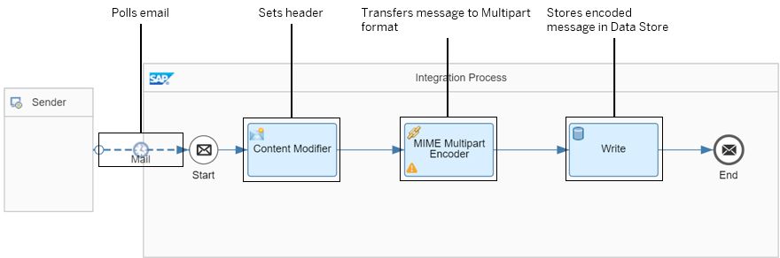

<!-- loio80baed3d7c6f4bb592aaaf80894ac1e6 -->

# Example Scenario with MIME Multipart Encoder/Decoder

The following integration flow shows the *MIME Multipart encoding* step in action.

The integration flow initially polls an e-mail \(with an attachment\) from an e-mail server. In a subsequent step, the e-mail is converted into a MIME Multipart message. The encoded message is stored as Data Store entry. To illustrate how headers are handled, the first Content Modifier sets a message header.

> ### Tip:  
> In a productive use case, assume that the integration flow finally sends the message to a receiver that can't process attachments. In such a setup, the MIME Multipart encoder adds the following value: It transforms the original message, including the attachment, into a format that the receiver can handle.

1.  The Mail sender adapter polls e-mails from the e-mail server

    For sakes of simplicity, you can configure the Mail sender adapter in such a way that it polls unread e-mails from a dedicated folder at a certain point in time.

    More information on the available Mail sender adapter parameters: [Configure the Mail Sender Adapter](configure-the-mail-sender-adapter-e23e9cc.md)

    To illustrate the main use case of this Encoder step, we recommend that you test the scenario with an e-mail with an attachment \(for example, an image file\).

    

2.  The Content Modifier sets a certain header \(to illustrate how a header is handled by the Encoder step\). In our example, a header with name `header1` and value `00001` is set.

3.  The Encoder step transfers the e-mail \(with attachment\) into a MIME Multipart message. During this step, the attachment is transferred into a part of the MIME message \(text string\).

    The Encoder step is configured in the following way:

    -   Option *Add Multipart Headers Inline* is selected.

    -   In field *Include Headers*, the following regular expression is entered:

        `h.*`

        With this regular expression \(regex\), you determine that headers that start with the character `h` are considered by this feature.

4.  The Data Store Write step is introduced to be able to analyze the content of the MIME Multipart message that results from the e-mail with attachment.

With the e-mail \(with image attachment\) polled by the Mail sender adapter and the described settings, executing the integration flow yields the following result:

The Data Store entry contains the following message body \(after the Encoder step\):

This document is the representation of your e-mail as a MIME Multipart message. The lower part that represents the encoded photo data is cut and greyed out \(not complete\).

For more information on how the MIME Multipart Encoder can handle headers, see: [MIME Multipart Encoder: Handling Message Headers \(Examples\)](mime-multipart-encoder-handling-message-headers-examples-b446281.md).

> ### Note:  
> For testing purposes, you can enhance the integration flow in the following way:
> 
> 1.  After the Write step, add a MIME Multipart Decoder.
> 
> 2.  Add a Receiver component and connect the End Message event with a Mail receiver adapter.
> 
>     Select the option *Add Message Attachments* \(*Connection* tab\).
> 
>     More information: [Configure the Mail Receiver Adapter](configure-the-mail-receiver-adapter-f68d5e0.md)
> 
> 
> The Mail receiver adapter sends the decoded MIME Multipart message to the e-mail receiver. If the scenario has been executed successfully, the e-mail account contains the same e-mail \(with attachment\) as the one that has been polled from the e-mail server.

