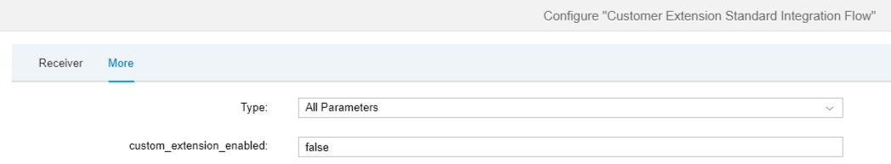

<!-- loio909ec348c6854103baefdbceaa9eea7e -->

# Executing the Scenario


To execute the scenario, you need to install a SOAP client \(for example, SoapUi\) and configure it accordingly. You need to configure the SOAP client so that it calls the endpoint address of the *standard* integration flow.

More information: [Set Up the SOAP Client and Start Message Processing](set-up-the-soap-client-and-start-message-processing-4844baa.md) 

To define the inbound message \(sent by the SOAP client\), upload the file `A.wsdl` in the SOAP client. When the SOAP client has been configured accordingly, and the message structure is shown, you can enter any values for the elements, for example:

> ### Sample Code:  
> ```
> <soapenv:Envelope xmlns:soapenv="http://schemas.xmlsoap.org/soap/envelope/" xmlns:demo="http://cpi.sap.com/demo">
>    <soapenv:Header/>
>    <soapenv:Body>
>       <demo:Order_MT>
>          <orderNumber>1</orderNumber>
>          <supplierForename>WALTER</supplierForename>
>          <supplierSurname>SMITH</supplierSurname>
>          <productName>Notebook</productName>
>       </demo:Order_MT>
>    </soapenv:Body>
> </soapenv:Envelope>
> ```

1.  Configure the standard integration flow \(open the standard integration flow and choose *Configure*\).
2.  Specify a value for the *Address* parameter of the ProcessDirect adapter \(or leave the default value as it is\).

    

3.  Go to the *More* tab and leave the default value for the *custom\_extension\_enabled* parameter as `false`.

    

4.  Choose *Save* and then *Deploy*.

5.  Choose the *Operations* view of the Web UI and under *Manage Integration Content* check the deploy status of your standard integration flow.

6.  As soon as the integration flow deployment has finished \(status *Started*\), copy the endpoint address to your clipboard and paste it into the address field of your SOAP client.

7.  Now configure and deploy the custom integration flow. Make sure that you configure the same ProcessDirect adapter *Address* parameter as in the standard integration flow.

    When the custom integration flow is also deployed, trigger message processing from your SOAP client as explained in [Set Up the SOAP Client and Start Message Processing](set-up-the-soap-client-and-start-message-processing-4844baa.md).

    The SOAP client should receive a response where the standard mapping has been applied to the original message.

    The fields `supplierForename` and `supplierSurname` of the original message have been concatenated in the field `supplierName`.

    ```
    <soap:Envelope xmlns:soap="http://schemas.xmlsoap.org/soap/envelope/" ...>
       <soap:Header/>
       <soap:Body>
          <ns0:Order_MT xmlns:ns0="http://cpi.sap.com/demo">
             <orderNumber>1</orderNumber>
             <supplierName>WALTER / SMITH</supplierName>
             <productName>Notebook</productName>
          </ns0:Order_MT>
       </soap:Body>
    </soap:Envelope>
    ```

8.  Repeat all these steps, but with the externalized parameter *custom\_extension\_enabled* of the standard integration flow specified as `true`.

9.  The SOAP client should receive a response in which the custom mapping has been applied.

    The field `additionalField` is available and contains the content from the original field `supplierSurname` \(but uppercase characters have been transformed to lowercase characters\).

    ```
    <soap:Envelope xmlns:soap="http://schemas.xmlsoap.org/soap/envelope/" ...>
       <soap:Header/>
       <soap:Body>
          <ns0:Order_MT xmlns:ns0="http://cpi.sap.com/demo">
             <orderNumber>1</orderNumber>
             <supplierName>WALTER / SMITH</supplierName>
             <productName>Notebook</productName>
             <additionalField>smith</additionalField>
          </ns0:Order_MT>
       </soap:Body>
    </soap:Envelope>
    ```


