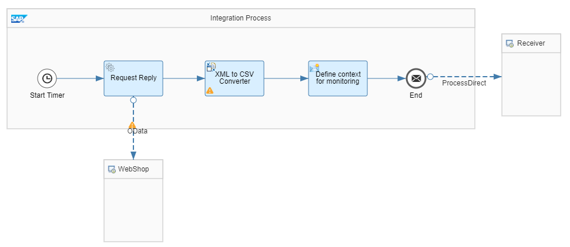
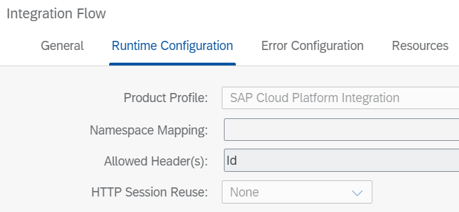

<!-- loiod4bb40c9394949c5aaaae14b75076177 -->

# Expose an Endpoint for a Scheduled Integration Flow

This section shows you how to expose an endpoint for a scheduled integration flow.

<a name="loiod4bb40c9394949c5aaaae14b75076177__section_dd3_t24_3nb"/>

## Scenario

Let’s assume you have defined an integration flow with a timer start event to schedule the exchange of data on a regular basis between connected systems. In addition to the scheduled runs, you’d like to be able to manually trigger the message exchange either for an ad hoc data transfer or for testing purposes.

To solve this issue, you add an additional endpoint to the existing scheduled integration flow.

> ### Note:  
> Though testing purposes are a valid use case for this scenario, if you are using this integration flow for testing purposes, see [Simulation of an Integration Flow](simulation-of-an-integration-flow-2e2210b.md). The simulation allows you to test an integration flow or parts of it even before deployment. Furthermore, simulation doesn't generate any real message.

<a name="loiod4bb40c9394949c5aaaae14b75076177__section_c2s_sf4_3nb"/>

## Implementation

The starting point of this guideline is the following integration flow that exchanges data between 2 systems on a regular basis:

The regular data exchange is initiated by a timer start event. Then, via a *Request Reply* step, the product text is read from an external source via OData \(using the OData receiver adapter\). For our scenario, we use the ESPM WebShop, which is based on the Enterprise Sales and Procurement Model \(ESPM\) provided by SAP. Access the demo: [https://refapp-espm-ui-cf.cfapps.eu10.hana.ondemand.com/webshop/index.html](https://refapp-espm-ui-cf.cfapps.eu10.hana.ondemand.com/webshop/index.html).

The URL of the OData request is defined as follows: [https://refapp-espm-ui-cf.cfapps.eu10.hana.ondemand.com/espm-cloud-web/espm.svc/ProductTexts](https://refapp-espm-ui-cf.cfapps.eu10.hana.ondemand.com/espm-cloud-web/espm.svc/ProductTexts).

The query string is defined as `$select=Id,Language,Name,ProductId,ShortDescription`.

Furthermore, we use an *XML to CSV Converter* to convert the web shop response into a CSV format. Here, we choose semicolon as delimiter and add the field names as header.

Finally, the message is sent to the *Generic Receiver* where it is saved in the data store.

With this integration flow definition, we synchronize the complete product texts between the 2 systems on a regular basis, say: once in a day.

<a name="loiod4bb40c9394949c5aaaae14b75076177__section_a2s_dg4_3nb"/>

## Enhancement

In addition, we now need to exchange the text of a particular product ad hoc so that the updated text is immediately reflected in the receiving system. Both requirements, the regular update and the ad hoc update, are considered in the example integration flow *Modeling Basics - Expose Endpoint For Scheduled Flow*, which is designed in the following way.

First of all, we move the business logic from the previously described integration flow into a subprocess:

The URL and the query string of the OData call remain the same. Furthermore, the adapter offers a field *Custom Query Options*, which is used for adding an additional filter to the OData call. We use a dynamic property called *FilterString* to provide the value of the filter in the *Custom Query Options* field. This value differs depending on whether the integration flow is scheduled via the Timer Start Event or triggered manually via the additional endpoint. The custom query string is defined as `${property.FilterString}`.

Now, we define a 2nd main integration process for the manual trigger. The other one for scheduling the data exchange remains, however it is modified. Both integration processes call the subprocess created before via a *Process Call* step.

As already explained, the integration process *Integration Process - Timer triggered exchange of data* starts with a timer start event. In our case, for testing purposes, the scheduler is configured to run only once. Usually, you would define a regular time interval like once per day or any other frequency.

After the timer start event, via a *Content Modifier*, the property *FilterString* is defined as type constant with a blank value. This way the filter is empty, and the complete list of product texts is exchanged. You could also completely skip the creation of the property as it has the same effect, but for clarity it has been added as empty value.

Then, via the *Process Call* step, the control is passed to the subprocess where the OData call is performed. Once, the subprocess is done, it passes the message back to the main integration process. From here, the message is sent to the generic receiver where it is saved in the data store. The ID of the data store entry is all.

The 2nd integration process *Integration Process - Message triggered exchange of data* receives a message through an HTTP adapter. The message contains a header called Id. To make this header available in the integration flow, it has been allowed in the configuration of the flow.

When you trigger the message exchange, the intention is to exchange product text for a specific product only. The Content Modifier in this process defines the property *FilterString* with the provided header *Id* as value.

-   Type: Expression

-   Data type: java.lang.String

-   Value: $filter=Id eq $\{header.Id\}

Like before, in a process call the control is then passed to the subprocess, and the returned message is sent to the generic receiver where it's saved in the data store. The ID of the data store entry is the product text Id.

> ### Note:  
> In monitoring, both executions of the different integration processes appear under the same integration flow name.

**Related Information**  

[Simulation of an Integration Flow](simulation-of-an-integration-flow-2e2210b.md "The simulation feature allows you to test an integration flow or its subset and see if you can get the desired outcome even before you deploy the integration flow. Based on the simulation result, you can decide to deploy the integration flow or resolve any errors.")

[Define Local Integration Process](define-local-integration-process-520341a.md "You use the local integration process to simplify your integration process. You can break down the main integration process into smaller fragments by using local integration processes. You combine these fragments to achieve your main integration process.")

