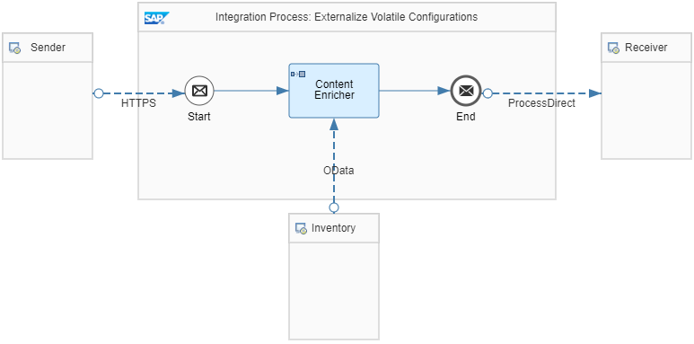

<!-- loio300277d954b74ca9b1f3c24ed2c33735 -->

# Externalize Volatile Configurations

Externalize volatile configurations in an integration flow.

Certain parameters of a processing step in an integration flow have to be changed depending on the environment in which the integration flow is executed. For example, transporting an integration flow from the test tenant to the productive tenant usually requires reconfiguring the connectivity to the application system to which a message is sent. We refer to such parameters as volatile because they are to be adapted each time an integration flow is deployed in another landscape.

<a name="loio300277d954b74ca9b1f3c24ed2c33735__section_qbc_lkm_wjb"/>

## Use Case

Let's say that you want to transport your integration flow from a test system to a productive system. When designing the integration flow, you realize that certain parameters have to be changed depending on the environment of the productive system in which the integration flow is to be executed.

<a name="loio300277d954b74ca9b1f3c24ed2c33735__section_s5y_fmq_tjb"/>

## Implementation

Externalizing such volatile properties of an integration flow increases its level of maintainability. You don't need to understand the complete logic of the integration flow to perform a change. In addition, using externalized parameters allows you to reuse certain configurations across the integration flow.

You can externalize parameters adapters or integration flow steps. The intended value of parameters can be provided at a later point in time, without the need to edit the integration flow. You can define multiple parameters for each field, but you can only assign a single value for each parameter.

The *Preserve Readability - Externalize Volatile Configurations* integration flow illustrates such a simple scenario.

This integration flow enriches the product data with the main product category from the inventory component and sends them to the generic receiver.

To make the integration flow independent from the sender and inventory addresses, both parameters are defined as externalized parameters:

`{{inventory_address}} = https://espmrefapps.hana.ondemand.com/espm-cloud-web/espm.svc`

`{{sender_address}} = /Externalize_Volatile_Configurations`**

**Related Information**  

[Externalize Parameters of an Integration Flow](externalize-parameters-of-an-integration-flow-45b2a07.md "")

