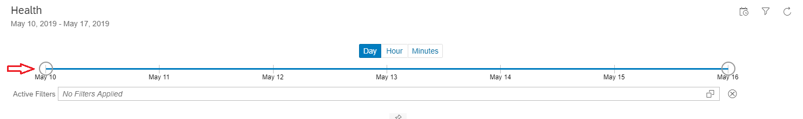
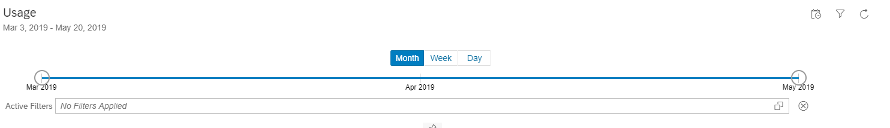

<!-- loio1f96ba3b6d2447e1953b0dbaae585170 -->

<link rel="stylesheet" type="text/css" href="../css/sap-icons.css"/>

# Find Your Way around Advanced API Analytics Dashboard

Familiarize yourself with the main features and controls of the Advanced API Analytics dashboard.

<a name="loio1f96ba3b6d2447e1953b0dbaae585170__section_mr2_2rp_thb"/>

## Help and Notifications Menu

Every page in Analytics dashboard gives you access to notifications, help documentation, and lets you manage your account. This menu is available at the top-right corner of the analytics dashboard.

Click :bell: to know about the latest news and updates for SAP Integration Suite.

Click  to view the version of SAP Integration Suite, access the online help documentation, and logout of Integration Suite.

<a name="loio1f96ba3b6d2447e1953b0dbaae585170__section_eff_grp_thb"/>

## Report Pages

In the Analytics dashboard, you access all your reports in report pages. The reports are categorized into report pages namely Overview, Health, and Usage. These report pages provide information about key metrics related to your API usage and performance.

You can find a time zone switcher to the right side of the report pages. The time zone switcher allows you to view analytics data based on different time zones. The default time zone shown is UTC. The time zone switcher is available across all the report pages including custom report pages.

> ### Note:  
> The values on the chart for a particular dimension are shown only up to a certain threshold. Any values beyond this threshold are grouped together and labelled as **Others**. By default, the threshold value for the charts is set to **25**. If you wish to modify the threshold value for the charts, please create a support ticket. To create a support ticket, see [Request to Modify Threshold Value for Charts](request-to-modify-threshold-value-for-charts-b55f89d.md).

> ### Note:  
> The data retention period for all report types available in the analytics dashboard is 6 months. That is, the analytics dashboard stores and retains data only for a period of 6 months. After the retention period, the data is purged.

### *Overview*

The Overview page provides a summarized report about your most important and key API metrics. By default, the Overview page provides report data for the last seven days.

At the top of the Overview report page, the following key API metrics are represented in a tile format:

-   **Total API Calls**: Total number of API requests made over a specified period.
-   **API Response Time**: Total time in milliseconds to respond to an API request. This round-trip time includes the API proxy overhead and the target server time.
-   **Request Processing Latency**: Total time in milliseconds from the time when a request reaches the selected API proxy to the time when the proxy sends the request to the target server.
-   **Total API Errors**: Total number of errors that occur on the API proxy plus the errors that occurs on the target server from all the API requests and responses over a specified period.
-   **Target System Errors**: Total number of errors that occur on the target server over a specified period.
-   **Target Response Time**: Total time in milliseconds for the target server to respond to an API request.

Each tile shows weekly percentage difference in data for a key API metric. A green-arrowed percentage difference indicates a healthy API metric, whereas, a red-arrowed percentage difference indicates the API metric needs improvement.

Hovering over each tile shows data for the current week, last week, and the difference between current week and last week.

Just below the key API metrics tiles, you can filter and check for the number of calls for each of your APIs using the **API Calls** dropdown menu. By default, it shows the total number of success and failure calls for all the APIs, combined.

The rest of the Overview page provides a graphical view of other key API metrics, which include the following:

-   Top APIs of the Week
-   Top Products of the Week
-   Top Applications of the Week
-   Top API Providers of the Week
-   Top Developers of the Week
-   Top APIs
-   Top Applications
-   Top Products
-   Top API Providers
-   Top Developers
-   Top Response Codes
-   API Errors
-   API Response Time
-   Developer Engagement
-   Top Backend Errors
-   Top Proxy Errors
-   Slowest APIs

> ### Note:  
> In any of the key API metrics, if you observe an entity in the chart marked as `Unidentified`, it indicates the following:
> 
> -   `Unidentified Application`: An application could not be identified for these API calls as the API key could not be verified.
> -   `Unidentified Product`: A product could not be identified for these API calls as the API key could not be verified.
> -   `Unidentified Developer`: A developer could not be identified for these API calls as the API key could not be verified.

### *Health*

The Health page provides reports about key metrics related to the performance of your APIs. By default, it shows data for the last seven days.

At the top of the Health page, there is a date-range selector. This date-range selector lets you set the time period for which you want to analyze the reports. To set a new time period, click and drag the bubble-like endpoints on the date-range selector.

Above the date-range selector, select **Day**, **Hour**, or **Minutes** tabs to see daily, hourly, or 30-minute aggregate data.

The **Day** option displays seven touch points, one for each day of the week.

The **Hour** option displays 24 touch points, one for each hour of the day.

The **Minutes** option displays 48 touch points, one for every 30 minutes of the day.

At the top right corner of the Health page, click  to view advanced filter menu and options. The filter menu and options appear below the date-range selector and you can filter your reports by API, Applications, Products, or Developers. Once you apply the filter options, the applied filters are displayed under *Active Filters*.

The rest of the Health page displays a graphical view of key API metrics, which include the following:

-   API Calls
-   Response Code Count
-   Cache Responses
-   Backend Error Call Count
-   Backend Response Time
-   API Error Calls
-   API Response Time
-   Error Count per Response Code
-   Average Response Time

### *Usage*

The Usage report page provides reports on key metrics related to user-engagement. You can obtain information about the sources or medium from where you are acquiring users and traffic to your APIs, your most popular developers applications, and request verbs. By default, it displays data for the last two months and present month until the current date.

At the top of the Usage report page, there is a date-range selector. This date-range selector lets you set the time period for which you want to analyze the reports. To set a new time period, click and drag the bubble-like endpoints available on the date-range selector.

Above the date-range selector, you can select **Month**, **Week**, or **Day** tabs to see data by month, week, or day.

The **Month** option displays three touch points, one for each of the last three months inclusive the current month.

The **Week** option displays one touch point for each week of the last three months inclusive the current month. A week starts on a Sunday and ends on a Saturday.

The **Day** option displays one touch point for each day. The number of touch points displayed here varies depending upon the time range you have selected under Month or Week tabs.

At the top right corner of the Usage page, click  to view advanced filter menu and options. The filter menu and options appear below the date-range selector and you can filter your reports by API, Applications, Products, or Developers. Once you apply the filter options, the applied filters are displayed under *Active Filters*.

The rest of the Usage page displays a graphical view of key API metrics, which include the following:

-   API Calls
-   Developer Engagement Status
-   New Developers
-   New Applications
-   Top Browsers
-   Top Agents
-   Top Operating Systems
-   Top Device Types
-   Browser Call Count
-   Agent Call Count
-   Operating Systems Call Count
-   Device Types Call Count
-   Request Verb Call Count

> ### Note:  
> In any of the key API metrics, if you observe an entity in the chart marked as `Unidentified`, it indicates the following:
> 
> -   `Unidentified Application`: An application could not be identified for these API calls as the API key could not be verified.
> -   `Unidentified Product`: A product could not be identified for these API calls as the API key could not be verified.
> -   `Unidentified Developer`: A developer could not be identified for these API calls as the API key could not be verified.
> -   `Unidentified Platform`: A platform could not be identified for these API calls as the API key could not be verified.
> -   `Unidentified Agent`: An agent could not be identified for these API calls as the API key could not be verified.
> -   `Unidentified Operating System`: An operating system could not be identified for these API calls as the API key could not be verified.
> -   `Unidentified Device Type`: A device type could not be identified for these API calls as the API key could not be verified.

<a name="loio1f96ba3b6d2447e1953b0dbaae585170__section_zyt_hrp_thb"/>

## Date-Range Selector

In the **Health** and **Usage** report pages, there is a date-range selector. This date-range selector lets you set the time period for which you want to analyze the reports. To set a new time period, click and drag the bubble-like endpoints available on the date-range selector.

At the top-right corner of the date-range selector, there is a small action bar with options to hide the date-range selector and refresh the reports.

Click  to hide or unhide the date-range selector.

Click  to refresh the reports with latest data from API calls.

While viewing your reports on the Health and Usage page, you can choose to keep the data-range selector always visible. You can do so by clicking on the :pushpin:icon available below the date-range selector.

<a name="loio1f96ba3b6d2447e1953b0dbaae585170__section_f3c_jrp_thb"/>

## Action Bar

The Action Bar appears at the top of each report that contains graphical data. The controls on the action bar allow you to act on the graphical data. Using these controls, you can switch between graphical view and tabular view, and switch between different chart types.

Click  to hide and unhide legends for a graph.

Click  to view enlarged and diminished image of a graph.

Click  to switch between full screen view and default screen view.

Click  to select a different chart type. You can select between pie charts, line charts, bar charts, donut charts, or heatmaps. Note that not all chart types might be supported for a specific report.

Click  to switch between a tabular view and graphical view of a report.

**Related Information**  

[Create and Work with Custom Reports](create-and-work-with-custom-reports-daf54fd.md "Create your own custom reports in Advanced API Analytics dashboard.")

[Create Custom Dimensions and Measures](create-custom-dimensions-and-measures-ba211be.md "Capture and analyze data using custom dimensions and custom measures.")

