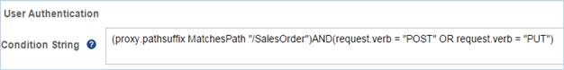

<!-- loio08b40d9e47a0470a8b14cc47abab89ec -->

# Flow

A Flow defines a processing pipeline which controls how the API behaves and defines what information it should carry.

A processing pipeline comprises of a Request and a Response stream. Proxy endpoint and target endpoint define a pipeline to process request and response messages. A flow is a request or response processing pipeline defined by a proxy endpoint or target endpoint. Each request or response flow is subdivided into a PreFlow, one or more optional Conditional Flow, a Post Flow, and an optional PostClient Flow.

-   **PreFlow**: This flow is always executed as the first step in the segment where it is applied, before the conditional flow. Configure a PreFlow when you want to ensure a policy is executed before anything else. Use the PreFlow on the proxy endpoint for example, when you don’t want a call that has exceeded its quota to be routed to the backend layer, or when you have to authenticate users. To support such requirements, you usually put quota and security policies in the PreFlow pipeline. This ensures that the policies will always execute before any other processing takes place.

-   **Conditional Flow**: A condition associated to a flow. A flow can contain one or more conditions. However, only the first condition met is executed. Configure a conditional Flow when you want a set of policies to be executed only when a condition is met. You can define multiple conditional Flows. However, a conditional flow segment is executed only when a match is found with the criteria defined in the Conditional String. Once a conditional Flow is executed, all other succeeding conditional Flows along the chain will not be executed. For example, you want to convert XML to JSON only when the requesting application is running on a mobile device. This scenario can be configured by setting up conditional Flows.

    > ### Note:  
    > If you need a custom ordering of conditional flows, you can modify it in the proxy zip. The proxy zip can be exported and in the *proxyzip* \> *APIProxy* \> *APIProxyEndPoint* \> *default.xml file*, you can order the sequence of the conditional flows as needed. However, please note that the DefaultFaultFlow will always be appended at the end, regardless of the sequence order assigned to other flows.

-   **PostFlow**: This flow is always executed as the last step in the segment where it is applied, after the conditional flow. Configure a PostFlow when you want to log some data or send a notification that something happened. A PostFlow is always executed regardless of the situation.

-   **PostClientFlow**: This is an optional flow that executes after the response message has been sent to the requesting client application. You can add a PostClientFlow only to the response flow of a ProxyEndpoint. PostClientFlow reduces API proxy latency and makes information available for logging that is not calculated until after the response is returned to the client.

    > ### Note:  
    > PostClientFlow is executable via the import functionality, it is executed only when you import an API proxy that contains the PostClientFlow standard payload. The sample payload is provided below for your reference. You can attach only Message Logging policies to a PostClientFlow.

    To execute a PostClientFlow, perform the following:

    1.  Export the required API proxy from Integration Suite. For more information, see [Export an API Definition](export-an-api-definition-420abb6.md).
    2.  Add the below sample payload starting from the line `<postClientFlow>` in the `default.xml` file available under `APIProxyEndPoint` folder of your API proxy. For more information, see [API Proxy Structure](api-proxy-structure-4dfd54a.md).

        > ### Sample Code:  
        > ```
        > <postFlow>.......
        >         .........</postFlow>
        > 	<postClientFlow>
        > 	        <name>PostClientFlow</name>
        > 	        <response>
        >                  <isRequest>false</isRequest>
        > 	            <steps>
        > 	                <step>
        > 	                    <policy_name>clientflowMessagePolicy</policy_name>
        > 	                    <condition> </condition>
        > 	                    <sequence>1</sequence>
        > 	                </step>
        > 	            </steps>
        > 	        </response>
        > 	    </postClientFlow>
        > 	
        > ```

        > ### Note:  
        > isRequest : needs to be marked false in the response section of PostClient Flow.

        > ### Note:  
        > In the payload, ensure that the policy name entered in the `<policy_name>` field is an existing policy that belongs to your API proxy. The `Policy` folder displays all the policies that are currently attached to your API proxy.

    3.  Import the updated API proxy in SAP Integration Suite. For more information, see[Import an API Definition](import-an-api-definition-9342a93.md) 


A policy can be assigned to any of the above four flow types. You configure a PreFlow and PostFlow in the proxy endpoint or target endpoint configurations only when you want to enforce a policy.


## Defining Flows in Policy Designer

Use the policy designer to define Flows and policies. The policy designer allows you to define one PreFlow, one PostFlow and zero or more Conditional Flows on the proxy endpoint and target endpoint individually. You can also choose to have no conditional Flows on the proxy endpoint or target endpoint.

You can assign one or more policies to each PreFlow, PostFlow or Conditional Flow. The list of supported policies is available on the right under the *Policies* section. The count of the policies attached to a Flow is depicted as a number beside the Flow. To view the list of policies attached to a flow, for example on a PreFlow, select PreFlow under proxy endpoint in the *Flows* section. The Policy designer will visually display all policies attached on this PreFlow for the proxy endpoint. On selecting a policy, you can view the details of the Conditional String as well as the content of the Policy itself. The Policy is executed only if the conditional String element on the Policy evaluates to true. You can similarly attach policies to a PostFlow or Conditional Flow.

You enter the conditions in the Conditional String field as illustrated below:




## Creating and Configuring Policies

Adding a policy to an API proxy involves the following two steps:

1.  Select an existing flow or create a conditional Flow
2.  Create and attach the policy to the Flow


The above graphic illustrates the relationship between policies and Flows. A policy is attached to a Flow as a processing **Step**. Each Step can contain one policy. A flow can contain zero or many steps. Each step has a condition, which decides whether the policy has to be executed.

