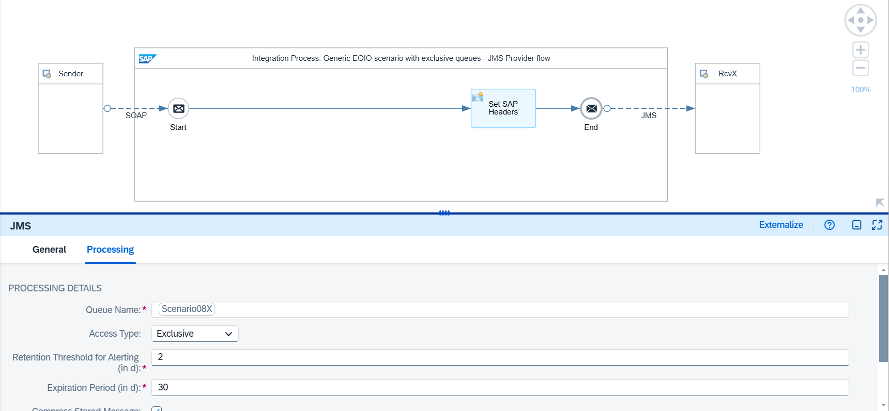
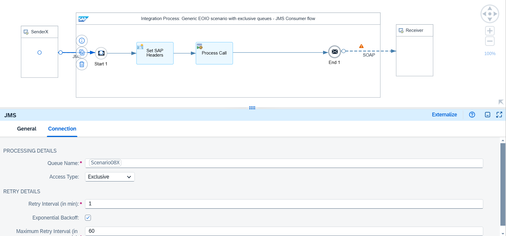

<!-- loio70c7774b7ba7420ea17efed6e9394982 -->

# Generic Use Case

The following assumptions apply to the design of this scenario:

-   The receiver is idempotent, which means that it can detect and ignore duplicate messages.
-   The sender ensures that a message is only sent when the predecessor message has been acknowledged by a technical success response.

-   If an error occurs when delivering the message to Cloud Integration, the sender performs a retry.

An exclusive JMS queue is used where the messages are directly stored once they reach the middleware, Cloud Integration. This ensures the following:

-   By persisting the messages in a JMS queue, Cloud Integration can carry out the retry of the message delivery if there's an error.
-   By using an exclusive JMS queue, the message sequence can be preserved.

You can anticipate the following situation: A message fails and is retried automatically until the message is successfully delivered. As long as the failed message is in retry, all successor messages are kept on hold to ensure that they don't overtake the predecessor message.

<a name="loio70c7774b7ba7420ea17efed6e9394982__section_u1c_pfb_1fc"/>

## Integration Flows Involved

To simulate the communication of sender and receiver systems through Cloud Integration for the different scenarios, the integration package comes with multiple integration flows. To learn more about how these integration flows interact during the processing of a scenario, see [Interaction of the Involved Integration Flows](interaction-of-the-involved-integration-flows-44be68d.md).

<a name="loio70c7774b7ba7420ea17efed6e9394982__section_mqm_2gb_y2c"/>

## Example Scenario

The following example integration flow `Pattern Quality Of Service - EOIO in General` consists of two integration processes.

The first integration process contains a SOAP sender adapter and a JMS receiver adapter. The messages are directly stored in a JMS queue after they're received from the sender system. The content modifier in the integration process model is only used to define the headers `SAP_Sender` and `SAP_Receiver` for an improved monitoring. The access type of the JMS queue is defined as *Exclusive*.

The second integration process reads the message from the same JMS queue and carries out the integration flow steps. Here, you need to ensure that the access type of the JMS queue is also defined as *Exclusive*. Otherwise, the deployment of the integration flow fails.

On the receiver side, the scenario uses the SOAP \(SAP RM\) receiver adapter. In the Processing tab of the receiver adapter, the *SAP RM Message ID Determination* property is set to *Map*. As source for SAP RM Message ID, an ID is required that is constant throughout all potential retries from the JMS queue. Use the message ID of the message processing log for this purpose. At runtime, Cloud Integration gets the actual value for the message ID from the header `SAP_MessageProcessingLogID`. The expression `${header.SAP_MessageProcessingLogID}` is used to specify the source for the ID Determination. Cloud Integration uses the mapped unique ID as SAP RM Message ID.

> ### Note:  
> By using the message processing log ID for the duplicate handling, we assume that the sender wouldn’t do a retry of the same message because Cloud Integration can handle the retry. However, if the sender does a retry, a new message processing log ID is created, which results in a duplicate message. In this case, we recommend using a unique document ID from the message payload if this is applicable for your scenario.

See: [Configure the SOAP \(SAP RM\) Receiver Adapter](configure-the-soap-sap-rm-receiver-adapter-8366495.md)

These integration flow settings ensure that Cloud Integration passes on a unique ID to the receiver system. If an error occurs during message processing, Cloud Integration retries the message from the JMS queue. Since the retry is performed within the same instance of the message processing log, the message processing log ID and, as a result, the mapped unique ID remain the same.

If the message delivery fails, the JMS persistence ensures that the message is retried. If the message wasn't sent to the receiver in the first place, a unique ID doesn't have any effect anyway. However, if the message was delivered to the receiver successfully and the positive acknowledgment got lost, a unique and repeatable ID is required. Otherwise, this behavior can lead to duplicate messages arriving at the receiver. Since the receiver is idempotent, it recognizes the duplicate message based on the ID and discards it.

Furthermore, because the JMS queue is of access type *Exclusive*, only one consumer can access the queue at any time. Therefore, all successor messages keep waiting until the predecessor message was processed successfully. This setting guarantees that messages are processed in the exact order in which they're stored on the JMS queue.

<a name="loio70c7774b7ba7420ea17efed6e9394982__section_wpz_zfb_1fc"/>

## Testing the Scenario

To test the scenario, perform the following steps.

1.  Set up inbound *Basic* authentication for integration flow endpoints.

    See [Basic Authentication with clientId and clientsecret for Integration Flow Processing](../40-RemoteSystems/basic-authentication-with-clientid-and-clientsecret-for-integration-flow-processing-647eeb3.md) and [Setting Up Inbound HTTP Connections \(with Basic Authentication\), Neo Environment](https://help.sap.com/docs/integration-suite/sap-integration-suite/setting-up-inbound-http-connections-with-basic-authentication-neo-environment).

2.  Go to *Manage Security* \> *Security Material* \> *Monitor*, and deploy a *User Credentials* artifact with the following parameters:

    <table>
    <tr>
    <th valign="top">

    Parameter
    
    </th>
    <th valign="top">

    Setting
    
    </th>
    </tr>
    <tr>
    <td valign="top">
    
    *Name*
    
    </td>
    <td valign="top">
    
    `OWN`
    
    </td>
    </tr>
    <tr>
    <td valign="top">
    
    *User*
    
    </td>
    <td valign="top">
    
    Enter the user you specified when you set up inbound basic authentication.
    
    </td>
    </tr>
    <tr>
    <td valign="top">
    
    *Password*
    
    </td>
    <td valign="top">
    
    Enter the password you specified when you set up inbound basic authentication.
    
    </td>
    </tr>
    </table>
    
    > ### Note:  
    > When you check out the integration flows `Pattern Quality Of Service – Mocked Sender` and `Pattern Quality Of Service - EOIO in General`, you notice that the receiver adapters refer to a user credentials artifact with the name `OWN`.
    > 
    > Both integration flows operate on the same tenant and use the same user credentials for inbound requests.

3.  Deploy the three integration flows `Generic Receiver`, `Pattern Quality Of Service – Mocked Sender`, and `Pattern Quality Of Service - EOIO in General`.

4.  In the Postman client, open the *QualityOfService* folder in the *Enterprise Integration Patterns* collection, and run the `QualityOfService - EOIO in General` requests.

    For each request, a message is stored in the exclusive queue with name `EOIO_General_X`. The first POST request sets the request parameter `enforceError` to true \(in the *Params* tab of Postman\), simulating an error situation. The message read from the exclusive queue then automatically runs into an error. In the message monitor, you can see that the message goes into *Retry*. Furthermore, the custom status is set to *Error enforced*. All subsequent messages now wait until the predecessor message has been either processed successfully or canceled. This test shows that the message sequence is kept.

5.  For demo purposes, each retry runs into the same enforced error. So, the error can’t be resolved and you should delete it. To do so, first save the message ID of the erroneous message to your clipboard. Then, navigate to the *Message Queues* monitor. To cancel the message, filter for it in the JMS queue monitor using the message ID. Select the JMS message entry of the erroneous message within the exclusive queue `EOIO_General_X` and choose *Delete*. After a while, the successor message is automatically retried and, if processed successfully, removed from the queue.

6.  Once the system has canceled the first erroneous message and processed the second message successfully, check the message monitor. You should see one message in status *Canceled* and a new message login status *Completed* with sender `JMSExclusive` and receiver `MockedSOAPReceiver`.

7.  Optionally, you can switch on the trace to be able to verify the overall behavior.

