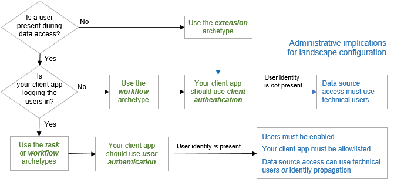

<!-- loio8fb14e0b02964541841750985ace9385 -->

# Getting Started

There are two important considerations before developing your Graph application:

1.  What type of application are you planning to develop? What is the use case? For more information about the implications of this question, see [Application Archetypes](application-archetypes-4db0c0b.md).

2.  What is your authentication strategy, and how do you plan to retrieve the necessary access token to communicate with Graph? For more information about the possible options, see [Authentication](authentication-79aabda.md).

These considerations have some implications for the landscapes that your application can support. The following diagram summarizes your choices as a developer:

There is a [Graph tutorial](https://blogs.sap.com/2021/06/08/sap-graph-multi-part-tutorial-information-map/), which uses a sandbox landscape and introduces developers to Graph through simple examples. As mentioned, the [Graph Navigator](https://api.sap.com/graph) provides detailed information for over 2,200 root entities.

