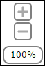

<!-- loioa53aeedf19924cdba3f919797ce973b6 -->

# Graphical Model Viewer Features

The Graphical Model Viewer in the Cloud Integration Web application provides you with the following navigation controls and viewing options to customize your viewing preferences:

## Fit to Screen

There might be instances where the OData model objects of a big model extend beyond the scope of the Graphical Model Viewer space. In such cases, you can choose *Fit to Screen* to view the entire model within the boundaries of the Graphical Model Viewer. This feature automatically aligns the model to fit the Graphical Model Viewer space.

## Expanding and Collapsing OData Objects

The Graphical Model Viewer lets you expand or collapse all the section headers of the objects in the OData model. You can also expand and collapse individual OData model objects.

**Collapsed State**

-   To collapse all OData objects in the Graphical Model Viewer, choose the *Collapse All* button on the toolbar. The *Collapse All* button toggles to *Expand All* once the model is collapsed.
-   If you want to collapse an individual OData object, choose the arrowhead button in the expanded object.

**Expanded State**

-   To expand all OData objects in the Graphical Model Viewer, choose the *Expand All* button on the toolbar. The *Expand All* button toggles to *Collapse All* once the model is expanded.
-   If you want to expand an individual OData object, choose the arrowhead button in the collapsed object.

## Navigation Controls

Depending on the number of OData objects in the model, objects might appear too small or be too big for the Graphical Model Viewer to accommodate. In such cases, the navigation controls help you view the model better.

****

<table>
<tr>
<th valign="top">

Button

</th>
<th valign="top">

Usage

</th>
</tr>
<tr>
<td valign="top">

</td>
<td valign="top">

Use the compass to control the perspective of the model:

-   Choose  to move right.

-   Choose  to move left.

-   Choose  to move down.

-   Choose  to move up.

-   Choose  to zoom the model to 100%.

</td>
</tr>
<tr>
<td valign="top">

</td>
<td valign="top">

-   Choose  to zoom in to the model.
-   Choose  to zoom out of the model.
-   The zoom level indicator  shows the zoom percentage.

</td>
</tr>
</table>

