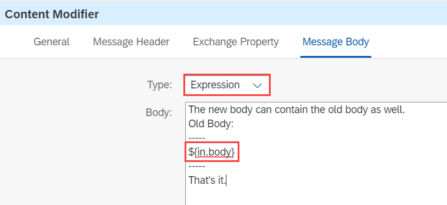
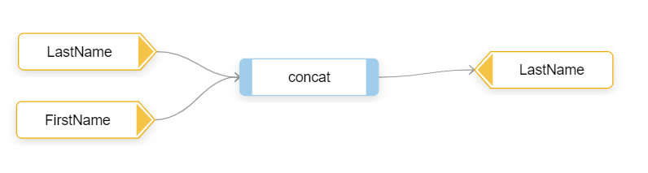
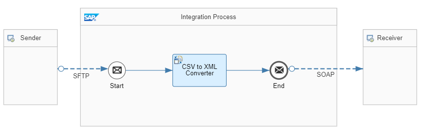
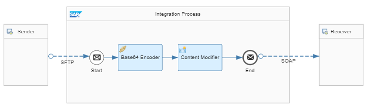
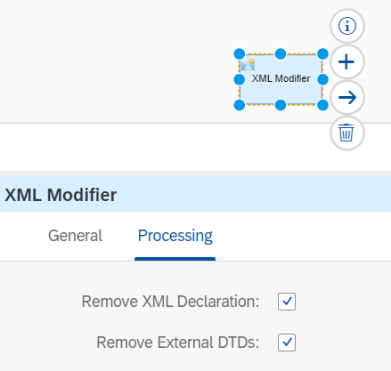

<!-- loio6a7c9a10886a4465a10481375837bb15 -->

# Guidelines for Modifying Content

There are various ways to modify the content or change the format. In this topic, you find a short explanation of each option. Additionally, there's guidance on when to use what at the end of this document.

### Content Modifier

The *Content Modifier* allows you to create and delete headers and properties. Furthermore, it gives you an easy option to change the payload by simply adding the desired target value directly into the corresponding field. This can be of any format, Plain Text, XML, JSON, etc.

If you don't enter anything into this field, the body remains unchanged, not necessarily empty.

If you want to include the existing payload into a new payload, you can use the expression `${in.body}`. Make sure to set the field *Type* to *Expression* to indicate that you're using expressions in your content.

You can also refer to existing headers or properties and use them in your modified body.

The Content Modifier is a powerful tool for payload modifications. Nevertheless, for XML modifications we recommend using other flow steps as you might invalidate the XML encoding when modifying or merging XML payloads.

See [Define Content Modifier](define-content-modifier-8f04a70.md).

### Message Mapping

If you need a more complex modification of your XML or JSON payload, you can use a message mapping. Today, message mappings support JSON messages with OpenAPI Spec 2.0 and 3.0 format as well as XML messages using XSD, WSDL, or EDMX format.

In the message mapping, you can define a source and a target message and map the fields between them. It’s also possible to add simple or complex expression like condition checks or modifications. Also custom scripts can be used inside the mapping expressions, for example, [Access Header and Properties in Message Mapping](access-header-and-properties-in-message-mapping-4f2a8c9.md).

For more information, see [Message Mapping](message-mapping-459ccdf.md).

### XSLT

Another way to change XML messages, is the use of XSL transformation, or – in short – XSLT. XSLT is a text-based mapping script, that allows you to parse the source XML and produce the target XML according to the transformation script.

See [Create XSLT Mapping](create-xslt-mapping-5ce1f15.md) and [Access Header and Properties in XSLT Mapping](access-header-and-properties-in-xslt-mapping-f917c39.md).

### Filter

If your payload is an XML message and only a certain part of the existing payload is relevant and shall be set as new payload, you can use the Filter step that allows you to provide an XML path, or short XPath. The result of the XPath is set as the new payload. This also means if the XPath doesn't return any result, the new payload is empty.

XPath allows you to filter for a certain XML element or elements with certain criteria like attributes.

For more information, see [Define Filter](define-filter-733f8dc.md) and [Message Filter](message-filter-bd52346.md).

### Content Enricher

You can also modify the body by merging the existing payload with the payload of an external message, for example a lookup call.

To do so, you can use the Content Enricher step. The step is connected to a message channel from a communication participant like a sender or receiver. At runtime, the Enricher invokes the participant and fetches the additional payload. Once successful, the Content Enricher combines the external payload with the existing payload to form a new message body. There are different aggregation patterns available:

-   *Combine*: concatenating any kind of payload like plain text, JSON but also XML

-   *Merge*: allows a deeper integration of XML messages

For more information, see [Define Content Enricher](define-content-enricher-8827f9f.md) and [Content Enricher](content-enricher-0e7ba7f.md).

### Script

In a Javascript or Groovy script, the payload can be modified in any kind of way. The only thing you need to pay attention to is to hand back the modified body to the message object at the end of the script using “return message;” so that the next flow steps will receive it. We recommend using scripts only if you need to access our script APIs or in case there's no graphical flow step available for your required operation as you've to take care of compatibility of the scripts in case of upgrades of the underlying Java version or when switching platforms like from Neo to Multi-Cloud. For the graphical flow steps compatibility is ensured by SAP Cloud Integration.

For more information, see [Define a Local Script Step](define-a-local-script-step-03b32eb.md) and [Use Scripting Appropriately](use-scripting-appropriately-d4dc13c.md).

### Splitter – Gather

Also, the Splitter is a kind of modification as it changes the payload.

A payload that contains multiple elements or rows can be separated by a Splitter to focus on each element separately. Every split element is its own message with its own payload that can be treated as any other message.

Once the processing/modification of the split elements is done, they can be merged back into a single message by using the Gather step – if you want to.

For more information, see:

-   [Define Splitter](define-splitter-dabea9d.md)

-   [Define Gather and Join](define-gather-and-join-94ef1f2.md)

-   [Splitter](splitter-4b475ea.md)

-   [Composed Message Processor](composed-message-processor-353a119.md)

-   [Handle Exceptions When Using the Splitter Pattern](handle-exceptions-when-using-the-splitter-pattern-74e431c.md)

### Datastore Get / Select

With the datastore, payloads can be persisted to and read from the SAP Cloud Integration database. When values are read from the database, the result is set as new message body. For this reason, this step is also listed here as a payload modification.

There are two options to read the values from the database. The datastore GET step reads exactly one entry from the database and sets the payload as a new body. The retrieved payload can be of any format. The datastore SELECT step loads multiple entries from the database and forms a new body using a certain XML schema. Therefore, the entries also have to be in XML format.

For more information, see [Define Data Store Operations](define-data-store-operations-79f63a4.md) and [Control the Number of Simultaneously Opened Database Connections](control-the-number-of-simultaneously-opened-database-connections-90628e9.md)

### Converter

Different communication partners offer different endpoints. Some partners use REST services, others Web services, and there are those with OData services and those which even use SFTP servers. Many endpoints are connected to a certain format. To connect two communication partners that 'speak' different protocols, it’s necessary to modify the payload by converting it from one format to a different one. SAP Cloud Integration offers converters to transform payloads into different formats: XML, JSON, and CSV converters are available.

For more information, see [Define Gather and Join](define-gather-and-join-94ef1f2.md) and [Convert Data](convert-data-c5507d7.md).

### Encoder / Decoder

Sometimes, a payload can contain special characters that might get lost when the payload is transferred into plain text, binary content for example. To safeguard the transfer of such elements, a base64 encoder can be used. Other encoders of Cloud Integration are GZip, Zip, and MIME Multipart.

The encoding can be reverted with a Decoder.

For more information, see [Define Message Transformer Steps](define-message-transformer-steps-e223071.md) and [Encode and Decode Content](encode-and-decode-content-2ba8448.md).

### XML Modifier

XML payloads usually contain a preamble with information about the encoding, etc. Sometimes, it’s necessary to remove those preambles, for example, when you manually merge payloads using scripts or content modifier.

Furthermore, XML payloads can contain Document Type Definitions or short DTDs. They define, among other things, the structure of the XML payload.

If one or both of the above-mentioned elements are removed from the payload, the XML modifier is the best option to do so.

For more information, see [Define XML Modifier](define-xml-modifier-af16d64.md).

### Encryptor

The encryptor steps enable you to encrypt the payload so that it can be transferred to a receiver or stored on a share in a secure way. SAP Cloud Integration supports PKCS\#7 and PGP encryption \(and decryption\). You can select the certificate or public keyring that is to be used to encrypt the payload as well as the security algorithm.

For more information, see [Define Security-Related Steps](define-security-related-steps-0f71687.md) and [Apply Message-Level Security](apply-message-level-security-9036c0c.md).

<a name="loio6a7c9a10886a4465a10481375837bb15__section_hkb_whb_q4b"/>

## When to Use What?

You now know every option available to modify the payload, so the following chapter explores the question which flow step is recommended in which situation.

### Protocol Change Only

Converters are the preferred choice, if the content of the payload is correct and complete, and only the format is to be changed.

### Wrap Existing Body

If you don’t want to change the body but add additional content, you've multiple options:

-   Use the Content Modifier if you want to enrich the body \(any type\) with plain text. Yet, use the Content Modifier only if you're sure that there's no special encoding. Use the XML Modifier to remove the XML preamble first.

-   Use XSLT and Message Mapping if you want to wrap an existing XML payload with other XML elements t. And if done memory efficient also scripts can be used.

### Replace the Original Body with Parts Of It

If you want to extract a part of the original body and set it as new payload, you have multiple options:

-   Filter is the best option if the original body is of type XML . Also, you can use XSLT and message mapping for that purpose.

-   If the original body is of type JSON, you can either use the Message Mapping or you convert the payload to XML using the JSON-to-XML converter and then any of the methods mentioned above.

-   If the original content is of type CSV, you can convert it to XML using the CSV-to-XML converter and then extract the required information.

-   If the original content is plain text, you can either do a String parsing in a script or you might use the Token or Line Splitter to split the text at certain points.

    > ### Note:  
    > Pay attention to memory efficiency!

### Enrich the Body with Headers or Properties

You can include headers and properties in various ways:

-   Use the Content Modifier, if you create a new body from scratch.

-   Use XSLT or Message Mapping, if your original body is XML and you want to keep XML as output and only want to add or replace certain elements with the content from headers or properties.

-   Use a Message Mapping, if your original body is JSON and the output is either JSON or XML.

-   Use a script, for any other case, that is, if none of the above-mentioned steps fits.

### Map the Original Body to a New Schema

If the original body doesn't fit your needs and you need a different schema using parts of the original content, you've the following options:

-   In case of XML to XML transformations, you can use an XSLT or a message mapping.

-   In case of a JSON/XML to XML/JSON mapping, you can use the message mapping.

-   Also, a script can be used for any kind of transformation into a new payload schema.

### Merge / Combine Two Payloads

If you want to take the original body and merge it with a body from either a different split branch or a multicast branch, you've to use a Gather step and either merge or combine the two payloads. If the results, that is, the structure isn't satisfactory, you can refine it afterwards with the steps mentioned in the other chapters, like message mappings, scripts, etc.

If you want to merge or combine the original body with content from an external call, you've to use Content Enricher. If you need to adjust the new body after the merge, refer to the other chapters in this section.

### Make the Payload Unreadable

There are multiple options if you want to transfer or park the payload and want to avoid that anyone can see the payload in clear text:

-   If the payload doesn't contain any business critical data and you don’t mind that with a bit of effort the payload can be made readable, you can simply transfer the original body into base64 content by using the base64 encoder step.

-   If the payload contains business or any other sensitive data and must therefore be protected, you've to use one of the encryption steps described already.

### Replace the Payload with a Previous state

In some scenarios, for example, when an intermediate external call overwrites your payload, it might be necessary to buffer the original payload and restore it later. You've got two options:

-   If you want to use the payload in the same flow process, store the payload initially into a property by using the Content Modifier and restore it once needed again using a Content Modifier. Don’t use any persistency for inner-flow buffer.

-   If you need to load a payload that was persisted in a previous run of an integration flow, you can use the Datastore GET or SELECT step.

