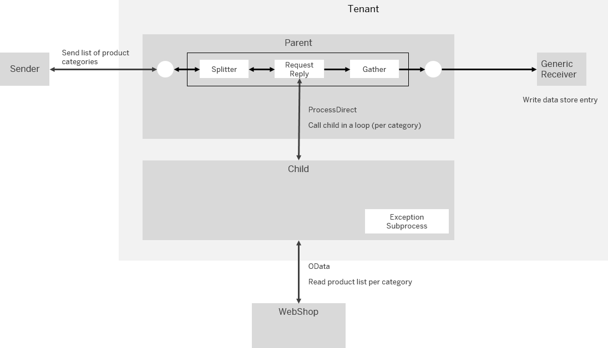
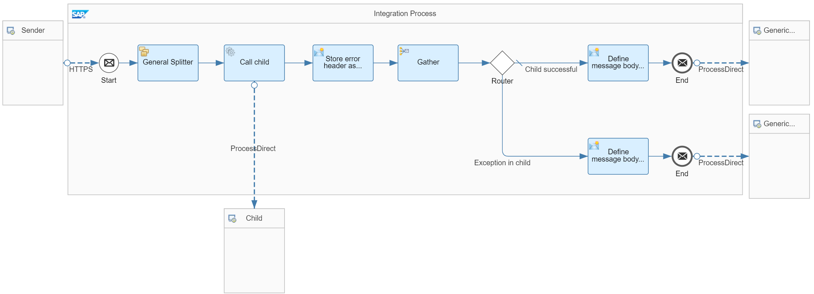

<!-- loio3973cc3ba7c7463283868da4d539e71b -->

# Handle Exceptions in Dependent Integration Flows

Handle exceptions in a setup of dependent integration flows that communicate with each other through the ProcessDirect adapter.

When following the guideline [Apply a Balanced Encapsulation of the Integration Logics](apply-a-balanced-encapsulation-of-the-integration-logics-e010db3.md), you've the option to modularize your integration scenario by outsourcing integration logic into different integration flows. In complex scenarios, you deal with a high number of integration flows that communicate with each other at runtime. In each integration flow, an exception can occur.

We provide a guideline how to handle exceptions in such a way that message processing is continued even in case an error occurs during a dedicated step of the overall process sequence.

> ### Tip:  
> To modularize integration logic, there's an alternative to using different integration flows connected through the ProcessDirect adapter: You can use one single integration flow containing multiple subprocesses \(modeled as *Local Integration Process* shapes as described under [Define Local Integration Process](define-local-integration-process-520341a.md)\). The different parts of the integration logic are implemented in separate subprocesses that are called from the main process by a local call. However, if in such a scenario an error occurs in 1 subprocess, always the whole integration flow fails. Therefore, this design isn't suitable to implement an exception handling scenario as described.

To discuss the topic based on a simplified setup, let's consider a scenario that consists of 2 integration flows - a parent and a child integration flow. Both integration flows communicate with each other as depicted in the figure.


The parent integration flow \(triggered by a message from the sender\) communicates with a child integration flow \(through the ProcessDirect adapter\). The child integration flow performs further processing steps and sends a response back to the parent integration flow. The parent integration flow performs additional steps and, finally, sends the resulting message to a receiver system.

Let's consider the case that an exception occurs in the child integration flow.

You've different options to implement error handling for such a scenario:


<table>
<tr>
<th valign="top">

Error Handling Option

</th>
<th valign="top">

When to Use

</th>
</tr>
<tr>
<td valign="top">

Option 1

If an exception occurs in the child integration flow, processing of the parent integration flow is stopped.

</td>
<td valign="top">

You don't need to retrieve detailed information about the cause of the exception when monitoring the scenario.

It's expected that message processing always fails if an exception occurs in one dependent child integration flow.

</td>
</tr>
<tr>
<td valign="top">

Option 2

If an exception occurs in the child integration flow, the parent integration flow continues message processing in a defined way.

Furthermore, the integration scenario is designed in such a way that message processing is adapted to the exception situation at runtime: In such a case, the message is processed in a different way than in the success case.

</td>
<td valign="top">

-   You need to make sure that operation of the scenario is completed also if an exception occurs.

-   You need to be able to analyze the exception and to easily locate the integration flow and step in the process chain that caused the exception.

    When modularizing your integration logic for complex scenarios, you can expect that a high number of integration flows are in place that communicate with each other. It’s important that you're able to quickly locate the cause of the exception within the overall, modularized integration scenario design.

-   You need to provide as specific information as possible about the cause of the exception and forward this information to affected administrators \(for example, in an email notification\).


> ### Note:  
> For example, assume that the scenario processes various items in a loop and processing of the individual item is designed in a child integration flow. In such a scenario, it's a likely requirement that message processing continues even in case processing of one individual item fails. Furthermore, the message is processed by the parent integration flow in such a way that it's easy for the tenant administrator to identify the item that wasn't processed properly.


</td>
</tr>
</table>

This guideline shows you how to implement option 2.


<a name="loio3973cc3ba7c7463283868da4d539e71b__section_h5s_d42_dmb"/>

## Implementation

The following features are used to handle the exception:

-   An Exception Subprocess handles the exception in the child integration flow.

    When the Exception Subprocess ends with a *Message End* event, the integration developer can specify a custom error message that is sent back from the child integration flow if an exception occurs \(see guideline: [Handle Exceptions](handle-exceptions-ca95c61.md)\).

-   If an exception occurs in the child integration flow, a header with a dedicated value is set and sent to the parent integration flow. This header can be used by the parent integration flow to control the processing for the exception case \(for example, in a dedicated route\).


The example scenario is implemented in the following way:



The goal of the scenario is to find out per category how many products are available in the WebShop. The result is sent to the receiver.

The case that for a given category no products are available is treated as an exception. In such a case, according to option 2, the scenario continues message processing and sends a modified message to the receiver. The message indicates which product category caused the exception.

The parent integration flow \(name: *Handle Errors - Dependent Integration Flows – Parent*\) splits the inbound message \(that contains a list of product categories\) and sends a request \(per category\) through the ProcessDirect adapter to the child. For each split message, this integration flow receives a response with information on the number of products available for the category. The received individual messages are finally concatenated and sent to the receiver. If for each category a list of products could be retrieved, a Data Store entry with Entry ID *Success* is created.

If for at least 1 category an exception occurs, the result \(a modified message\) is stored in the Data Store entry with Entry ID *Error*. The behavior for the exception case is controlled by the header `error_occured` \(with value set to `true`\) sent back from the erroneous child.

The child integration flow \(name: *Handle Errors - Dependent Integration Flows – Child*\) is called per category and reads the list of products for this category from the WebShop. It counts the number of products and stores this value in message text. Note that the WebShop doesn't treat the case that for a request no product is found as exception. Therefore, an exception is enforced by design in a route that leads to an *Error End* event for that case. The Exception Subprocess also sends a header \(`error_occured`\) back to the parent.

The parent integration flow *Handle Errors - Dependent Integration Flows – Parent* is designed in the following way:



The integration flow performs the following steps:

1.  SAP Integration Suite receives an XML message with a list of product categories.

2.  The General Splitter decomposes the inbound message into individual messages \(with only 1 product category\).

3.  The Request Reply step *Call child* calls the child integration flow through the ProcessDirect adapter.

4.  The parent integration flow receives the response from the child integration flow \(in the success case, with the information about the number of products for the given category\). In case an exception occurred in the child integration flow, a modified \(error\) message, and the header `error_occured` with value `true` is received.

5.  The Content Modifier *Store error header as property* stores the `error_occured` header as property \(to keep its value accessible for the integration flow after the next Gather step\).

6.  The Gather step concatenates the content of the individual response messages.

7.  The Router step leads to the following branches:

    -   The default route hands over the message to the Content Modifier *Define message body in success case*.

        This step creates the headers `context` and `receiver` for the Generic Receiver \(see: [Generic Receiver](generic-receiver-83a6970.md)\). Header `context` provides the name `HandlingErrors-DependentFlows` for the Data Store created by the Generic Receiver. Header `receiver` provides the Entry ID \(`Success` in this case\).

        The message body is defined by the following expression:

        > ### Sample Code:  
        > ```
        > For all categories products are available:
        > ${in.body}
        > ```

        The expression `${in.body}` provides the concatenated message body from the gathered individual messages.

    -   In case a property `error_occured` with value `true` has been created \(if an exception in the child process occurred in 1 loop\), the lower route is taken.

        The lower route hands over the message to Content Modifier *Define message body in error case*.

        This step creates the headers `context` and `receiver` for the Generic Receiver. Header `context` provides the name `HandlingErrors-DependentFlows` for the Data Store created by the Generic Receiver. Header `receiver` provides the Entry ID \(`Error` in this case\).

        The message body is defined by the following expression:

        > ### Sample Code:  
        > ```
        > At least for one category, products are not available:
        > ${in.body}
        > ```

        The expression `${in.body}` provides the concatenated message body from the gathered individual messages.


8.  The resulting message is sent to the *Generic Receiver* integration flow through the ProcessDirect adapter.


The child integration flow *Handle Errors - Dependent Integration Flows – Child* is designed in the following way:


The integration flow performs the following steps:

1.  The integration flow receives the message sent from the parent integration flow through the ProcessDirect adapter. The message contains the value of 1 product category.

2.  The Content Modifier *Store category as property* stores the value of element `category` in the inbound message as property.

3.  The Request Reply step *Call WebShop* calls the WebShop through the OData adapter.

    The query selects the list of products available for the given category:

    `$select=ProductId,Category,Name&$filter=Category eq '${property.category}'`

4.  The Content Modifier *Store number of products as property* retrieves the number of items in the OData response by the following XPath expression and stores the result as a property:

    `count(//Product)`

5.  The Router step leads to the following branches:

    -   The default route hands over the message to the Content Modifier *Create message body for item*.

        The message body is defined by the following expression:

        > ### Sample Code:  
        > ```
        > \tCategory '${property.category}': ${property.NoOfProducts} products \n
        > ```

    -   In case the OData request retrieves no products, the lower route is taken.

        Note that the WebShop API does **not** treat the fact that no products are found for a category as exception. Therefore, an exception is enforced by the *Error End* event in that case.

        If an exception occurs, the Exception Subprocess is processed.

        In that case, the Content Modifier *Create error header and body* creates the header `error_occured` with value `true` \(that is passed on to the parent integration flow\).

        Further-on, this step creates the following message body \(for this individual split message\):

        > ### Sample Code:  
        > ```
        > \tCategory '${property.category}': an exception occured, no products found\n
        > ```


To test the scenario for the success case, provide a list of categories in the body of the HTTP request. The following list contains categories for which products are available in the WebShop \(this is the default message body defined in the Postman collection\):

> ### Sample Code:  
> ```
> <categories>
> <category>Notebooks</category>
> <category>Software</category>
> <category>Beamers</category>
> </categories>
> ```

As result, you get the following result message \(both in the HTTP response and in entry `Success` in Data Store `HandlingErrors-DependentFlows`\):

> ### Sample Code:  
> ```
> For all categories products are available:
> 	Category 'Notebooks': 10 products 
> 	Category 'Software': 8 products 
> 	Category 'Beamers': 3 products 
> ```

To test the scenario for the success case, provide a list of categories in the body of the HTTP request for which products are available in the WebShop, for example:

> ### Sample Code:  
> ```
> <categories>
> <category>Notebooks</category>
> <category>Software</category>
> <category>XYZ</category>
> </categories>
> ```

As result, you get the following result message \(both in the HTTP response and in entry `Error` in Data Store `HandlingErrors-DependentFlows`\):

> ### Sample Code:  
> ```
> At least for one category, products are not available:
> 	Category 'Notebooks': 10 products 
> 	Category 'Software': 8 products 
> 	Category 'XYZ': an exception occured, no products found 
> ```

