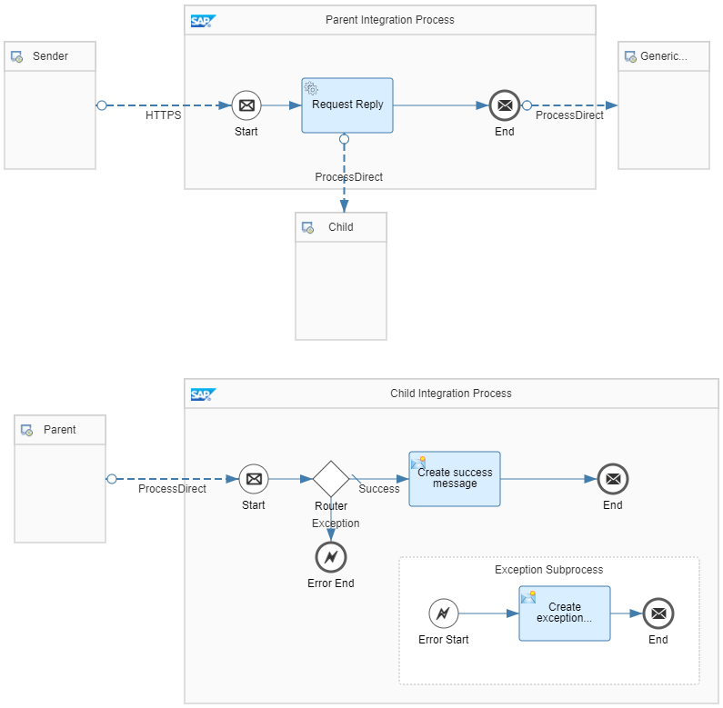

<!-- loio984e51a1d541462396e309f0f41c3e85 -->

# Handle Exceptions in Dependent Integration Flows \(Simple Scenario\)

Handle an exception raised in a connected integration flow called through the ProcessDirect adapter.

We provide a guideline on how to handle exceptions in such a way that message processing is continued even if Cloud Integration raises an exception during a dedicated step of the overall process sequence.

To discuss the topic based on a simplified setup, let's consider a scenario that consists of 2 integration flows - a parent and a child integration flow. Both integration flows communicate with each other as depicted in the diagram.

> ### Note:  
> You find a more complex scenario following the same exception handling principle under [Handle Exceptions in Dependent Integration Flows](handle-exceptions-in-dependent-integration-flows-3973cc3.md).

Let's assume that you've modularized your integration logic using separate integration flows \(connected with the ProcessDirect adapter\), and an exception is raised in a connected \(child\) integration flow.

To learn how to handle such an exception in the parent integration flow, check out the integration flow model *Handle Errors - Dependent Integration Flows - Simple Scenario*.

<a name="loio984e51a1d541462396e309f0f41c3e85__section_hwn_rzz_2sb"/>

## Implementation

To keep it simple, both parent integration flow and child integration flow are designed using 1 integration flow model \(name: *Handle Errors - Dependent Integration Flows - Simple Scenario*\).

The parent integration process is designed in the following way \(only exception use case considered\):

1.  The parent integration flow receives a message from an HTTP client with a header that indicates that an exception is to be triggered in the child integration process \(header `exception_in_subprocess` is by default set to `true`\).

2.  The Request Reply step calls the child integration process through the ProcessDirect adapter.

3.  Because the header `exception_in_subprocess` is set to `true`, the child integration process takes the *Exception* route and ends with an error end event. Consequently, the Exception Subprocess takes over the message processing.

4.  The Content Modifier *Create exception message* in the Exception Subprocess generates the following message body:

    `Error: Message processing failed.`

    Furthermore, the Content Modifier sets the following headers. They determine the name of the data store and the data store content created by the Generic Receiver integration flow in a later step.

    ****

    <table>
    <tr>
    <th valign="top">

    Name
    
    </th>
    <th valign="top">

    Source Type
    
    </th>
    <th valign="top">

    Source Value
    
    </th>
    </tr>
    <tr>
    <td valign="top">
    
    context
    
    </td>
    <td valign="top">
    
    Constant
    
    </td>
    <td valign="top">
    
    HandlingErrors-DependentFlowsSimple
    
    </td>
    </tr>
    <tr>
    <td valign="top">
    
    receiver
    
    </td>
    <td valign="top">
    
    Constant
    
    </td>
    <td valign="top">
    
    Error
    
    </td>
    </tr>
    </table>
    
5.  SAP Cloud Integration hands over the message body and the headers to the parent integration process.

6.  The parent integration process calls the *Generic Receiver* integration flow.

7.  The *Generic Receiver* integration flow creates a data store with name *HandlingErrors-DependentFlowsSimple* and an entry with entry ID *Error*. The entry contains the message with the message body defined by the Content Modifier *Create exception message*.

Analogously, in the success case \(when header `exception_in_subprocess` is set to `false`\), the other route of the child integration process is taken. SAP Cloud Integration generates a success message and stores it \(through the *Generic Receiver* integration flow\) as a data store entry with entry ID *Success*.

To execute the integration scenario using Postman, perform the following steps:

1.  Open the Postman collection that comes with the integration package.

2.  Go to the folder *DependentFlowsSimple*.

3.  Perform the HEAD and then the POST request. The header `exception_in_subprocess` by default has the value `true`.

    You get the following response:

    `Error: Message processing failed.`

4.  To verify the data store content, go to the *Monitor* application and under *Manage Stores* click the *Data Stores* tile.

    You find a data store with name *HandlingErrors-DependentFlowsSimple*. It contains an entry with entry ID *Error*. You can download the message from the entry and find that it contains the following content:

    `Error: Message processing failed.`

To run the integration scenario in success mode, change the value of header `exception_in_subprocess` in Postman \(at the POST request\) to `false`.

> ### Note:  
> When setting up the integration scenario, you learned the following: If an exception occurs, the steps after the *Request Reply* step are processed. That means that the *Generic Receiver* integration flow is called and a data store entry is created.
> 
> The integration flow *Handle Errors - Local Integration Process* is designed analogously \(see [Handle Exceptions in Subprocess \(Simple Scenario\)](handle-exceptions-in-subprocess-simple-scenario-e8b10b6.md)\). However, instead of a *Request Reply* step it uses a local *Process Call*. If an exception occurs in the subprocess, the steps after the local *Process Call* step aren't processed any more. Consequently, the *Generic Receiver* integration flow isn't called and no data store entry is created.

