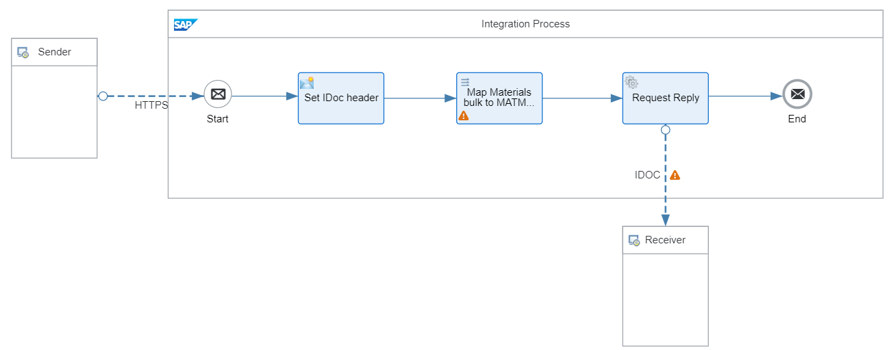
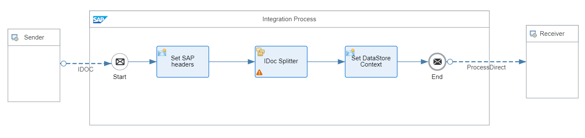

<!-- loioe35e38959c06422db7fcc8cdc1e756fc -->

# Handle IDoc Bulk Messages

Learn how to set up scenarios with composite IDoc messages.

IDoc \(Intermediate Document\) is a message format used by SAP systems for application integration \(see [IDocs \(SAP Library\)](https://help.sap.com/saphelp_46c/helpdata/en/0b/2a60ef507d11d18ee90000e8366fc2/content.htm?no_cache=true)\). A composite message is a message that consists of multiple items of the same structure.

To implement exchange of IDoc messages between Cloud Integration and remote systems, you can use the IDoc sender and receiver adapter. These adapters also support the processing of composite messages as demonstrated in the following example scenario. Another integration flow component that comes into play when dealing with IDoc bulk messages is the *IDoc Splitter* which splits a composite IDoc message into individual IDocs.

See also:

-   [Configure the IDoc Sender Adapter](configure-the-idoc-sender-adapter-bf769d6.md)

-   [Configure the IDoc Receiver Adapter](configure-the-idoc-receiver-adapter-018aa88.md)

-   [Define IDoc Splitter](define-idoc-splitter-4f250e4.md)

<a name="loioe35e38959c06422db7fcc8cdc1e756fc__section_owf_qwh_v1c"/>

## Implementation

The example scenario works in the following way:

1.  You use an HTTP client \(for example, Postman\) to send a bulk XML message to the first integration flow *IDoc Bulk Handling – Outbound*. This integration flow transforms the XML message to a \(bulk\) IDoc message and forwards the latter to a second integration flow *IDoc Bulk Handling – Inbound*. Both integration flows are deployed on the same tenant.

2.  Integration flow *IDoc Bulk Handling – Inbound* splits the composite message into single parts and sends them to the *Generic Receiver* integration flow.

3.  The *Generic Receiver* integration flow stores the resulting individual IDocs in a data store.

> ### Note:  
> This scenario is a simplified demo version and is not suitable for use in a production environment. IDocs are used to exchange messages with SAP systems. Regarding this aspect, this scenario doesn’t show, in particular, how to set up the connection of Cloud Integration with SAP systems.
> 
> To mock a sender system, an HTTP client and to simulate as receiver the *Generic Receiver* integration flow is used \(like in the other integration flow design guidelines\).

The example integration flow *IDoc Bulk Handling – Outbound* is designed the following way:

It performs the following steps:

1.  The sender \(HTTP client, for example, Postman\) sends an XML message to the integration flow through the HTTPS sender adapter. The XML message is a composite \(bulk\) message that contains three *Material* items.

2.  The Content Modifier *Set IDoc header* sets properties to define the IDoc control header, for example sender and receiver port, sender and receiver partner type, sender and receiver partner name, IDoc type, and so forth.

3.  The IDoc is sent to a receiver through an IDoc receiver adapter. The receiver is integration flow *IDoc Bulk Handling – Inbound* deployed on the same tenant. The sender integration flow authenticates itself against the receiver using basic authentication \(with credentials stored in the *User Credentials* artifact *OWN*\).

    As *IDoc Content Type* the option *Text/XML* is selected \(only this content type supports composed messages\).

    For each single IDoc within the IDoc bulk message, the IDoc receiver adapter creates a transfer ID and an IDoc number. Note that the header *SapIDocTransferId* contains as value the transfer ID of the first IDoc in the composite message only. The same applies for the header *sapidocdbid*: it contains the IDoc number of the first IDoc in the composite message only. You can access the complete list of IDoc transfer IDs and the assigned IDoc numbers either from the header *SapIDocAssignMap* or from the payload of the response message.

The example integration flow *IDoc Bulk Handling – Inbound* is designed the following way:

It performs the following steps:

1.  The integration flow receives an IDoc bulk message from integration flow *IDoc Bulk Handling – Outbound* \(through the IDoc sender adapter\).

    The received composite IDoc message contains the header *SapIDocTransferId*. Its value specifies the transfer ID of the first IDoc only.

    Note that this header contains the incoming IDoc number from the sending system and corresponds to the field *DOCNUM*.

2.  The Content Modifier *Set SAP headers* defines the following headers:

    -   *SAP\_Sender* with XPath expression *//EDI\_DC40/SNDPRN*

    -   *SAP\_MessageType* based on header *sapidoctype*

3.  The *IDoc Splitter* step splits the composite message into individual IDocs.

4.  Content Modifier *Set DataStore Context* sets the context for the *Generic Receiver* integration flow.

5.  Finally, the integration flow sends the messages to the *Generic Receiver* integration flow through the ProcessDirect adapter.

    Like in the other integration flow design guidelines, the *Generic Receiver* integration flow simulates \(mocks\) a receiver system. In this specific scenario, imagine the receiver system \(for the IDoc messages\) to be an SAP system. In a real-live scenario, such a receiver system is connected with an IDoc receiver adapter. In our example scenario, the *Generic Receiver* is used to store the resulting message in a data store. This integration flow is deployed on the same tenant and connected with the integration flow by the ProcessDirect adapter.

To test the scenario, perform the following steps:

1.  Set up inbound *Basic* authentication for integration flow endpoints.

    See:

    [Basic Authentication with clientId and clientsecret for Integration Flow Processing](../40-RemoteSystems/basic-authentication-with-clientid-and-clientsecret-for-integration-flow-processing-647eeb3.md)

2.  Deploy a *User Credentials* artifact with the following parameters using the *Monitor* application \(*Security Material* tile under *Manage Security*\).

    <table>
    <tr>
    <th valign="top">

    Parameter
    
    </th>
    <th valign="top">

    Setting
    
    </th>
    </tr>
    <tr>
    <td valign="top">
    
    Name
    
    </td>
    <td valign="top">
    
    OWN
    
    </td>
    </tr>
    <tr>
    <td valign="top">
    
    User
    
    </td>
    <td valign="top">
    
    Enter the user as specified when setting up inbound basic authentication.
    
    </td>
    </tr>
    <tr>
    <td valign="top">
    
    Password
    
    </td>
    <td valign="top">
    
    Enter the password as specified when setting up inbound basic authentication.
    
    </td>
    </tr>
    </table>
    
    > ### Note:  
    > When you check out the integration flow *IDoc Bulk Handling – Outbound*, you notice that the IDoc receiver adapter refers to a *User Credentials* artifact with the name *OWN*.

3.  Deploy all 3 integration *IDoc Bulk Handling – Outbound*, *IDoc Bulk Handling – Inbound*, and *Generic Receiver*.

4.  In the Postman client, open the *HandlingIDocBulks* folder in the *Integration Flow Design Guidelines - Learn the Basics* collection, and first run the *HandlingIDocBulks\_GetXsrfToken* request to fetch the CSRF token. Then, run the *HandlingIDocBulks* request to post the sample message to the *IDoc Bulk Handling – Outbound* integration flow.

5.  Once the system has processed the message successfully, you receive an IDoc response that contains the list of transfer IDs and IDoc numbers of all IDoc messages in the IDoc bulk. Furthermore, check the data store *IDocBulk* \(open the *Monitor* application and select the *Data Stores* tile under *Manage Stores*\). You notice three new entries whereas the data store IDs correspond to the IDoc numbers.

6.  Before rerunning the test, clean up the data store.

7.  Optionally, you can switch the log level of the deployed integration flows to *Trace* to be able to verify the overall behavior. In particular, you can use the trace to evaluate the value of the headers *SapIDocTransferId*, *SapIDocAssignMap*, and *sapidocdbid*.

