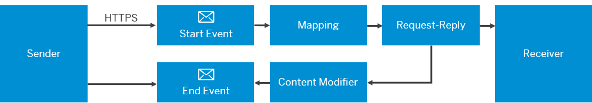

<!-- loio0ae4a78909c4479cbc3cc414250919de -->

# HTTPS Sender Adapter

## Context

You use the HTTPS sender adapter to communicate with receiver systems using HTTPS message protocol.

> ### Note:  
> In the following cases certain features might not be available for your current integration flow:
> 
> -   You are using a runtime profile other than the one expected. See: [Runtime Profiles](IntegrationSettings/runtime-profiles-8007daa.md).
> 
> -   A feature for a particular adapter or step was released after you created the corresponding shape in your integration flow.
> 
>     To use the latest version of a flow step or adapter – edit your integration flow, delete the flow step or adapter, add the step or adapter, and configure the same. Finally, redeploy the integration flow. See: [Updating your Existing Integration Flow](updating-your-existing-integration-flow-1f9e879.md).

> ### Note:  
> This adapter exchanges data with a remote component that might be outside the scope of SAP. Make sure that the data exchange complies with your company’s policies.

Supported Header:

> ### Remember:  
> -   The adapter adds the headers that follow and you can't add them manually. The adapter removes any custom header that you send with the prefix `camel` even if you add them as *Allowed Headers* in the *Runtime Configuration* of the integration flow.
> 
> -   Any query parameter \(with a key and value\) that you send to the adapter is automatically converted to a header. So, if you send a query and a header with same name, the adapter appends the query to the header.
> 
> -   All request and response header names and its values should be a string without whitespace. For more information, refer to [HTTP Specifications](https://datatracker.ietf.org/doc/html/rfc7230#section-3.2).

-   SapAuthenticatedUserName

    Contains the user name of the client that calls the integration flow.

The following HTTPS request headers for the sample HTTPS endpoint `https://test.bsn.neo.ondemand.com/http/hello?abcd=1234` are added to exchange headers for further processing in integration flow:

-   **CamelHttpUrl**

    Refers to the complete URL called, without query parameters.

    For example, `CamelHttpUrl=https://test.bsn.neo.ondemand.com/http/hello`.

-   **CamelHttpQuery**

    Refers to the query string that is contained in the request URL.

    In the context of a receiver adapter, this header can be used to dynamically change the URI to be called.

    For example, `CamelHttpQuery=abcd=1234`.

-   **CamelHttpMethod**

    Refers to the incoming method names used to make the request. These methods are *GET*, *POST*, *PUT*, *DELETE*, and so on.

-   **CamelServletContextPath**

    Refers to the path specified in the address field of the channel.

    For example, if the address in the channel is*/abcd/1234*, then *CamelServletContextPath* is */abcd/1234*.

> ### Note:  
> -   Adapter tracing is supported for HTTPS adapter. For more information, see [Message Processing Log - Adapter Tracing](message-processing-log-adapter-tracing-a9db4ea.md).
> -   When you deploy an integration flow with HTTPS sender adapter, you can review the endpoint information of this integration flow in *Manage Integration Content* section of operations view.

When you have created a sender channel with HTTPS adapter, you can configure the following attributes:

### Connection

**Parameters of the HTTPS Sender Adapter**

<table>
<tr>
<th valign="top">

Parameter

</th>
<th valign="top">

Description

</th>
</tr>
<tr>
<td valign="top">

*Address* 

</td>
<td valign="top">

Enter a relative path to address the integration flow.

When deploying the integration flow, the path is appended to the address of the service instance, completed with `/http`. This results in the endpoint address through which a sending system can reach the integration flow.

When as *Address* you enter `/myIntegrationFlow`, the endpoint address of the integration flow will finally be:

`<service instance URL>/http/myIntegrationFlow`

Example:

`https://abcd-1234-efg-5678.it-xyz001-rt.cfapps.eu12.hana.ondemand.com/http/myIntegrationFlow`

The service instance URL is also displayed in the *url* field of the service key created for the corresponding service instance \([Creating Service Instance and Service Key for Inbound Authentication](../40-RemoteSystems/creating-service-instance-and-service-key-for-inbound-authentication-19af5e2.md)\).

> ### Note:  
> -   The field value supports these characters **~, -, . , $** and **\*** .
> -   The *Address* field should start with '/ ' and can contain alphanumeric values, '\_' and '/ '. For example a valid address is */test/123*.
> -   In the example mentioned above, you can use **~** only for the address part which succeeds */test/*
> -   You can use **$** only at the beginning of the address after **/**.
> -   You cannot begin address with**.**, **\-** or **~**. Alphanumeric value or**\_** must succeed these characters.
> -   You can use **\*** only at the extreme end of the address and no characters are allowed after **\***. A **\*** can only be preceded with**/**.
> -   If you are using **/\***, it implies that URI containing the prefix preceding the **/\*** is supported. For example. if the address is */Customer/\** then URIs supported are `<service instance URLt>/http/Customer/<Any-url>`.
> -   If you are using **/path /\***, then no other integration flows with the addresses `/path/any-URL` or `/path/any-URL/text` can be deployed across the tenant.
> -   URIs are case insensitive. So, `<service instance URLt>/http/test` and `<service instance URLt>/http/Test` are treated as same.

</td>
</tr>
<tr>
<td valign="top">

*CSRF Protected* 

</td>
<td valign="top">

This option prevents Cross-Site Request Forgery \(CSRF\), which is a malicious online attack. Such attacks exposes user content without their authorization.

> ### Note:  
> -   During an inbound HTTPS communication, if the sender adapter receives a GET or HEAD request to fetch the CSRF token value and you have the enabled CSRF Protected then the adapter will return the CSRF token and stop processing the message further.
> 
> -   Include X-CSRF-Token in the HTTP header field for all modifying requests and these requests are validated during runtime. If the validation fails then the server returns “HTTP 403 Forbidden” status code.

</td>
</tr>
</table>

### Conditions

The parameters in *Maximum Message Size* allows you to set a maximum size limit for processing inbound messages. All inbound messages that exceeds the configured limit are rejected and the sender receives an error message.

> ### Note:  
> The minimum allowable size limit is 1MB.

**Configure to set size limit**

<table>
<tr>
<th valign="top">

Parameter

</th>
<th valign="top">

Description

</th>
</tr>
<tr>
<td valign="top">

Body Size \(in MB\)

</td>
<td valign="top">

Define the allowable size limit for processing the message body.

</td>
</tr>
</table>

Save the settings.

> ### Note:  
> -   Additional incoming request headers and URL parameters can be added to exchange headers for further processing in integration flow. You must define these headers and paramters in *Allowed Headers* list at integration flow level.
> -   Once the integration flow processing completes, the HTTPS sender adapter returns header and body to end user and sets the response code. You can use *Content Modifier* element to send back specific http response and customize the response.
> -   The sample integration flow is as shown next:
> -   Address URLs for http endpoints across integration flow must be unique. If it is not unique then the integration flow does not start.
> -   Adapter returns the following HTTP response code:
> 
>     **HTTP Response Code**
> 
> 
>     <table>
>     <tr>
>     <th valign="top">
> 
>     Runtime Version
>     
>     </th>
>     <th valign="top">
> 
>     Response Code
>     
>     </th>
>     </tr>
>     <tr>
>     <td valign="top">
>     
>     For Cloud Integration version 6.\*, runtime based on Apache Camel version 2.\*
>     
>     </td>
>     <td valign="top">
>     
>     -   200 - Processing successful
> 
>     -   503 - Service not available
> 
>     -   500 - Exception during integration flow processing
> 
> 
> 
>     
>     </td>
>     </tr>
>     <tr>
>     <td valign="top">
>     
>     Form Cloud Integration version 8.\*, runtime based on Apache Camel version 3.\*
>     
>     </td>
>     <td valign="top">
>     
>     -   200 - Processing successful
> 
>     -   204 - Processing successful but no content to return
> 
> 
> 
>     
>     </td>
>     </tr>
>     </table>
>     
>     Also, you can set the header *CamelHttpResponseCode* to customize the response code.
> 
> -   You can invoke the HTTP endpoints using the syntax **<Base URI\>/http/<Value of address field\>**. You can get *Base URI* value from *Services* tab in *Properties* view of a worker node.
> 
>     Atleast one integration flow with SOAP endpoint must be deployed to view details in *Services* tab.
> 
> -   You should use *Script* element to customise which headers can be sent in response to the HTTP call. It is a recommendation that you must remove internal headers and sent back only required headers.
> -   If an exception occurs during a HTTPS call, due to which the message is not processed and you have selected *Return Exception to Sender*, then the exception is sent back to the sender. For more information, see [Define Error Configuration](define-error-configuration-77d0041.md).
> -   If an exception occurs during the HTTPS call and you have not selected *Return Exception to Sender*, it throws back a message and MPL ID explaining the exception, rather than displaying the stack trace.

**Related Information**  

[Authentication and Authorization Options \(Inbound\)](../40-RemoteSystems/authentication-and-authorization-options-inbound-983f2a5.md "When a client calls a server using a secure communication channel, two different kinds of checks are performed subsequently.")

[OData API](odata-api-a617d6f.md "The Cloud Integration application programming interface (API) allows you to access Cloud Integration resources, for example, monitoring data.")

[Sender-Initiated Scenario (with HTTPS Sender Adapter)](https://help.sap.com/viewer/368c481cd6954bdfa5d0435479fd4eaf/Cloud/en-US/ccdb189ad99a4db0908150c799cbe9e3.html "Create a simple integration scenario that is initiated by a sender (using the HTTPS sender adapter).") :arrow_upper_right:

[Setting Up Inbound HTTP Connections (Integration Flow Processing), Neo Environment](https://help.sap.com/viewer/368c481cd6954bdfa5d0435479fd4eaf/Cloud/en-US/778c7e7835ff46408aafe0d499720dc7.html "You can use various sender adapters (for example, the SOAP adapters, the IDoc adapter, and the HTTP adapter) to connect the tenant to a sender system so that the sender can send messages to Cloud Integration over the HTTP protocol.") :arrow_upper_right:

