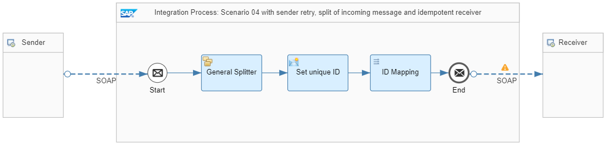

<!-- loio441e51df221c470a83a2d87741e1bc94 -->

# ID Mapping \(with Splitter\)

This is the example scenario: A purchase order is split into individual messages for each item, see[Variant with General Splitter](variant-with-general-splitter-cba1ecb.md). Cloud Integration sends the split messages to the same receiver. The receiver carries out the duplicate check if Cloud Integration resends the message with the same message ID. The duplicate check at receiver side requires a unique ID for each split item.

If the receiver adapter isn't offering the option to map an ID, use the *ID Mapping* integration flow step to map a source message ID to a target message ID. The ID mapping generates a unique ID for the combination of a source message ID and a context. When processing the ID mapping step with a dedicated combination of parameter settings the first time, Cloud Integration stores the generated ID temporarily in the tenant database. When executed with the same combination again, the ID mapping provides the same previously generated ID.

> ### Note:  
> To avoid database overflows, the ID mapping stores the generated ID with a limited lifetime. You can customize the corresponding parameter*Expiration Period* when designing the *ID Mapping* integration flow step step. To be more specific: The expiration period, that is: the number of days after which the system deletes the stored ID mapping. The default setting is 30 days.
> 
> Make sure that the expiration period is longer than the expected maximal time period during which retries can happen.
> 
> See: [Define ID Mapping](define-id-mapping-2367101.md)

To keep it simple, the same assumptions apply as in scenario [Sender and Receiver with SAP RM Protocol](sender-and-receiver-with-sap-rm-protocol-9f3e2b6.md):

-   It implements the communication between exactly 1 sender and 1 receiver.

-   The message protocol contains a unique ID such as a message ID.

-   The sender supports message retry. It's assumed that the message ID remains the same for all retries.

-   The receiver is **idempotent**. This means that the receiver is able to detect and ignore duplicate messages.

-   The integration flow design bears no risk of any side effects that can result in nondeterministic behavior. For example: During message processing, Cloud Integration writes variables and doesn't roll back the write action on failure.

The *Pattern Quality Of Service - Scenario 04* integration flow illustrates this splitter scenario.

At sender side, the scenario uses the SOAP \(SAP RM\) sender adapter with message protocol SAP Reliable Messaging. This setting ensures that the sender can pass on a protocol-specific message ID to the integration flow. Cloud Integration saves the ID in the header `SapMessageIdEx`. See [Configure the SOAP \(SAP RM\) Sender Adapter](configure-the-soap-sap-rm-sender-adapter-6962234.md).

A *General Splitter* step with the following settings splits a message containing multiple items into as many messages as items exist:

<table>
<tr>
<th valign="top">

Parameter

</th>
<th valign="top">

Setting

</th>
</tr>
<tr>
<td valign="top">

*Expression Type* 

</td>
<td valign="top">

`XPath` 

</td>
</tr>
<tr>
<td valign="top">

*XPath Expression* 

</td>
<td valign="top">

`//Item` 

</td>
</tr>
<tr>
<td valign="top">

*Parallel Processing* 

</td>
<td valign="top">

Is unselected to ensure sequential processing.

</td>
</tr>
</table>

The Content Modifier *Set unique ID* defines the unique ID for each split item based on:

-   The message ID provided by the sender system

-   The Camel split index that indicates at which position a message is located in the split sequence.

    > ### Note:  
    > Cloud Integration writes the split index into the header `CamelSplitIndex` \(see [Headers and Exchange Properties Provided by the Integration Framework](headers-and-exchange-properties-provided-by-the-integration-framework-d0fcb09.md)\).

> ### Note:  
> Cloud Integration executes the splitter process in sequence. Therefore, even if the message is retried and the sender doesn't change the message, all split items keep the same order. As a result, the same Camel split index is assigned to each split item. If you need to run the splitter in parallel, Cloud Integration can't guarantee the same order. Therefore, in this case you can't use the Camel split index to define the unique ID. Instead of this, you can use any field in your message payload that is unique for each split message, for example, a line item number.

If you check out the *Exchange Property* tab of the Content Modifier *Set unique ID* to verify the following settings.

<table>
<tr>
<th valign="top">

Parameter

</th>
<th valign="top">

Setting

</th>
</tr>
<tr>
<td valign="top">

*Name* 

</td>
<td valign="top">

`SplitMessageID` 

</td>
</tr>
<tr>
<td valign="top">

*Type* 

</td>
<td valign="top">

`Expression` 

</td>
</tr>
<tr>
<td valign="top">

*Data Type* 

</td>
<td valign="top">

`java.lang.String` 

</td>
</tr>
<tr>
<td valign="top">

*Value* 

</td>
<td valign="top">

`${header.SapMessageIdEx}_${header.CamelSplitIndex}` 

</td>
</tr>
</table>

Based on this setting, the Content Modifier defines a new property that is a concatenation of the message ID provided by the sender system and the Camel split index.

The *ID Mapping* step is defined in the following way:

<table>
<tr>
<th valign="top">

Parameter

</th>
<th valign="top">

Setting

</th>
</tr>
<tr>
<td valign="top">

*Source Message ID* 

</td>
<td valign="top">

`${property.SplitMessageID}`

The source message ID is defined using the property defined in the previous Content Modifier.

</td>
</tr>
<tr>
<td valign="top">

*Target Header Name* 

</td>
<td valign="top">

`SapMessageIdEx`

For each split item, the header `SapMessageIdEx` is overwritten with a newly generated ID.

</td>
</tr>
<tr>
<td valign="top">

*Context* 

</td>
<td valign="top">

`IDMapperContext_01`

Background: You define a unique context for each *ID Mapping* step within your integration flow. For any further *ID Mapping* step, you simply increment the number in the context name. In this scenario, there's 1 single *ID Mapping* step anyway. Therefore, we could have omitted the number without any side effect on the scenario.

</td>
</tr>
<tr>
<td valign="top">

*Visibility* 

</td>
<td valign="top">

*Integration Flow*

The generated IDs are unique within the same integration flow model. If your ID mapping is to be used across different integration flows, you need to select *Global*.

</td>
</tr>
<tr>
<td valign="top">

*Expiration Period \(in d\)* 

</td>
<td valign="top">

`30` 

</td>
</tr>
</table>

At receiver side, the scenario uses the SOAP \(SAP RM\) receiver adapter. On the *Processing* tab of the adapter, the *SAP RM Message ID Determination* property is set to `Reuse`. This setting ensures that Cloud Integration uses the value of header `SapMessageIdEx` to set the SAP RM Message ID that is then passed to the receiver system. See [Configure the SOAP \(SAP RM\) Receiver Adapter](configure-the-soap-sap-rm-receiver-adapter-8366495.md).

To test the scenario, perform the following steps:

1.  Set up inbound *Basic* authentication for integration flow endpoints.

    See:

    [Basic Authentication with clientId and clientsecret for Integration Flow Processing](../40-RemoteSystems/basic-authentication-with-clientid-and-clientsecret-for-integration-flow-processing-647eeb3.md)

    [Setting Up Inbound HTTP Connections (with Basic Authentication), Neo Environment](https://help.sap.com/viewer/368c481cd6954bdfa5d0435479fd4eaf/Cloud/en-US/391c45cfcd0f4435952ab085283b7f7d.html "") :arrow_upper_right:

2.  Deploy a *User Credentials* artifact with the following parameters using the *Monitor* application \(*Security Material* tile under *Manage Security*\).

    <table>
    <tr>
    <th valign="top">

    Parameter
    
    </th>
    <th valign="top">

    Setting
    
    </th>
    </tr>
    <tr>
    <td valign="top">
    
    *Name*
    
    </td>
    <td valign="top">
    
    `OWN`
    
    </td>
    </tr>
    <tr>
    <td valign="top">
    
    *User*
    
    </td>
    <td valign="top">
    
    Enter the user as specified when setting up inbound basic authentication.
    
    </td>
    </tr>
    <tr>
    <td valign="top">
    
    *Password*
    
    </td>
    <td valign="top">
    
    Enter the password as specified when setting up inbound basic authentication.
    
    </td>
    </tr>
    </table>
    
    > ### Note:  
    > When you check out the integration flows *Pattern Quality Of Service – Mocked Sender* and *Pattern Quality Of Service - Scenario 04*, you notice that the receiver adapters refer to a *User Credentials* artifact with the name *OWN*.
    > 
    > Both integration flows operate on the same tenant and use the same user credentials for inbound requests.

3.  Deploy all 3 integration flows *Generic Receiver*, *Pattern Quality Of Service – Mocked Sender*, and *Pattern Quality Of Service - Scenario 04*.

4.  In the Postman client, open the *QualityOfService* folder in the *Enterprise Integration Patterns* collection, and run the *QualityOfService – Scenario 04* request.

    If you set the request parameter `sendDuplicates` to `true` \(in the *Params* tab of Postman\), the *Pattern Quality Of Service – Mocked Sender* integration flow sends a second message to the *Pattern Quality Of Service - Scenario 04* integration flow with a delay of 5 seconds.

5.  Once the system has processed the second message successfully, check the data store *Pattern-QualityOfService* \(open the *Monitor* application and select the *Data Stores* tile under *Manage Stores*\).

    > ### Tip:  
    > Since the sample payload contains 5 items, you see 5 entries with entry *ID* identical to the generated message IDs.

6.  Before rerunning the test, clean up the data store.

7.  Optionally, you can switch on the trace to be able to verify the overall behavior.

