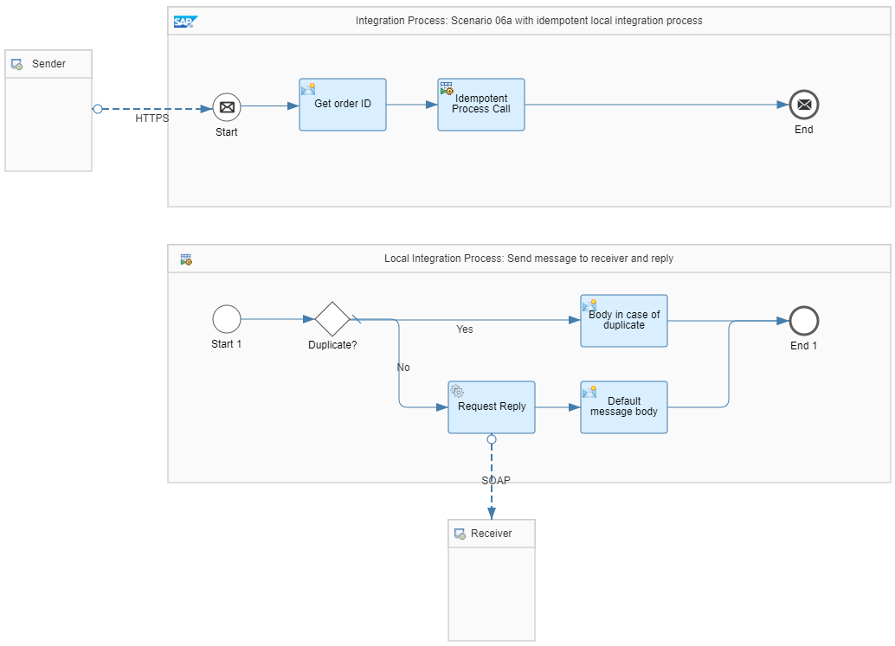

<!-- loioa8706217bf174994bdca4cbe2b06955e -->

# Idempotent Process Call Handles Duplicates \(With Alternative Response\)

In this example, Cloud Integration synchronously creates a purchase order and expects a response if the purchase order has been successfully delivered to the receiver system. If the same request is called again, the purchase order must not be sent to the receiver system. Instead of this, an alternative response is to be created.

The *Pattern Quality Of Service - Scenario 06a* integration flow illustrates this scenario.

The integration flow is called using an HTTP sender adapter.

The *Get order ID* content modifier step stores the purchase order number from the payload in an exchange property using the following parameter settings:

****

<table>
<tr>
<th valign="top">

Parameter

</th>
<th valign="top">

Setting

</th>
</tr>
<tr>
<td valign="top">

Action

</td>
<td valign="top">

Create

</td>
</tr>
<tr>
<td valign="top">

Name

</td>
<td valign="top">

orderNumber

</td>
</tr>
<tr>
<td valign="top">

Type

</td>
<td valign="top">

XPath

</td>
</tr>
<tr>
<td valign="top">

Data Type

</td>
<td valign="top">

java.lang.String

</td>
</tr>
<tr>
<td valign="top">

Value

</td>
<td valign="top">

string\(//@PurchaseOrderNumber\)

</td>
</tr>
</table>

The *Idempotent Process Call* step sends the message to the local integration process using the following idempotent conditions:

****

<table>
<tr>
<th valign="top">

Parameter

</th>
<th valign="top">

Setting

</th>
</tr>
<tr>
<td valign="top">

Message ID

</td>
<td valign="top">

$\{property.orderNumber\}

</td>
</tr>
<tr>
<td valign="top">

Skip Process Call for Duplicates

</td>
<td valign="top">

Deselected

</td>
</tr>
</table>

The duplicate check is based on the unique order number. Since the response is changed, the idempotent process call isn't skipped in case of duplicates.

In the local integration process, the following routing condition is carried out to determine duplicates:

`${property.CamelDuplicateMessage} = 'true'`

> ### Note:  
> Before each idempotent process call, the property `CamelDuplicateMessage` is reset. In case of a duplicate, the property is set to the value `true`.

For the default branch *No* \(if there are no duplicates\), the message is passed on to the receiver \(using a *Request Reply* step\). Furthermore, in the *Default message body* content modifier step Cloud Integration defines the body of the response using the following expression:

`Purchase order ${property.orderNumber} has been successfully created.`

In the other branch *Yes* \(if there are duplicates\), the *Body in case of duplicate* content modifier defines the body of the response using the following expression:

`Purchase order ${property.orderNumber} is a duplicate and will be discarded!`

These settings guarantee that no duplicate messages are sent to the receiver system. If the sender retries the message delivery, the same ID is passed on to the idempotent local integration process, and the alternative text is returned.

> ### Note:  
> If the call to the receiver fails in the first place, the update of the idempotent repository isn't committed. In this case, a retry of the request with the same order number won’t be seen as duplicate which is the correct behavior.

To test the scenario, perform the following steps:

1.  Set up inbound *Basic* authentication for integration flow endpoints.

    See:

    [Basic Authentication with clientId and clientsecret for Integration Flow Processing](../40-RemoteSystems/basic-authentication-with-clientid-and-clientsecret-for-integration-flow-processing-647eeb3.md)

    [Setting Up Inbound HTTP Connections (with Basic Authentication), Neo Environment](https://help.sap.com/viewer/368c481cd6954bdfa5d0435479fd4eaf/Cloud/en-US/391c45cfcd0f4435952ab085283b7f7d.html "") :arrow_upper_right:

2.  Deploy a *User Credentials* artifact with the following parameters using the *Monitor* application \(*Security Material* tile under *Manage Security*\).

    <table>
    <tr>
    <th valign="top">

    Parameter
    
    </th>
    <th valign="top">

    Setting
    
    </th>
    </tr>
    <tr>
    <td valign="top">
    
    *Name*
    
    </td>
    <td valign="top">
    
    `OWN`
    
    </td>
    </tr>
    <tr>
    <td valign="top">
    
    *User*
    
    </td>
    <td valign="top">
    
    Enter the user as specified when setting up inbound basic authentication.
    
    </td>
    </tr>
    <tr>
    <td valign="top">
    
    *Password*
    
    </td>
    <td valign="top">
    
    Enter the password as specified when setting up inbound basic authentication.
    
    </td>
    </tr>
    </table>
    
    > ### Note:  
    > When calling the integration flow *Pattern Quality Of Service - Scenario 06a*, a *User Credentials* artifact with the name *OWN* is passed on to the integration flow in the header of the request which is needed to logon to the *Generic Receiver* integration flow.

3.  Deploy the integration flows *Generic Receiver* and *Pattern Quality Of Service - Scenario 06a*.
4.  In the Postman client, open the *QualityOfService* folder of the Postman collection that has been provided with the *Integration Flow Design Guidelines - Enterprise Integration Patterns* package. Run the *QualityOfService – Scenario 06a* GET request.
5.  Once the system has processed the message successfully, you receive a response that the order has been successfully created.
6.  Rerun the request with the same order number. In this case you should get a message that the purchase order is a duplicate and will be discarded.
7.  Check the data store *Pattern-QualityOfService* \(open the *Monitor* application and select the *Data Stores* tile under *Manage Stores*\).

    > ### Tip:  
    > You see only 1 entry with an entry ID that is automatically generated by the data store write operation.

8.  Before rerunning the test, clean up the data store. Furthermore, increase the value of the *PurchaseOrderNumber* attribute in the body of the request by 1.
9.  You can force an error by changing the request header credentials to a wrong alias name.
10. When running the request with the wrong credentials header, you should run into an error.
11. Change back the request header credentials to *OWN*, and re-run the request.
12. You receive a response that the order has been successfully created.
13. Optionally, you can switch on the trace to be able to verify the overall behavior.

**Related Information**  

[Configure the SOAP \(SOAP 1.x\) Receiver Adapter](configure-the-soap-soap-1-x-receiver-adapter-57f7b34.md "The SOAP (SOAP 1.x) receiver adapter enables a SAP BTP tenant to exchange messages with a receiver system that supports Simple Object Access Protocol (SOAP) 1.1.")

[Define Idempotent Process Call](define-idempotent-process-call-84c85d7.md "Execute a process call step to check if an incoming message was already processed, and skip the processing of this message.")

