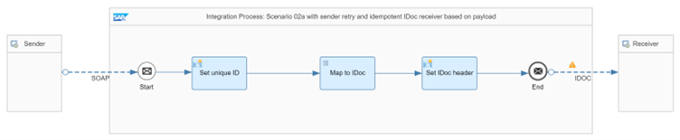

<!-- loiobb441a9b974a4b0aba8cb6189a3f2231 -->

# IDoc Receiver Handles Duplicates \(based on unique ID in payload\)

The scenario described in this topic is similar to scenario [IDoc Receiver Handles Duplicates](idoc-receiver-handles-duplicates-8f8feea.md), except that the protocol doesn't support a unique ID. Therefore, we need to make sure that the system derives a unique ID from the payload.

The following assumptions apply for the design of this scenario:

-   It implements the communication between exactly 1 sender and 1 receiver.

-   The message protocol doesn’t contain a unique ID.

    Therefore, the integration developer needs to design the scenario in such a way that Cloud Integration derives a unique ID from the payload.

-   The sender supports message retry.

-   The IDoc receiver adapter is used to exchange Intermediate Document \(IDoc\) messages with the receiver.

> ### Note:  
> The IDoc runtime in the backend is able to detect and ignore duplicate messages, hence is idempotent, if the following prerequisites are fulfilled:
> 
> -   IDoc Content Type equals Application/x-sap.doc
> 
> -   Header `SapMessageId` remains the same for each message retry.

<a name="loiobb441a9b974a4b0aba8cb6189a3f2231__section_uct_kx2_2yb"/>

## Involved Integration Flows

To simulate the communication of sender and receiver systems through Cloud Integration for the different scenarios, the integration package comes with multiple integration flows. To learn more about how these integration flows interact with each other during the processing of a scenario, see [Interaction of the Involved Integration Flows](interaction-of-the-involved-integration-flows-44be68d.md).

<a name="loiobb441a9b974a4b0aba8cb6189a3f2231__section_tdm_sx2_2yb"/>

## Example Scenario

To give an example, we have modified [IDoc Receiver Handles Duplicates](idoc-receiver-handles-duplicates-8f8feea.md): Instead of the sender SAP RM adapter, the scenario uses SOAP 1.x protocol. The *Pattern Quality Of Service - Scenario 02a* integration flow illustrates this simple scenario.

The scenario contains a SOAP \(SOAP 1.x\) sender adapter that *doesn't* pass on any message ID as part of the message protocol to the integration flow. Instead of a message ID, Cloud Integration uses the booking reference contained as part of the message payload. We assume that the booking reference is unique for this business scenario.

On the receiver side, the scenario uses an IDoc receiver adapter. The IDoc receiver adapter passes on the header `SapMessageId` to the backend which is used to detect duplicates.

You can choose between three options how to specify the target ID `SapMessageId`:

-   *Generate*

-   *Reuse*

-   *Map*

See [Configure the IDoc Receiver Adapter](configure-the-idoc-receiver-adapter-018aa88.md) 

So, we need to ensure that the header `SapMessageId` is set with the unique ID from the payload. If the sender retries the message delivery, the same ID is passed on to the IDoc receiver. In this case, we ensure that duplicate messages are discarded.

The Content Modifier *Set unique ID* stores the booking reference as exchange property with name *bookingReference* using the following settings \(*Exchange Property* tab\).

<table>
<tr>
<th valign="top">

Parameter

</th>
<th valign="top">

Value

</th>
</tr>
<tr>
<td valign="top">

Name

</td>
<td valign="top">

bookingReference

</td>
</tr>
<tr>
<td valign="top">

Type

</td>
<td valign="top">

XPath

</td>
</tr>
<tr>
<td valign="top">

Data Type

</td>
<td valign="top">

java.lang.String

</td>
</tr>
<tr>
<td valign="top">

Value

</td>
<td valign="top">

ns0:FlightBooking/BookingReference

</td>
</tr>
</table>

On the *Processing* tab of the IDoc receiver adapter, the following settings are to be configured:

<table>
<tr>
<th valign="top">

Parameter

</th>
<th valign="top">

Setting

</th>
</tr>
<tr>
<td valign="top">

*SapMessageId Determination*

</td>
<td valign="top">

*Map*

</td>
</tr>
<tr>
<td valign="top">

*Source For SapMessageId*

</td>
<td valign="top">

`${property.bookingReference}`

</td>
</tr>
</table>

To test the scenario, perform the following steps:

1.  Set up inbound *Basic* authentication for integration flow endpoints.

    See:

    [Basic Authentication with clientId and clientsecret for Integration Flow Processing](../40-RemoteSystems/basic-authentication-with-clientid-and-clientsecret-for-integration-flow-processing-647eeb3.md)

    [Setting Up Inbound HTTP Connections (with Basic Authentication), Neo Environment](https://help.sap.com/viewer/368c481cd6954bdfa5d0435479fd4eaf/Cloud/en-US/391c45cfcd0f4435952ab085283b7f7d.html "") :arrow_upper_right: 

2.  Deploy a *User Credentials* artifact with the following parameters using the *Monitor* application \(*Security Material* tile under *Manage Security*\).

    <table>
    <tr>
    <th valign="top">

    Parameter
    
    </th>
    <th valign="top">

    Setting
    
    </th>
    </tr>
    <tr>
    <td valign="top">
    
    Name
    
    </td>
    <td valign="top">
    
    OWN
    
    </td>
    </tr>
    <tr>
    <td valign="top">
    
    User
    
    </td>
    <td valign="top">
    
    Enter the user as specified when setting up inbound basic authentication.
    
    </td>
    </tr>
    <tr>
    <td valign="top">
    
    Password
    
    </td>
    <td valign="top">
    
    Enter the password as specified when setting up inbound basic authentication.
    
    </td>
    </tr>
    </table>
    
    > ### Note:  
    > When you check out the integration flows *Pattern Quality Of Service – Mocked Sender* and *Pattern Quality Of Service - Scenario 02a*, you notice that the receiver adapters refer to a *User Credentials* artifact with the name *OWN*.

    Both integration flows operate on the same tenant and use the same user credentials for inbound requests.

3.  Deploy all 3 integration flows *Generic Receiver*, *Pattern Quality Of Service – Mocked Sender*, and *Pattern Quality Of Service - Scenario 02a*.
4.  In the Postman client, open the *QualityOfService* folder in the *Enterprise Integration Patterns* collection, and run the *QualityOfService – Scenario 02a* request.

    If you set the request parameter `sendDuplicates to true` \(in the *Params* tab of Postman\), the *Pattern Quality Of Service – Mocked Sender* integration flow sends a second message to the *Pattern Quality Of Service - Scenario 02a* integration flow with a delay of 5 seconds.

5.  Once the system has processed the second message successfully, check the data store *Pattern-QualityOfService* \(open the *Monitor* application and select the *Data Stores* tile under *Manage Stores*\).

    > ### Tip:  
    > You see only 1 entry with an entry *ID* that is identical to the mapped ID based on the booking reference.

6.  Before rerunning the test, clean up the data store. Optionally, maintain a new booking reference in the message body.

7.  Optionally, you can switch on the trace to be able to verify the overall behavior.

