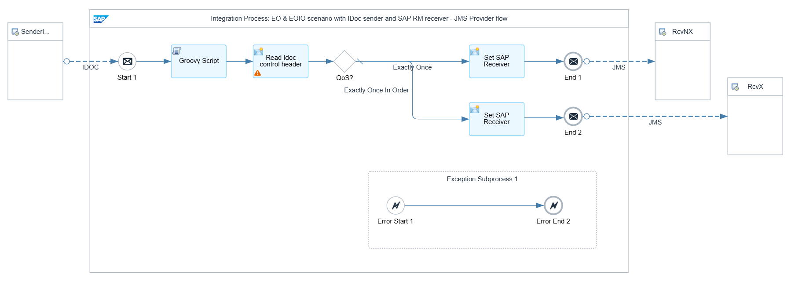
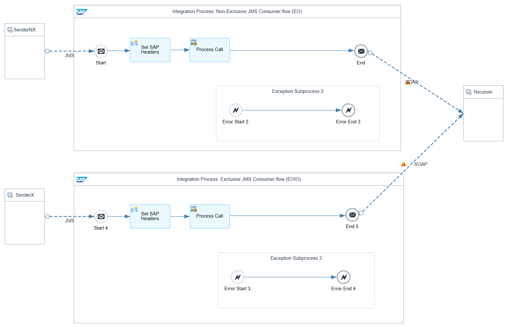

<!-- loio72666281f7a14e4786d7522170e4dafd -->

# IDoc Sender Scenario

The following assumptions apply for the design of this IDoc sender scenario:

-   The IDoc sender adapter is used to reliably exchange IDoc messages with the sender.
-   The SAP RM receiver adapter is used to reliably exchange messages with the receiver using the SAP RM protocol.
-   The receiver is idempotent, which means that it can detect and ignore duplicate messages.

The IDoc sender adapter in Cloud Integration supports both Exactly Once and Exactly Once In Order. Which Quality of Service is used depends on how the IDoc communication is configured in the sending system.

-   For Exactly Once In Order, the IDoc sender adapter sets the headers `SapPlainSoapQoS` and `SapPlainSoapQueueId` based on the IDoc control header `ARCKEY`, which can be used within the integration flow to model the message orchestration.
-   The IDoc sender adapter saves the protocol-specific ID in the header `SapMessageId`, which can then be passed to the SAP RM receiver adapter for defining a unique ID for duplicate handling.

For Exactly Once In Order delivery, an exclusive JMS queue is used in which the messages are directly stored once they reach Cloud Integration. This ensures the following:

-   If you persist the messages in a JMS queue, Cloud Integration can carry out the retry of the message delivery if an error occurs.
-   If you use an exclusive JMS queue, the message sequence can be preserved.

> ### Note:  
> To ensure that IDocs are sent in the sequence in which they were created and that the sequence is preserved when a message goes into an error, apply SAP note [3519275](https://me.sap.com/notes/3519275) in the sending system.

<a name="loio72666281f7a14e4786d7522170e4dafd__section_vcg_m1f_j1c"/>

## Example Scenario

The following example integration flow consists of three integration processes.

The first integration process contains an IDoc sender adapter and a JMS receiver adapter. The Groovy script is only used to store the Quality of Service and the queue ID derived from the message headers `SapPlainSoapQoS` and `SapPlainSoapQueueId` as custom header property for an improved monitoring.

The first content modifier in the integration process model retrieves the IDoc control headers and stores them in corresponding exchange properties. The second content modifiers in the flow sequence define the headers `SAP_Sender` and `SAP_Receiver`, respectively, for an improved monitoring.

In a router, the *Quality of Service* is checked. Depending on the header `SapPlainSoapQoS`, the message is either stored in a non-exclusive or in an exclusive JMS queue. This is shown in the following example:

The two other integration processes read the message from the same JMS queues, so either from the non-exclusive or the exclusive JMS queue, and carry out the flow steps. For both JMS sender adapters, you must ensure that the proper access type is defined according to the access type of the corresponding JMS receiver adapters. Otherwise, the deployment of the integration flow fails.

In the integration process handling the Exactly Once In Order case, the header `SapPlainSoapQoS` and `SapPlainSoapQueueId` must be set to ensure that the SAP RM receiver adapter passes the queue ID to the receiving system. Because the IDoc adapter sets those headers automatically, they can be passed to both flows.

On the *Processing* tab of the SAP RM receiver adapters, the SAP RM Message ID Determination property is set to *Map*. As *Source* for SAP RM Message ID, select the header `SapMessageId`. This ensures that you take over the message ID that's passed from the IDoc sender for duplicate handling. Cloud Integration uses the mapped unique ID as SAP RM Message ID.

> ### Note:  
> To pass through the message headers, the headers must be added to the list of allowed headers in the runtime configuration of the integration flow.

These integration flow settings ensure that Cloud Integration passes on a unique ID to the receiver system. If an error occurs during message processing, Cloud Integration retries the message from the JMS queue. Since the retry is performed within the same instance of the message processing log, there's no change to the message processing log ID and, as a result, the mapped unique ID.

Furthermore, when reading from the JMS queue with access type *Exclusive*, only one consumer can access the queue at once. Therefore, all successor messages wait until the predecessor message has been processed successfully. This setting guarantees that messages are processed in the exact order in which they're stored on the JMS queue. See the following the example:

